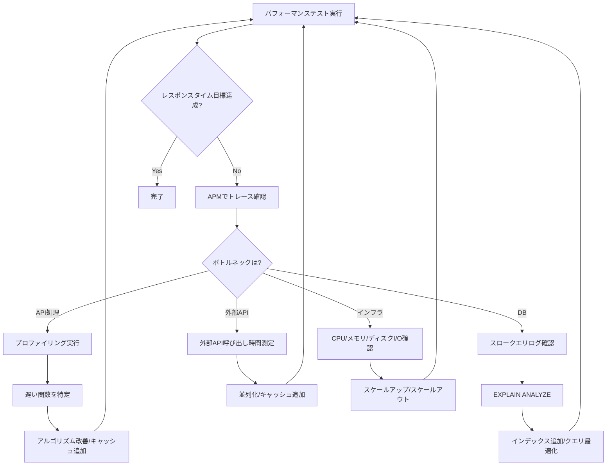

# 2.5.6.4 ボトルネック分析

## 目的

システム全体のボトルネックを特定し、改善策を実施します。

---

## 🔍 ボトルネック分析手法

### 1. APM（Application Performance Monitoring）

#### Datadog APM

```yaml
# docker-compose.yml
version: '3.8'
services:
  app:
    image: myapp:latest
    environment:
      DD_AGENT_HOST: datadog-agent
      DD_TRACE_ENABLED: true
      DD_SERVICE: myapp
      DD_ENV: production
```

**確認項目**:
- ✅ エンドポイントごとのレスポンスタイム
- ✅ データベースクエリの実行時間
- ✅ 外部API呼び出しの時間
- ✅ CPU・メモリ使用率

---

### 2. プロファイリング

#### Python (py-spy)

```bash
# インストール
pip install py-spy

# プロファイリング実行（60秒間）
py-spy record -o profile.svg --pid <PID> --duration 60

# フレームグラフ生成
py-spy record -o profile.svg -- python myapp.py
```

#### Node.js (clinic.js)

```bash
# インストール
npm install -g clinic

# プロファイリング実行
clinic doctor -- node server.js

# フレームグラフ
clinic flame -- node server.js
```

#### Go (pprof)

```go
import (
    _ "net/http/pprof"
    "net/http"
)

func main() {
    go func() {
        log.Println(http.ListenAndServe("localhost:6060", nil))
    }()

    // アプリケーションコード
}
```

```bash
# CPUプロファイル取得
go tool pprof http://localhost:6060/debug/pprof/profile?seconds=30

# メモリプロファイル
go tool pprof http://localhost:6060/debug/pprof/heap
```

---

### 3. データベースボトルネック分析

#### 接続数の監視

```sql
-- PostgreSQL: 現在の接続数
SELECT count(*) FROM pg_stat_activity;

-- アクティブなクエリ
SELECT pid, usename, state, query, now() - query_start AS duration
FROM pg_stat_activity
WHERE state != 'idle'
ORDER BY duration DESC;
```

#### ロック待ちの確認

```sql
-- PostgreSQL: ロック待ちクエリ
SELECT
  blocked.pid AS blocked_pid,
  blocked.query AS blocked_query,
  blocking.pid AS blocking_pid,
  blocking.query AS blocking_query
FROM pg_stat_activity blocked
JOIN pg_locks blocked_lock ON blocked.pid = blocked_lock.pid
JOIN pg_locks blocking_lock ON blocked_lock.locktype = blocking_lock.locktype
  AND blocked_lock.relation = blocking_lock.relation
JOIN pg_stat_activity blocking ON blocking.pid = blocking_lock.pid
WHERE NOT blocked_lock.granted
  AND blocking_lock.granted;
```

---

### 4. ネットワークボトルネック

#### レイテンシー測定

```bash
# API レスポンスタイム
curl -w "@curl-format.txt" -o /dev/null -s https://api.example.com/users

# curl-format.txt
time_namelookup:  %{time_namelookup}\n
time_connect:     %{time_connect}\n
time_appconnect:  %{time_appconnect}\n
time_pretransfer: %{time_pretransfer}\n
time_starttransfer: %{time_starttransfer}\n
time_total:       %{time_total}\n
```

#### CDN・キャッシュの確認

```bash
# レスポンスヘッダ確認
curl -I https://example.com/static/app.js

# 出力例:
HTTP/2 200
cache-control: public, max-age=31536000
x-cache: HIT from cloudfront
```

---

### 5. リソース使用率の監視

#### CPU使用率

```bash
# リアルタイム監視
top -o %CPU

# プロセスごとのCPU使用率
ps aux | sort -nrk 3 | head -10
```

#### メモリ使用率

```bash
# メモリ状況確認
free -h

# プロセスごとのメモリ使用率
ps aux | sort -nrk 4 | head -10
```

#### ディスクI/O

```bash
# I/O統計
iostat -x 1

# プロセスごとのI/O
iotop
```

---

## 📊 ボトルネック分析フロー



---

## 🎯 改善例

### 例1: DBクエリがボトルネック

**問題**:
```
APMで確認 → GET /api/users のレスポンスタイム: 800ms
内訳: DBクエリ 750ms、その他 50ms
```

**原因**:
```sql
EXPLAIN ANALYZE SELECT * FROM users WHERE email LIKE '%@example.com';
-- Seq Scan（全表スキャン）: 750ms
```

**改善**:
```sql
-- インデックス追加
CREATE INDEX idx_users_email ON users(email);

-- または、クエリ変更
SELECT * FROM users WHERE email = 'specific@example.com';  -- インデックス利用可能
```

**結果**: 800ms → 50ms

---

### 例2: 外部API呼び出しがボトルネック

**問題**:
```
APMで確認 → GET /api/weather のレスポンスタイム: 1,200ms
内訳: 外部API呼び出し 1,150ms、その他 50ms
```

**改善**:
```python
# ✅ キャッシュ追加（Redis）
from redis import Redis
import json

redis_client = Redis()

async def get_weather(city: str):
    # キャッシュ確認
    cached = redis_client.get(f"weather:{city}")
    if cached:
        return json.loads(cached)

    # 外部API呼び出し
    data = await external_weather_api.get(city)

    # キャッシュ保存（TTL: 10分）
    redis_client.setex(f"weather:{city}", 600, json.dumps(data))

    return data
```

**結果**: 1,200ms → 50ms（キャッシュヒット時）

---

### 例3: N+1問題

**問題**:
```
GET /api/users → 1,000人のユーザーと注文情報を取得
実行時間: 5,000ms
クエリ数: 1,001回（1 + 1,000）
```

**改善**:
```python
# ❌ Before
users = session.query(User).all()
for user in users:
    orders = user.orders  # 1,000回のクエリ

# ✅ After: Eager Loading
users = session.query(User).options(joinedload(User.orders)).all()
for user in users:
    orders = user.orders  # 追加クエリなし
```

**結果**: 5,000ms → 200ms

---

**作成日**: 2025-10-19
**重要度**: ⭐⭐⭐
