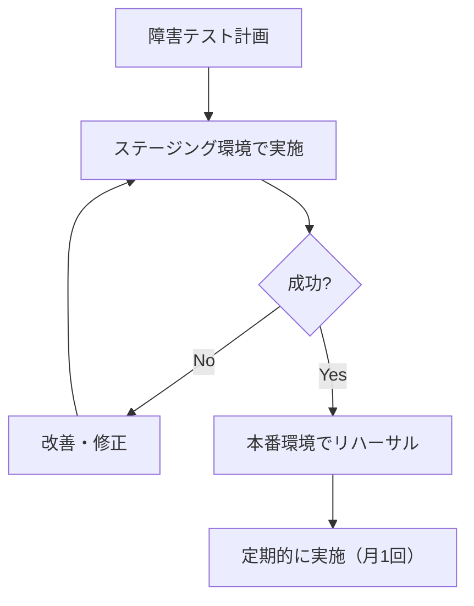

# 2.5.7.1 障害テスト方針

## 目的

システムの障害時の挙動と復旧能力を検証します。

---

## 🔥 障害テストの種類

### 1. Chaos Engineering（カオステスト）

**目的**: 予期しない障害への耐性確認

**実施内容**:
- サーバーの突然の停止
- ネットワーク遅延・切断
- リソース枯渇
- 依存サービスの障害

---

### 2. Failover Test（フェイルオーバーテスト）

**目的**: 冗長構成の切り替え動作確認

**実施内容**:
- プライマリDBダウン → スタンバイDB昇格
- アクティブサーバーダウン → スタンバイサーバー起動
- AZ障害時のクロスAZ切り替え

---

### 3. Recovery Test（復旧テスト）

**目的**: 障害復旧手順の検証

**実施内容**:
- バックアップからのリストア
- ログからのトランザクション復元
- データ整合性確認

---

## 🛠️ 使用ツール

### AWS Fault Injection Simulator (FIS)

**メリット**:
- ✅ AWS環境でのカオステストを安全に実施
- ✅ EC2、ECS、RDSなど様々なリソースに対応
- ✅ ロールバック機能

```yaml
# FIS実験テンプレート例
ExperimentTemplate:
  Description: "ECSタスクを停止してフェイルオーバーを確認"
  Targets:
    ECSTarget:
      ResourceType: aws:ecs:task
      ResourceTags:
        Environment: staging
      SelectionMode: COUNT(1)
  Actions:
    StopTask:
      ActionId: aws:ecs:stop-task
      Targets:
        Tasks: ECSTarget
  StopConditions:
    - Source: aws:cloudwatch:alarm
      Value: arn:aws:cloudwatch:...
```

---

### Chaos Mesh（Kubernetes環境）

```yaml
# Chaos Mesh: Pod障害注入
apiVersion: chaos-mesh.org/v1alpha1
kind: PodChaos
metadata:
  name: pod-failure-test
spec:
  action: pod-failure
  mode: one
  selector:
    namespaces:
      - default
    labelSelectors:
      app: myapp
  duration: '30s'
```

---

### Gremlin（商用ツール）

- ✅ GUIで簡単に障害注入
- ✅ CPU、メモリ、ディスク、ネットワークの障害シミュレーション
- ✅ スケジュール実行

---

## 📋 実施項目

### 1. サーバー障害テスト

```bash
# EC2インスタンス停止（AWS CLI）
aws ec2 stop-instances --instance-ids i-1234567890abcdef0

# ECSタスク停止
aws ecs stop-task --cluster myapp-cluster --task arn:aws:ecs:...
```

**検証項目**:
- ✅ ロードバランサーがヘルスチェックで検知（30秒以内）
- ✅ トラフィックが正常インスタンスに切り替わる
- ✅ エラー率の上昇がない（< 0.1%）
- ✅ オートスケーリングで新しいインスタンスが起動

---

### 2. データベース障害テスト

```bash
# RDS プライマリDB フェイルオーバー
aws rds failover-db-cluster --db-cluster-identifier myapp-cluster
```

**検証項目**:
- ✅ リードレプリカがプライマリに昇格（60秒以内）
- ✅ アプリケーションの接続エラーハンドリング
- ✅ リトライ処理の動作
- ✅ データロスがないこと

---

### 3. ネットワーク障害テスト

#### レイテンシ注入

```bash
# tc（Linux Traffic Control）を使用
# 500msのレイテンシを追加
sudo tc qdisc add dev eth0 root netem delay 500ms

# 削除
sudo tc qdisc del dev eth0 root
```

#### パケットロス注入

```bash
# 10%のパケットロスを注入
sudo tc qdisc add dev eth0 root netem loss 10%
```

**検証項目**:
- ✅ タイムアウト処理の動作
- ✅ リトライ処理の動作
- ✅ サーキットブレーカーの発動

---

### 4. リソース枯渇テスト

#### CPU負荷注入

```bash
# stress-ngを使用
sudo apt-get install stress-ng
stress-ng --cpu 4 --timeout 60s
```

#### メモリ枯渇

```bash
# メモリを消費
stress-ng --vm 1 --vm-bytes 4G --timeout 60s
```

**検証項目**:
- ✅ アプリケーションのエラーハンドリング
- ✅ CloudWatchアラームの発火
- ✅ オートスケーリングの発動

---

## 🎯 目標品質基準

| 項目 | 目標 |
|------|------|
| フェイルオーバー時間 | < 60秒 |
| フェイルオーバー時のエラー率 | < 1% |
| データロス | 0件 |
| 復旧時間（RTO） | < 1時間 |
| 復旧ポイント（RPO） | < 5分 |

---

## 📊 テスト実施フロー



---

**作成日**: 2025-10-19
**重要度**: ⭐⭐⭐
