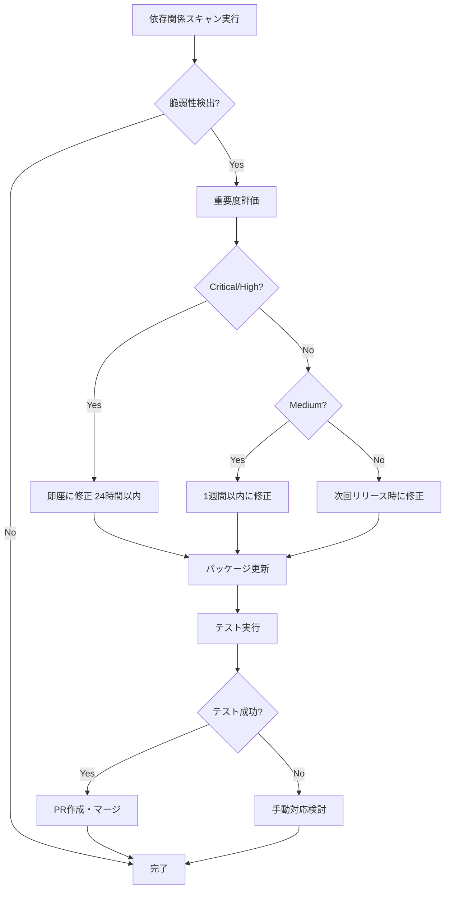

# 2.5.8.2 依存関係スキャン

## 目的

依存ライブラリの脆弱性を検出し、修正します。

---

## 🔍 依存関係スキャンツール

### Python: pip-audit

```bash
# インストール
pip install pip-audit

# スキャン実行
pip-audit

# 出力例:
Found 3 known vulnerabilities in 2 packages
Name    Version  ID              Fix Versions
------  -------  --------------  ------------
urllib3 1.26.5   PYSEC-2023-74   1.26.18,2.0.7
urllib3 1.26.5   PYSEC-2023-192  1.26.17,2.0.6
requests 2.25.1  PYSEC-2023-173  2.31.0
```

**修正**:

```bash
# requirements.txtを更新
pip install --upgrade urllib3 requests
pip freeze > requirements.txt
```

---

### Node.js: npm audit

```bash
# スキャン実行
npm audit

# 出力例:
found 5 vulnerabilities (2 moderate, 3 high)
run `npm audit fix` to fix them

# 詳細表示
npm audit --json
```

**修正**:

```bash
# 自動修正（互換性のある範囲）
npm audit fix

# 破壊的変更を含む修正
npm audit fix --force
```

---

### Node.js: Snyk

```bash
# インストール
npm install -g snyk

# 認証
snyk auth

# スキャン
snyk test

# 修正
snyk fix
```

---

### Go: govulncheck

```bash
# インストール
go install golang.org/x/vuln/cmd/govulncheck@latest

# スキャン
govulncheck ./...

# 出力例:
Vulnerability #1: GO-2023-1234
  Package: golang.org/x/net/http2
  Fixed in: v0.7.0
  More info: https://pkg.go.dev/vuln/GO-2023-1234
```

**修正**:

```bash
# go.modを更新
go get golang.org/x/net@v0.7.0
go mod tidy
```

---

### C#: dotnet list package

```bash
# 脆弱性チェック
dotnet list package --vulnerable

# 出力例:
The following sources were used:
   https://api.nuget.org/v3/index.json

Project `MyApp` has the following vulnerable packages
   [net8.0]:
   Top-level Package      Requested   Resolved   Severity   Advisory URL
   > Newtonsoft.Json      12.0.1      12.0.1     High       https://github.com/advisories/GHSA-5crp-9r3c-p9vr
```

**修正**:

```bash
# パッケージ更新
dotnet add package Newtonsoft.Json --version 13.0.3
```

---

## 🚀 CI/CDでの自動スキャン

### GitHub Actions (Node.js)

```yaml
name: Dependency Scan
on: [push, pull_request]

jobs:
  dependency-scan:
    runs-on: ubuntu-latest
    steps:
      - uses: actions/checkout@v3
      - uses: actions/setup-node@v3
        with:
          node-version: '18'

      - name: Install dependencies
        run: npm ci

      - name: Run npm audit
        run: npm audit --audit-level=high

      - name: Run Snyk
        uses: snyk/actions/node@master
        env:
          SNYK_TOKEN: ${{ secrets.SNYK_TOKEN }}
        with:
          args: --severity-threshold=high
```

---

### GitHub Actions (Python)

```yaml
name: Python Dependency Scan
on: [push, pull_request]

jobs:
  dependency-scan:
    runs-on: ubuntu-latest
    steps:
      - uses: actions/checkout@v3
      - uses: actions/setup-python@v4
        with:
          python-version: '3.11'

      - name: Install dependencies
        run: |
          pip install -r requirements.txt
          pip install pip-audit

      - name: Run pip-audit
        run: pip-audit
```

---

## 📊 脆弱性レポート管理

### Dependabot (GitHub)

**.github/dependabot.yml**:

```yaml
version: 2
updates:
  # npm
  - package-ecosystem: "npm"
    directory: "/"
    schedule:
      interval: "weekly"
    open-pull-requests-limit: 10

  # Python
  - package-ecosystem: "pip"
    directory: "/"
    schedule:
      interval: "weekly"

  # Docker
  - package-ecosystem: "docker"
    directory: "/"
    schedule:
      interval: "weekly"
```

**動作**:
- 毎週自動で依存関係をチェック
- 脆弱性が見つかるとPR自動作成
- セキュリティアップデートを優先

---

### Renovate Bot

**renovate.json**:

```json
{
  "extends": ["config:base"],
  "packageRules": [
    {
      "matchUpdateTypes": ["minor", "patch"],
      "automerge": true
    },
    {
      "matchPackagePatterns": ["*"],
      "matchUpdateTypes": ["major"],
      "labels": ["breaking-change"]
    }
  ],
  "vulnerabilityAlerts": {
    "labels": ["security"],
    "automerge": true
  }
}
```

---

## 🎯 対応フロー



---

## ✅ ベストプラクティス

### 1. 定期的なスキャン

```bash
# 毎週月曜日にスキャン（cron）
0 9 * * 1 cd /path/to/project && npm audit || pip-audit
```

### 2. ロックファイルの管理

```bash
# package-lock.json（Node.js）
npm install  # ✅ package-lock.jsonが更新される

# requirements.txt（Python）
pip freeze > requirements.txt  # ✅ 固定バージョン

# go.sum（Go）
go mod tidy  # ✅ go.sumが更新される
```

### 3. 最小権限の原則

```json
// package.json
{
  "dependencies": {
    "express": "^4.18.0"  // ✅ 必要な最小限のみ
  },
  "devDependencies": {
    "jest": "^29.0.0"  // ✅ 開発時のみ
  }
}
```

---

**作成日**: 2025-10-19
**重要度**: ⭐⭐⭐
