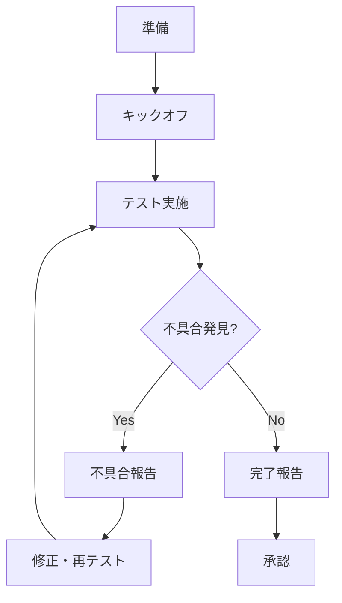

# 2.5.9.3 UAT実施手順

## 目的

UATを円滑に実施するための具体的な手順を定義します。

---

## 📋 UAT実施フロー



---

## 🚀 フェーズ1: 準備（UAT開始1週間前）

### 開発チームの準備

```markdown
## 開発チーム チェックリスト

### 環境準備
- [ ] UAT環境の構築完了
- [ ] 本番相当のテストデータ投入
- [ ] 外部システム連携確認（モック設定含む）
- [ ] 監視ツールの設定

### アカウント準備
- [ ] UATユーザーアカウント作成
  - 田中太郎（管理者権限）
  - 佐藤花子（一般ユーザー）
  - 鈴木一郎（一般ユーザー）
- [ ] パスワードの安全な共有（1Password等）

### ドキュメント準備
- [ ] UAT計画書
- [ ] ユーザーシナリオ一覧
- [ ] 操作マニュアル
- [ ] FAQ文書

### コミュニケーション準備
- [ ] Slackチャンネル作成（#uat-2025-10）
- [ ] 不具合管理ツール準備（GitHub Issues/Jira）
- [ ] 定例会議の予定確保
```

---

## 📢 フェーズ2: キックオフ（UAT開始日）

### キックオフミーティング

**時間**: 1時間
**参加者**: UATメンバー全員 + 開発チーム

**アジェンダ**:

```markdown
## キックオフアジェンダ

### 1. プロジェクト概要説明（10分）
- プロジェクトの目的
- 実装した機能の概要

### 2. UAT説明（20分）
- UATの目的と重要性
- テストスケジュール
- 合格基準
- 体制と連絡先

### 3. 環境・ツール説明（15分）
- UAT環境へのアクセス方法
- アカウント情報の配布
- 不具合報告方法のデモ
- Slackチャンネルの使い方

### 4. シナリオ説明（10分）
- 優先シナリオの説明
- 実施順序の確認

### 5. 質疑応答（5分）
```

---

## 🧪 フェーズ3: テスト実施（2週間）

### 日次の流れ

#### 午前: テスト実施

```markdown
## 午前の流れ（9:00〜12:00）

1. **シナリオ実施**
   - 担当シナリオを実施
   - 結果を記録
   - 不具合を発見したら即座に報告

2. **質問・サポート**
   - わからないことは#uat-channelで質問
   - 開発チームが30分以内に回答
```

#### 午後: テスト実施+不具合対応

```markdown
## 午後の流れ（13:00〜17:00）

1. **テスト継続**（13:00〜15:00）

2. **日次ミーティング**（15:00〜15:30）
   - 進捗報告
   - 不具合状況確認
   - 翌日の予定確認

3. **テスト継続**（15:30〜17:00）

4. **日報作成**（17:00〜17:10）
   - 実施したシナリオ
   - 発見した不具合
   - 翌日の予定
```

---

### 不具合報告手順

#### ステップ1: 不具合の記録

```markdown
## 不具合報告テンプレート

【タイトル】: 見積PDF出力時に合計金額が間違っている

【不具合ID】: UAT-001
【報告者】: 佐藤花子
【報告日】: 2025-10-23
【優先度】: High

【発生環境】:
- URL: https://uat.example.com
- ブラウザ: Chrome 119
- アカウント: sato@example.com

【再現手順】:
1. 見積作成画面で商品Aを追加（単価1,000円 × 10個）
2. 値引き10%を適用
3. 「PDF出力」ボタンをクリック

【期待結果】:
合計金額: 9,000円（10,000円 - 10%）

【実際の結果】:
合計金額: 10,000円（値引きが適用されていない）

【スクリーンショット】:
[添付]

【備考】:
値引き適用後の画面では9,000円と表示されているが、
PDFでは値引き前の金額が表示される。
```

#### ステップ2: GitHub Issueに登録

```bash
# GitHub CLIで報告（または手動）
gh issue create \
  --title "UAT-001: 見積PDF出力時に合計金額が間違っている" \
  --body "（上記のテンプレート内容）" \
  --label "uat,bug,high"
```

#### ステップ3: Slackで通知

```markdown
# Slack #uat-channel
@開発チーム
不具合を報告しました:UAT-001

【概要】見積PDFで値引きが適用されていない
【優先度】High
【Issue】https://github.com/xxx/issues/123
```

---

### 修正・再テストのフロー

```markdown
## 修正フロー

1. **開発チームが修正**
   - 不具合を修正
   - 単体テスト・結合テスト実施
   - UAT環境にデプロイ

2. **修正完了通知**
   ```
   @佐藤花子
   UAT-001を修正しました。
   再テストをお願いします。

   修正内容: PDF生成時に値引き後の金額を使用するよう修正
   ```

3. **ユーザーが再テスト**
   - 同じ手順で再現できないことを確認
   - Issueに結果をコメント
   ```
   再テスト完了しました。
   正しく9,000円と表示されることを確認しました。
   ```

4. **クローズ**
   - 開発チームがIssueをクローズ
```

---

## ✅ フェーズ4: 完了報告

### 最終日の活動

```markdown
## 最終日（UAT 2週目金曜日）

### 1. テスト結果の集計（午前）
- 実施したシナリオ数
- 合格/不合格の内訳
- 不具合の総数と内訳
- 未解決の不具合

### 2. 最終確認ミーティング（13:00〜14:00）
- テスト結果報告
- 未解決不具合の影響評価
- 本番リリース可否の判断

### 3. ユーザー満足度アンケート（14:00〜14:30）
- 使いやすさ
- 機能の充足度
- マニュアルの質
- 総合満足度

### 4. UAT完了報告書作成（14:30〜17:00）
```

---

## 🎯 成功のポイント

### ✅ Do

- **迅速なサポート**: 質問には30分以内に回答
- **定期的なコミュニケーション**: 毎日のミーティングで進捗共有
- **ポジティブなフィードバック**: ユーザーの発見を評価
- **柔軟な対応**: スケジュール調整に柔軟に対応

### ❌ Don't

- **ユーザーを放置しない**: 困っている様子を見逃さない
- **開発者目線で説明しない**: ユーザー目線で説明
- **不具合を軽視しない**: すべての不具合を真摯に対応
- **スケジュールを強制しない**: ユーザーのペースを尊重

---

**作成日**: 2025-10-19
**重要度**: ⭐⭐⭐
