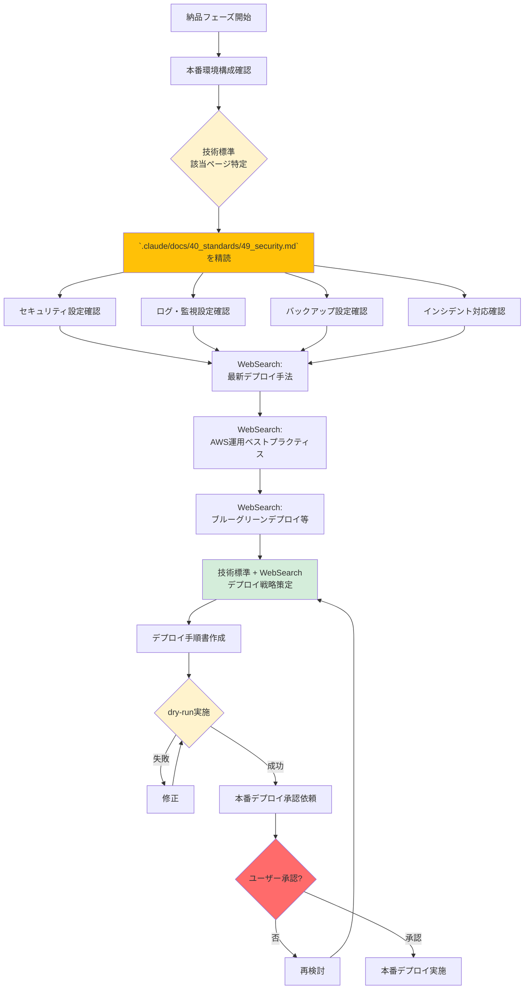

# 2.6.0 事前調査（納品フェーズ）

## 📋 このドキュメントの目的

納品フェーズ開始前に、**技術標準運用標準を参照**し、最新のデプロイ・運用ベストプラクティスを調査することで、安全で確実な本番リリースを実現する。

**重要:** テストフェーズで検証したシステムを、**どう本番環境にデプロイし、運用するか**を技術標準に基づいて確認する。

---

## ⭐⭐⭐ 技術標準の参照（最重要）

### デプロイ・運用設計前に必ず参照すべき技術標準ファイル

納品フェーズでは、**デプロイ・運用設計前に必ず技術標準（`.claude/docs/40_standards/`）を参照**する。

#### 全プロジェクト共通（必須）

1. **セキュリティ・運用基準**
   - `4.9 セキュリティ・運用基準` ⭐⭐⭐全プロジェクト必須
   - 本番環境セキュリティ設定
   - ログ・監視設定
   - バックアップ・リカバリ設定
   - インシデント対応手順

#### インフラ標準

**実装フェーズで使用したIaC方式に応じて参照:**

1. **AWS CloudFormation**
   - `4.3 AWS CloudFormation規約` - デプロイセクション
   - スタック作成・更新手順
   - ロールバック設定
   - 本番環境保護設定

2. **Terraform**
   - `4.4 Terraform規約` - デプロイセクション
   - terraform apply 手順
   - ステート管理
   - 本番環境保護設定

#### アプリケーション標準

1. **Python プロジェクト**
   - `4.5 Python規約` - デプロイ・運用セクション
   - Docker イメージビルド
   - 環境変数管理
   - ログ設定

2. **Node.js/TypeScript プロジェクト**
   - `4.6 Node.js/TypeScript規約` - デプロイ・運用セクション
   - ビルド手順
   - 環境変数管理
   - ログ設定

3. **C# .NET Core プロジェクト**
   - `4.7 C# .NET Core規約` - デプロイ・運用セクション
   - ビルド・発行手順
   - 環境変数管理
   - ログ設定

4. **Go言語プロジェクト**
   - `4.8 Go言語規約` - デプロイ・運用セクション
   - ビルド手順
   - 環境変数管理
   - ログ設定

---

## 🔍 納品フェーズの事前調査フロー



---

## 📂 事前調査の項目

### 1. 技術標準の精読 ⭐⭐⭐

#### 目的
テストフェーズで検証したシステムを、**社内運用標準を遵守して本番環境にデプロイ**する。

#### 調査内容

**セキュリティ設定（`.claude/docs/40_standards/49_security.md`）:**
```
必須設定項目:
- VPC設定（プライベートサブネット配置）
- セキュリティグループ（最小権限）
- IAMロール（最小権限）
- シークレット管理（AWS Secrets Manager / Parameter Store）
- TLS/SSL証明書（ACM）
- WAF設定（SQLインジェクション、XSS対策）
```

**ログ・監視設定（`.claude/docs/40_standards/49_security.md`）:**
```
必須設定項目:
- CloudWatch Logs（アプリケーションログ）
- CloudWatch Metrics（CPU、メモリ、ディスク）
- CloudWatch Alarms（閾値超過時アラート）
- X-Ray（分散トレーシング）
- SNS通知（アラート通知先）
```

**バックアップ・リカバリ設定（`.claude/docs/40_standards/49_security.md`）:**
```
必須設定項目:
- RDS自動バックアップ（日次）
- RDSスナップショット（週次）
- S3バケットバージョニング
- S3ライフサイクルポリシー
- DynamoDB バックアップ（該当する場合）
- リカバリ手順書
```

**インシデント対応手順（`.claude/docs/40_standards/49_security.md`）:**
```
必須手順:
1. インシデント検知（CloudWatch Alarms）
2. 影響範囲確認（監視ダッシュボード）
3. 一時対応（ロールバック、スケールアップ等）
4. 根本原因分析（ログ調査）
5. 恒久対策実施
6. 事後報告書作成
```

#### Good Example

```yaml
# `.claude/docs/40_standards/49_security.md` 準拠 CloudFormation テンプレート（セキュリティ設定）

Resources:
  # VPC（プライベートサブネット）
  PrivateSubnet:
    Type: AWS::EC2::Subnet
    Properties:
      VpcId: !Ref VPC
      CidrBlock: 10.0.1.0/24
      MapPublicIpOnLaunch: false  # プライベート

  # セキュリティグループ（最小権限）
  AppSecurityGroup:
    Type: AWS::EC2::SecurityGroup
    Properties:
      GroupDescription: Application Security Group
      VpcId: !Ref VPC
      SecurityGroupIngress:
        - IpProtocol: tcp
          FromPort: 443
          ToPort: 443
          SourceSecurityGroupId: !Ref ALBSecurityGroup  # ALBからのみ

  # IAMロール（最小権限）
  AppRole:
    Type: AWS::IAM::Role
    Properties:
      AssumeRolePolicyDocument:
        Version: '2012-10-17'
        Statement:
          - Effect: Allow
            Principal:
              Service: ecs-tasks.amazonaws.com
            Action: sts:AssumeRole
      ManagedPolicyArns:
        - arn:aws:iam::aws:policy/service-role/AmazonECSTaskExecutionRolePolicy
      Policies:
        - PolicyName: SecretsManagerAccess
          PolicyDocument:
            Version: '2012-10-17'
            Statement:
              - Effect: Allow
                Action:
                  - secretsmanager:GetSecretValue
                Resource: !Ref DBPasswordSecret  # 特定のシークレットのみ

  # Secrets Manager（シークレット管理）
  DBPasswordSecret:
    Type: AWS::SecretsManager::Secret
    Properties:
      Name: /myapp/prod/db/password
      GenerateSecretString:
        SecretStringTemplate: '{"username": "admin"}'
        GenerateStringKey: password
        PasswordLength: 32
        ExcludeCharacters: '"@/\'

  # CloudWatch Logs（ログ記録）
  AppLogGroup:
    Type: AWS::Logs::LogGroup
    Properties:
      LogGroupName: /aws/ecs/myapp
      RetentionInDays: 30  # 30日間保持

  # CloudWatch Alarm（監視）
  HighCPUAlarm:
    Type: AWS::CloudWatch::Alarm
    Properties:
      AlarmName: myapp-high-cpu
      MetricName: CPUUtilization
      Namespace: AWS/ECS
      Statistic: Average
      Period: 300
      EvaluationPeriods: 2
      Threshold: 80.0
      ComparisonOperator: GreaterThanThreshold
      AlarmActions:
        - !Ref SNSTopic

  # SNS Topic（アラート通知）
  SNSTopic:
    Type: AWS::SNS::Topic
    Properties:
      Subscription:
        - Endpoint: ops-team@example.com
          Protocol: email
```

**Bad Example:**
```yaml
# ❌ セキュリティ設定不足

Resources:
  AppSecurityGroup:
    Type: AWS::EC2::SecurityGroup
    Properties:
      SecurityGroupIngress:
        - IpProtocol: tcp
          FromPort: 0
          ToPort: 65535
          CidrIp: 0.0.0.0/0  # ❌ 全ポート開放

  AppRole:
    Type: AWS::IAM::Role
    Properties:
      ManagedPolicyArns:
        - arn:aws:iam::aws:policy/AdministratorAccess  # ❌ 過剰な権限
```

---

### 2. 最新デプロイ手法調査（WebSearch）

#### 目的
2025年時点での**モダンなデプロイ手法**を調査し、技術標準標準と組み合わせる。

#### WebSearch クエリ例

**デプロイ戦略:**
```
検索クエリ:
- "Blue-Green deployment AWS 2025"
- "Canary deployment best practices 2025"
- "Rolling deployment vs Blue-Green 2025"
- "Zero-downtime deployment strategies"
```

**CI/CDパイプライン:**
```
検索クエリ:
- "AWS CodePipeline best practices 2025"
- "GitHub Actions AWS deployment 2025"
- "GitOps deployment strategies 2025"
```

**コンテナデプロイ:**
```
検索クエリ:
- "ECS deployment strategies 2025"
- "EKS deployment best practices 2025"
- "Docker image security scanning 2025"
```

#### 記録内容

調査結果を `.claude-state/research-deployment-{timestamp}.md` に記録:

```markdown
# 納品フェーズ事前調査 - {プロジェクト名}

**調査日**: 2025-01-27
**対象環境**: AWS ECS (Fargate)

## 技術標準確認

**参照ページ**: 4.9 セキュリティ・運用基準

**セキュリティ設定**:
- VPC: プライベートサブネット配置
- セキュリティグループ: 最小権限（ALBからのみ）
- IAMロール: 最小権限（必要なリソースのみ）
- シークレット管理: AWS Secrets Manager
- TLS/SSL: ACM証明書
- WAF: SQLインジェクション、XSS対策ルール

**ログ・監視**:
- CloudWatch Logs: アプリケーションログ
- CloudWatch Metrics: CPU、メモリ、リクエスト数
- CloudWatch Alarms: CPU 80%超過、エラー率5%超過
- X-Ray: 分散トレーシング
- SNS: ops-team@example.com に通知

**バックアップ**:
- RDS: 自動バックアップ（日次）、スナップショット（週次）
- S3: バージョニング有効、ライフサイクルポリシー（90日後Glacier）

## 最新デプロイ手法調査（WebSearch）

**ブルーグリーンデプロイ**:
- 定義: 本番環境（Blue）と新環境（Green）を並行運用
- 切り替え: ALBのターゲットグループを切り替え
- ロールバック: 即座にBlueに戻せる
- 推奨: ダウンタイムゼロが必須の場合

**カナリアデプロイ**:
- 定義: 新バージョンを一部ユーザーのみに公開
- 切り替え: トラフィックを段階的に増加（5% → 25% → 50% → 100%）
- ロールバック: エラー率上昇時に自動ロールバック
- 推奨: リスクを最小化したい場合（2025年のトレンド）

**ECS デプロイ設定（2025年推奨）**:
```json
{
  "deploymentConfiguration": {
    "deploymentCircuitBreaker": {
      "enable": true,
      "rollback": true
    },
    "maximumPercent": 200,
    "minimumHealthyPercent": 100
  }
}
```
- デプロイサーキットブレーカー有効化
- ヘルスチェック失敗時に自動ロールバック

## CI/CDパイプライン調査

**GitHub Actions + AWS CodeDeploy（2025年推奨）**:
1. GitHub Actions でテスト・ビルド
2. ECR にDockerイメージpush
3. CodeDeploy でECSにデプロイ（ブルーグリーン）
4. ヘルスチェック
5. 成功時にトラフィック切り替え

## デプロイ戦略

1. **デプロイ方式**: ブルーグリーンデプロイ（ECS）
2. **CI/CDツール**: GitHub Actions + AWS CodeDeploy
3. **デプロイ前確認**:
   - dry-run（terraform plan / cfn validate）
   - セキュリティスキャン（Trivy）
   - ユーザー承認
4. **デプロイ手順**:
   - ステージング環境で検証
   - 本番環境にdry-run
   - ユーザー承認取得
   - 本番デプロイ実施
   - ヘルスチェック
   - スモークテスト
5. **ロールバック手順**:
   - エラー検知（CloudWatch Alarms）
   - 旧バージョンに即座に切り戻し
```

---

### 3. AWS運用ベストプラクティス調査（WebSearch）

#### 目的
AWS Well-Architected Framework に基づいた**運用ベストプラクティス**を調査する。

#### WebSearch クエリ例

```
検索クエリ:
- "AWS Well-Architected Framework 2025"
- "AWS operational excellence best practices"
- "AWS cost optimization 2025"
- "AWS reliability pillar best practices"
```

#### Good Example

```markdown
## WebSearch結果: AWS Well-Architected Framework 2025

**6つの柱**:
1. Operational Excellence（運用の優秀性）
2. Security（セキュリティ）
3. Reliability（信頼性）
4. Performance Efficiency（パフォーマンス効率）
5. Cost Optimization（コスト最適化）
6. Sustainability（持続可能性） ← 2025年追加

**運用の優秀性（本納品フェーズで重要）**:
- Infrastructure as Code（IaC）の使用 ✅
- 変更管理の自動化 ✅
- 定期的な運用レビュー
- 失敗から学ぶ（ポストモーテム）

**信頼性（本納品フェーズで重要）**:
- 自動復旧の仕組み（Auto Scaling）
- バックアップ・リストア手順の確立
- マルチAZ構成
- 障害テスト（Chaos Engineering）

**コスト最適化**:
- リザーブドインスタンス（長期稼働）
- Savings Plans
- 不要リソースの削除
- コスト配分タグ
```

---

### 4. 運用ドキュメント調査（WebSearch）

#### 目的
納品時に提供すべき**運用ドキュメント**のテンプレートを調査する。

#### WebSearch クエリ例

```
検索クエリ:
- "Operation manual template 2025"
- "System handover document template"
- "Incident response playbook template"
- "Runbook template AWS"
```

#### 必要なドキュメント

**1. システム運用手順書:**
```markdown
# システム運用手順書

## 日次運用
- [ ] ログ確認（CloudWatch Logs）
- [ ] メトリクス確認（CPU、メモリ、エラー率）
- [ ] バックアップ確認（RDSスナップショット）

## 週次運用
- [ ] セキュリティパッチ確認
- [ ] コスト確認（AWS Cost Explorer）
- [ ] 容量計画レビュー

## 月次運用
- [ ] アクセスログ分析
- [ ] パフォーマンスレビュー
- [ ] セキュリティレビュー
```

**2. インシデント対応手順書:**
```markdown
# インシデント対応手順書

## Severity 1（緊急：サービス停止）
1. 検知: CloudWatch Alarms → SNS通知
2. 初動対応（15分以内）:
   - 影響範囲確認
   - ステークホルダー通知
   - ロールバック実施
3. 復旧作業:
   - 原因特定（CloudWatch Logs, X-Ray）
   - 恒久対策実施
4. 事後報告:
   - ポストモーテム作成
   - 再発防止策策定
```

**3. ロールバック手順書:**
```markdown
# ロールバック手順書

## ECS ロールバック手順
1. AWS Management Console → ECS → クラスター選択
2. サービス選択 → 「更新」
3. タスク定義で前のリビジョンを選択
4. 「サービスの更新」実行
5. デプロイ完了確認（5分程度）

## Terraform ロールバック手順
1. Git で前のコミットに戻す
   ```bash
   git revert HEAD
   ```
2. terraform plan 実行（dry-run）
3. ユーザー承認取得
4. terraform apply 実行
```

---

## 🚀 デプロイ前のチェックリスト

### 技術標準確認

- [ ] `.claude/docs/40_standards/49_security.md` セキュリティ・運用基準を確認した
- [ ] セキュリティ設定（VPC、SG、IAM、Secrets Manager）を確認した
- [ ] ログ・監視設定（CloudWatch）を確認した
- [ ] バックアップ設定（RDS、S3）を確認した
- [ ] インシデント対応手順を確認した

### 最新情報調査

- [ ] 最新デプロイ手法を調査した（ブルーグリーン/カナリア）
- [ ] AWS Well-Architected Framework を確認した
- [ ] 運用ドキュメントテンプレートを調査した

### デプロイ準備

- [ ] dry-run を実施した（terraform plan / cfn validate）
- [ ] セキュリティスキャンを実施した（Trivy等）
- [ ] ステージング環境で検証した
- [ ] ロールバック手順を確認した
- [ ] ユーザー承認を取得した

### 運用ドキュメント作成

- [ ] システム運用手順書を作成した
- [ ] インシデント対応手順書を作成した
- [ ] ロールバック手順書を作成した
- [ ] アーキテクチャ図を作成した

### 調査結果記録

- [ ] `.claude-state/research-deployment-{timestamp}.md` に記録した
- [ ] 技術標準準拠ポイントを明記した
- [ ] WebSearch結果を統合した
- [ ] デプロイ戦略を明確にした

---

## 💡 納品フェーズ事前調査のコツ

### 1. `.claude/docs/40_standards/49_security.md`を最優先

**Good:**
```
1. `.claude/docs/40_standards/49_security.md` セキュリティ・運用基準を精読
2. WebSearchでAWS Well-Architected Frameworkを確認
3. 技術標準に準拠したデプロイ設計
```

**Bad:**
```
1. WebSearchでモダンなデプロイ手法を調査
2. 技術標準を無視して本番デプロイ
→ セキュリティ設定不足、運用トラブル
```

---

### 2. dry-run必須

**Good:**
```
- terraform plan / cfn validate で事前確認
- ステージング環境で検証
- ユーザー承認取得後に本番デプロイ
```

**Bad:**
```
- dry-runせずに本番デプロイ
→ 設定ミスで本番障害
```

---

### 3. ロールバック手順を必ず準備

**Good:**
```
- ロールバック手順書を事前作成
- ロールバックテストを実施
- エラー検知時に即座にロールバック
```

**Bad:**
```
- ロールバック手順を用意せずデプロイ
- 障害時にパニック
→ 長時間のサービス停止
```

---

### 4. 運用ドキュメントを必ず作成

**Good:**
```
- システム運用手順書
- インシデント対応手順書
- ロールバック手順書
- アーキテクチャ図
→ 運用チームがスムーズに引き継げる
```

**Bad:**
```
- ドキュメントなしで納品
→ 運用チームが困る、問い合わせ殺到
```

---

## 📝 まとめ

### 納品フェーズ事前調査の本質

**「技術標準運用標準を基盤に、最新デプロイ手法を組み合わせる」**

1. **`.claude/docs/40_standards/49_security.md`を最優先** - セキュリティ・運用基準遵守
2. **WebSearchで最新デプロイ手法補完** - ブルーグリーン/カナリア
3. **dry-run必須** - 本番環境保護
4. **ロールバック手順準備** - 障害時即座復旧
5. **運用ドキュメント作成** - 運用チーム引き継ぎ

これにより、**安全で確実な本番リリース**を実現できる。

### AIファシリテーターとしての心構え

1. **デプロイ前に必ず`.claude/docs/40_standards/49_security.md`参照**
2. **dry-runなしに本番操作は絶対禁止**
3. **ユーザー承認なしに本番デプロイ禁止**
4. **ロールバック手順を必ず準備**
5. **運用ドキュメントを必ず作成**
6. **ユーザーにデプロイ戦略を説明してから実施**

---

**最終更新**: 2025-10-19
**作成者**: Claude (AI開発ファシリテーター)
