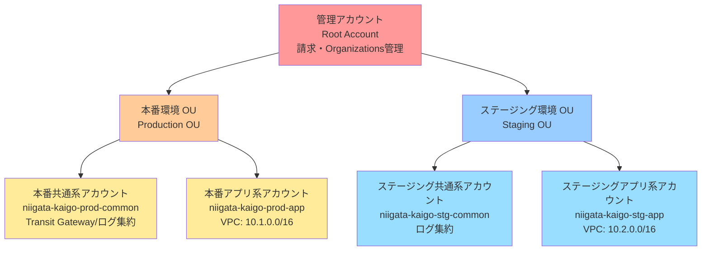
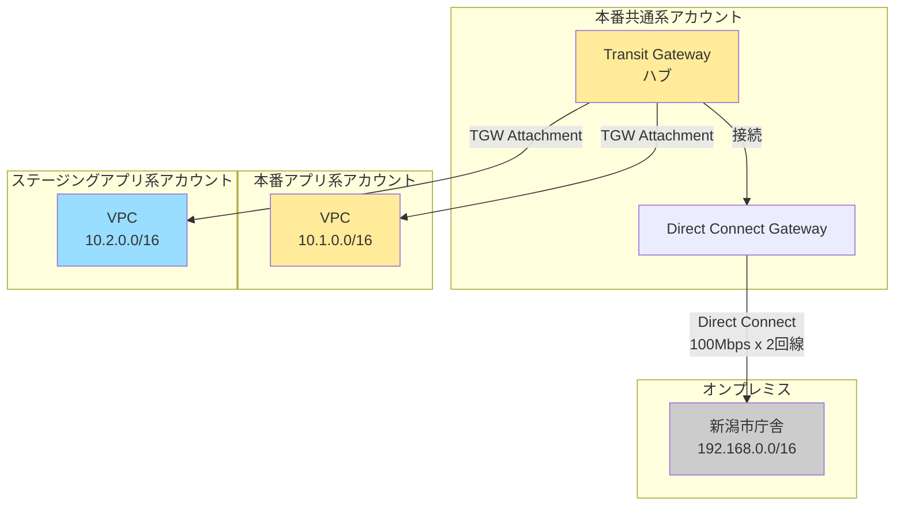
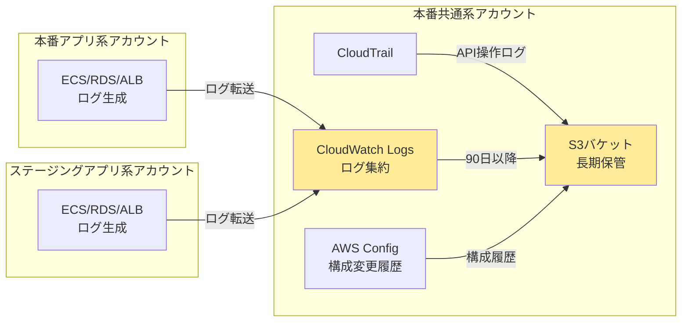
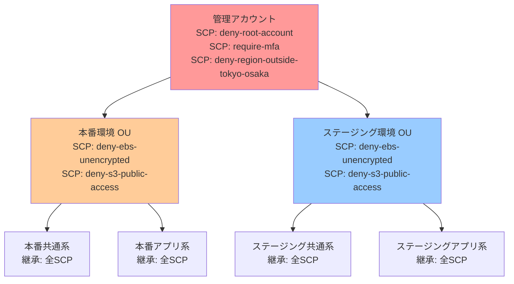
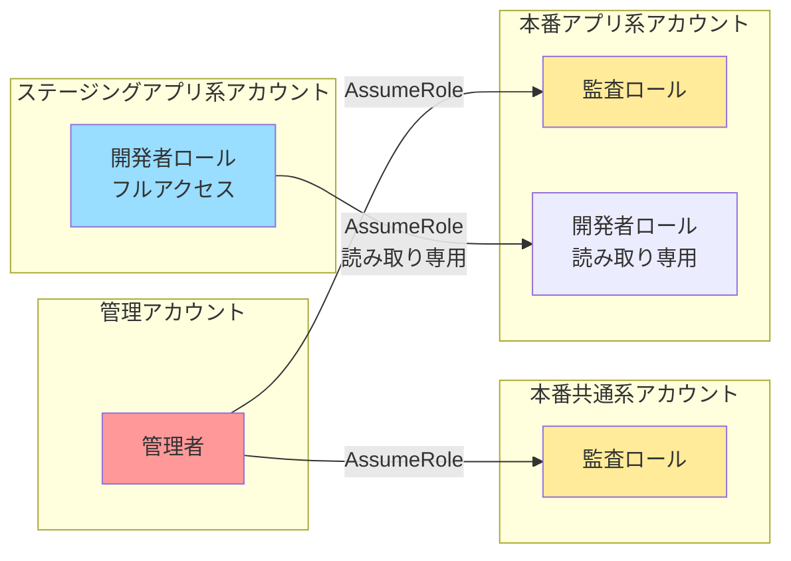

# アカウント構成図

## AWS Organizations 構成図

---

## アカウント間接続図（Transit Gateway）

---

## ログ集約フロー

---

## SCP適用範囲

---

## IAM ロール（クロスアカウントアクセス）

---

## 責務分離マトリクス

| リソース種別 | 管理アカウント | 本番共通系 | 本番アプリ系 | ステージング共通系 | ステージングアプリ系 |
|------------|-------------|----------|----------|----------------|-----------------|
| Organizations | ✅ | - | - | - | - |
| SCP | ✅ | - | - | - | - |
| 請求管理 | ✅ | - | - | - | - |
| Transit Gateway | - | ✅ | - | - | - |
| Direct Connect | - | ✅ | - | - | - |
| CloudTrail（集約） | - | ✅ | - | - | - |
| AWS Config（集約） | - | ✅ | - | - | - |
| VPC | - | - | ✅ | - | ✅ |
| ECS | - | - | ✅ | - | ✅ |
| RDS | - | - | ✅ | - | ✅ |
| S3（アプリデータ） | - | - | ✅ | - | ✅ |

---

## 環境別リソース比較

| リソース | 本番環境 | ステージング環境 |
|---------|---------|----------------|
| RDS | Multi-AZ、db.t3.medium | Single-AZ、db.t3.small |
| ECS | Fargate 2vCPU/4GB | Fargate 1vCPU/2GB |
| ElastiCache | cache.t3.medium | cache.t3.small |
| NAT Gateway | 2個（Multi-AZ） | 1個（Single-AZ） |
| Direct Connect | 共有 | 共有 |
| バックアップ保持期間 | 30日間 | 7日間 |

---

## 次のステップ

- [SCPポリシー例を確認](./scp_policies.json)
- [ネットワーク設計を確認](../03_network/)
