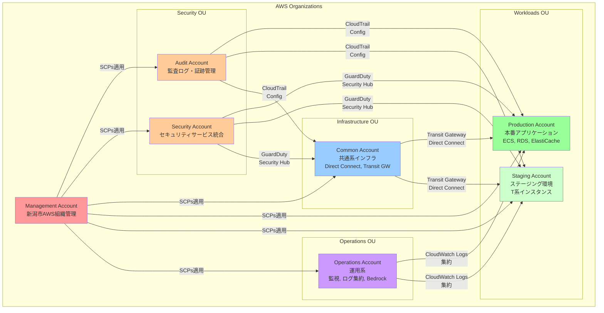
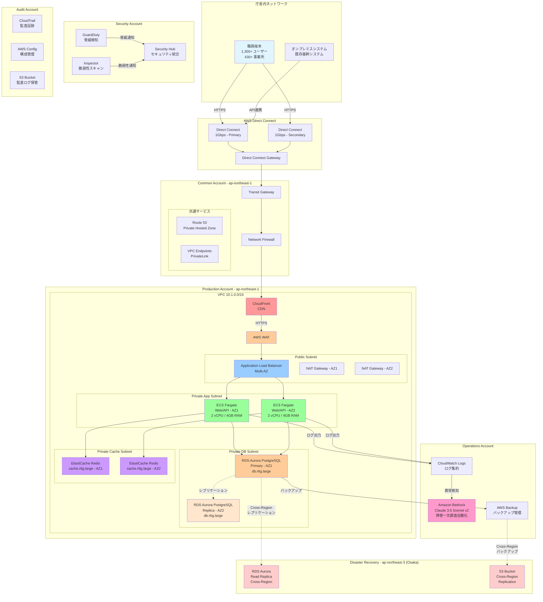
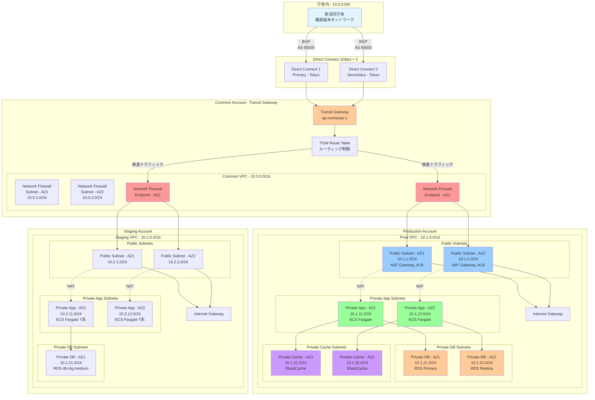
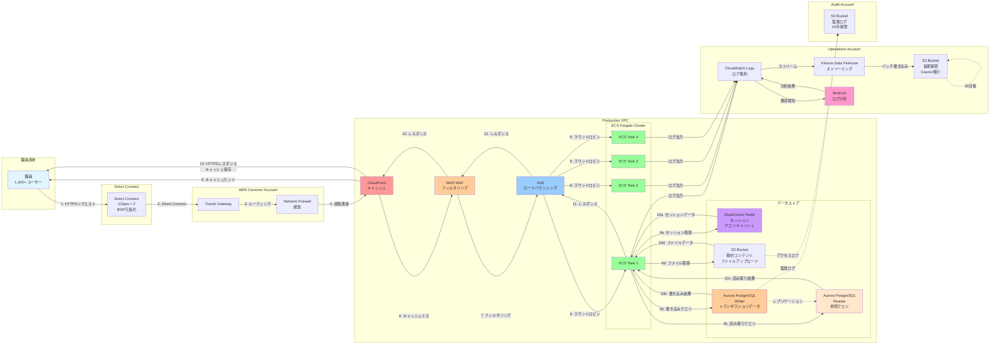
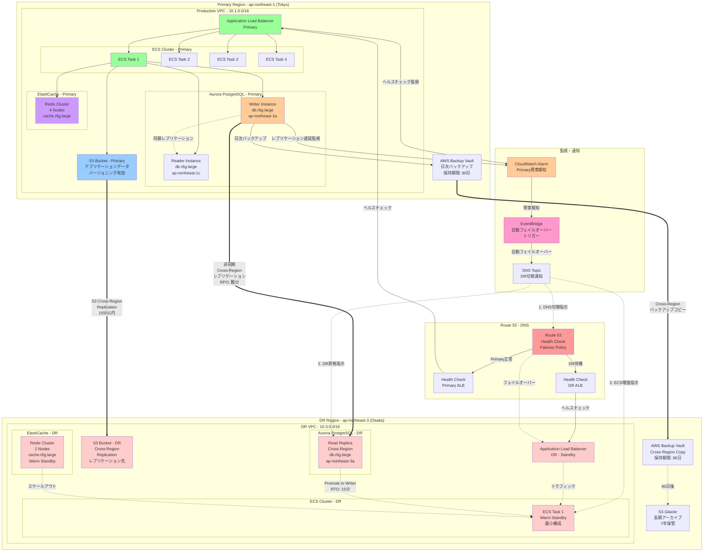

# システム構成図

## 目次

1. [マルチアカウント構成図](#1-マルチアカウント構成図)
2. [全体システム構成図](#2-全体システム構成図)
3. [ネットワーク構成図](#3-ネットワーク構成図)
4. [本番環境詳細構成図](#4-本番環境詳細構成図)
5. [セキュリティ構成図](#5-セキュリティ構成図)
6. [データフロー図](#6-データフロー図)
7. [DR構成図](#7-dr構成図)

---

## 1. マルチアカウント構成図

---

## 2. 全体システム構成図

---

## 3. ネットワーク構成図

---

## 4. 本番環境詳細構成図

```mermaid
graph TB
    subgraph "Internet"
        INTERNET[インターネット]
    end

    subgraph "CloudFront Distribution"
        CF[CloudFront<br/>グローバルエッジロケーション<br/>TLS 1.3]
    end

    subgraph "Production VPC - 10.1.0.0/16 - ap-northeast-1"
        subgraph "AWS WAF"
            WAF[WAF WebACL<br/>OWASP Top 10対策<br/>Rate Limiting]
        end

        subgraph "Public Subnet - AZ1 (10.1.1.0/24)"
            ALB1[Application Load Balancer<br/>Target Group: ECS<br/>Health Check: /health]
            NAT1[NAT Gateway<br/>固定EIP]
        end

        subgraph "Public Subnet - AZ2 (10.1.2.0/24)"
            NAT2[NAT Gateway<br/>固定EIP]
        end

        subgraph "Private App Subnet - AZ1 (10.1.11.0/24)"
            ECS_TASK1_1[ECS Task 1<br/>Web/API Container<br/>2 vCPU / 4GB]
            ECS_TASK1_2[ECS Task 2<br/>Web/API Container<br/>2 vCPU / 4GB]

            subgraph "Container"
                APP1[Application<br/>Node.js / Python]
                XRAY1[X-Ray Daemon<br/>分散トレーシング]
            end
        end

        subgraph "Private App Subnet - AZ2 (10.1.12.0/24)"
            ECS_TASK2_1[ECS Task 3<br/>Web/API Container<br/>2 vCPU / 4GB]
            ECS_TASK2_2[ECS Task 4<br/>Web/API Container<br/>2 vCPU / 4GB]
        end

        subgraph "Private DB Subnet - AZ1 (10.1.21.0/24)"
            RDS_W[Aurora PostgreSQL<br/>Writer Instance<br/>db.r6g.large<br/>2 vCPU / 16GB RAM]
        end

        subgraph "Private DB Subnet - AZ2 (10.1.22.0/24)"
            RDS_R[Aurora PostgreSQL<br/>Reader Instance<br/>db.r6g.large<br/>2 vCPU / 16GB RAM]
        end

        subgraph "Private Cache Subnet - AZ1 (10.1.31.0/24)"
            REDIS_M[ElastiCache Redis<br/>Primary Node<br/>cache.r6g.large<br/>13.07GB RAM]
            REDIS_R1[ElastiCache Redis<br/>Replica Node 1]
        end

        subgraph "Private Cache Subnet - AZ2 (10.1.32.0/24)"
            REDIS_R2[ElastiCache Redis<br/>Replica Node 2]
            REDIS_R3[ElastiCache Redis<br/>Replica Node 3]
        end

        subgraph "VPC Endpoints"
            EP_S3[S3 Gateway Endpoint]
            EP_ECR_API[ECR API Endpoint<br/>PrivateLink]
            EP_ECR_DKR[ECR DKR Endpoint<br/>PrivateLink]
            EP_LOGS[CloudWatch Logs<br/>Endpoint]
            EP_SECRETS[Secrets Manager<br/>Endpoint]
        end

        subgraph "Security Groups"
            SG_ALB[SG: ALB<br/>Ingress: 443<br/>Egress: ECS]
            SG_ECS[SG: ECS<br/>Ingress: ALB only<br/>Egress: DB, Cache]
            SG_RDS[SG: RDS<br/>Ingress: ECS only 5432<br/>Egress: None]
            SG_REDIS[SG: Redis<br/>Ingress: ECS only 6379<br/>Egress: None]
        end
    end

    subgraph "AWS Managed Services"
        ECR[ECR<br/>Container Registry<br/>イメージスキャン有効]
        SECRETS[Secrets Manager<br/>DB認証情報<br/>自動ローテーション]
        KMS[KMS<br/>暗号化キー管理<br/>CMK]
        S3[S3 Bucket<br/>静的コンテンツ<br/>アプリケーションログ]
        CW[CloudWatch Logs<br/>アプリケーションログ<br/>保持期間: 90日]
        XRAY_SVC[AWS X-Ray<br/>トレース分析]
    end

    INTERNET -->|HTTPS| CF
    CF -->|HTTPS| WAF
    WAF -->|HTTPS| ALB1

    ALB1 -->|HTTP 8080| ECS_TASK1_1
    ALB1 -->|HTTP 8080| ECS_TASK1_2
    ALB1 -->|HTTP 8080| ECS_TASK2_1
    ALB1 -->|HTTP 8080| ECS_TASK2_2

    ECS_TASK1_1 -->|PostgreSQL 5432| RDS_W
    ECS_TASK1_2 -->|PostgreSQL 5432| RDS_W
    ECS_TASK2_1 -->|PostgreSQL 5432| RDS_W
    ECS_TASK2_2 -->|PostgreSQL 5432| RDS_W

    ECS_TASK1_1 -->|Read Query| RDS_R
    ECS_TASK2_1 -->|Read Query| RDS_R

    RDS_W -.->|同期レプリケーション| RDS_R

    ECS_TASK1_1 -->|Redis 6379| REDIS_M
    ECS_TASK1_2 -->|Redis 6379| REDIS_M
    ECS_TASK2_1 -->|Redis 6379| REDIS_M
    ECS_TASK2_2 -->|Redis 6379| REDIS_M

    REDIS_M -.->|非同期レプリケーション| REDIS_R1
    REDIS_M -.->|非同期レプリケーション| REDIS_R2
    REDIS_M -.->|非同期レプリケーション| REDIS_R3

    ECS_TASK1_1 -->|コンテナイメージ取得| EP_ECR_API
    ECS_TASK1_1 -->|コンテナイメージ取得| EP_ECR_DKR

    EP_ECR_API --> ECR
    EP_ECR_DKR --> ECR

    ECS_TASK1_1 -->|DB認証情報取得| EP_SECRETS
    EP_SECRETS --> SECRETS

    ECS_TASK1_1 -->|ログ出力| EP_LOGS
    EP_LOGS --> CW

    APP1 -->|トレース送信| XRAY1
    XRAY1 --> XRAY_SVC

    ECS_TASK1_1 -->|静的コンテンツ| EP_S3
    EP_S3 --> S3

    RDS_W -->|暗号化| KMS
    SECRETS -->|暗号化| KMS
    S3 -->|暗号化| KMS

    style CF fill:#ff9999
    style WAF fill:#ffcc99
    style ALB1 fill:#99ccff
    style ECS_TASK1_1 fill:#99ff99
    style ECS_TASK1_2 fill:#99ff99
    style ECS_TASK2_1 fill:#99ff99
    style ECS_TASK2_2 fill:#99ff99
    style RDS_W fill:#ffcc99
    style RDS_R fill:#ffe6cc
    style REDIS_M fill:#cc99ff
    style REDIS_R1 fill:#e6ccff
    style REDIS_R2 fill:#e6ccff
    style REDIS_R3 fill:#e6ccff
```

---

## 5. セキュリティ構成図

```mermaid
graph TB
    subgraph "Security Account - セキュリティ統合"
        SECHUB[Security Hub<br/>セキュリティ統合ダッシュボード<br/>CIS Benchmark]
        GUARD[GuardDuty<br/>脅威検知<br/>機械学習ベース]
        INSPECTOR[Inspector<br/>脆弱性スキャン<br/>CVE検出]
        MACIE[Macie<br/>機密データ検出<br/>S3スキャン]
    end

    subgraph "Audit Account - 監査・証跡"
        TRAIL[CloudTrail<br/>API操作ログ<br/>全アカウント統合]
        CONFIG[AWS Config<br/>構成変更履歴<br/>コンプライアンス]
        S3_AUDIT[S3 Bucket<br/>監査ログ保管<br/>暗号化 + MFA削除]
    end

    subgraph "Production Account - 本番環境"
        subgraph "境界防御"
            WAF_PROD[AWS WAF<br/>WebACL<br/>- SQLi防御<br/>- XSS防御<br/>- Rate Limiting]
            NFW_PROD[Network Firewall<br/>- IDS/IPS<br/>- ドメインフィルタリング]
            SHIELD[AWS Shield Standard<br/>DDoS防御]
        end

        subgraph "アクセス制御"
            IAM_PROD[IAM Roles<br/>- ECS Task Role<br/>- Lambda Execution Role<br/>最小権限の原則]
            COGNITO[Amazon Cognito<br/>ユーザー認証<br/>MFA必須]
        end

        subgraph "暗号化"
            KMS_PROD[KMS CMK<br/>- RDS暗号化<br/>- S3暗号化<br/>- Secrets Manager]
            ACM[AWS Certificate Manager<br/>TLS証明書管理<br/>自動更新]
        end

        subgraph "ネットワーク分離"
            SG_PROD[Security Groups<br/>ステートフルファイアウォール<br/>最小権限ルール]
            NACL[Network ACLs<br/>ステートレスファイアウォール<br/>サブネット境界防御]
            PRIVLINK[VPC PrivateLink<br/>AWS Endpoints<br/>インターネット経由なし]
        end

        subgraph "データ保護"
            RDS_ENC[RDS暗号化<br/>保管時: KMS<br/>転送時: TLS]
            S3_ENC[S3暗号化<br/>SSE-KMS<br/>バージョニング有効]
            BACKUP_ENC[AWS Backup<br/>暗号化バックアップ<br/>Cross-Region]
        end

        subgraph "ログ・監視"
            FLOWLOG[VPC Flow Logs<br/>全ネットワークトラフィック<br/>CloudWatch Logs]
            CLOUDWATCH[CloudWatch Alarms<br/>異常検知<br/>自動通知]
            XRAY[AWS X-Ray<br/>分散トレーシング<br/>セキュリティ異常検出]
        end
    end

    subgraph "Operations Account - 運用監視"
        BEDROCK_SEC[Bedrock<br/>セキュリティインシデント<br/>一次調査自動化]
        SNS[SNS Topics<br/>セキュリティアラート通知<br/>エスカレーション]
        EVENTBRIDGE[EventBridge<br/>セキュリティイベント<br/>自動対応]
    end

    subgraph "外部連携"
        DIRECTCONNECT[Direct Connect<br/>専用線接続<br/>MACsec暗号化]
        VPN_BACKUP[Site-to-Site VPN<br/>バックアップ接続<br/>IPsec]
    end

    GUARD -->|脅威検知結果| SECHUB
    INSPECTOR -->|脆弱性レポート| SECHUB
    MACIE -->|機密データ検出| SECHUB
    CONFIG -->|コンプライアンス評価| SECHUB

    TRAIL -->|全API操作| S3_AUDIT
    CONFIG -->|構成変更履歴| S3_AUDIT

    WAF_PROD -->|攻撃ブロック| SECHUB
    NFW_PROD -->|侵入検知| SECHUB

    GUARD -->|異常検知| EVENTBRIDGE
    SECHUB -->|重要度High| EVENTBRIDGE

    EVENTBRIDGE -->|自動調査| BEDROCK_SEC
    EVENTBRIDGE -->|アラート送信| SNS

    FLOWLOG -->|トラフィック分析| CLOUDWATCH
    CLOUDWATCH -->|閾値超過| SNS

    KMS_PROD -->|鍵使用ログ| TRAIL
    IAM_PROD -->|権限変更| CONFIG

    SG_PROD -.->|通信制御| RDS_ENC
    SG_PROD -.->|通信制御| S3_ENC

    PRIVLINK -.->|プライベート接続| RDS_ENC
    PRIVLINK -.->|プライベート接続| S3_ENC

    DIRECTCONNECT -.->|暗号化通信| NFW_PROD
    VPN_BACKUP -.->|バックアップ経路| NFW_PROD

    style SECHUB fill:#ff9999
    style GUARD fill:#ffcc99
    style WAF_PROD fill:#ff9999
    style NFW_PROD fill:#ff9999
    style KMS_PROD fill:#ffcc99
    style IAM_PROD fill:#99ccff
    style COGNITO fill:#99ccff
    style TRAIL fill:#cc99ff
    style CONFIG fill:#cc99ff
    style BEDROCK_SEC fill:#ff99cc
```

---

## 6. データフロー図

---

## 7. DR構成図

---

## 災害復旧指標

### RPO (Recovery Point Objective) - 目標復旧時点

| サービス | RPO | レプリケーション方式 |
|---------|-----|-------------------|
| Aurora PostgreSQL | **5分以内** | Cross-Region 非同期レプリケーション |
| S3 バケット | **15分以内** | S3 Cross-Region Replication |
| AWS Backup | **24時間** | 日次バックアップの Cross-Region コピー |

### RTO (Recovery Time Objective) - 目標復旧時間

| フェイルオーバーシナリオ | RTO | 手順 |
|------------------------|-----|------|
| Route 53 DNS切替 | **5分** | Health Checkによる自動切替 |
| Aurora DR昇格 | **15分** | Read ReplicaをWriter Instanceに昇格 |
| ECS Fargate スケールアウト | **10分** | Desired Countを本番相当に増加 |
| **合計 RTO** | **30分以内** | 自動フェイルオーバー + 手動確認 |

---

## 構成図の凡例

| 色 | 意味 |
|----|------|
| 🟥 赤系 | 境界防御・CDN・DNS |
| 🟧 オレンジ系 | セキュリティサービス・暗号化 |
| 🟦 青系 | ネットワーク・ロードバランサー |
| 🟩 緑系 | アプリケーション・コンピューティング |
| 🟪 紫系 | キャッシュ・運用自動化 |
| ⬜ ピンク系 | 災害復旧・バックアップ |

| 線の種類 | 意味 |
|---------|------|
| 実線 `→` | データフロー・通信経路 |
| 点線 `-.->` | レプリケーション・バックアップ |
| 太線 `==>` | Cross-Region レプリケーション |

---

## 更新履歴

| 日付 | 版 | 更新内容 | 更新者 |
|------|---|---------|--------|
| 2025-11-05 | 1.0 | 初版作成 - 7種類のシステム構成図作成 | Claude |

---

**ドキュメント管理**
- ファイル名: `02_system_architecture_diagrams.md`
- 保存場所: `docs/02_design/basic/`
- 関連ドキュメント:
  - [01_aws_basic_design.md](01_aws_basic_design.md)
  - [../detailed/01_aws_detailed_design.md](../detailed/01_aws_detailed_design.md)
  - [../detailed/02_cloudformation_design.md](../detailed/02_cloudformation_design.md)
