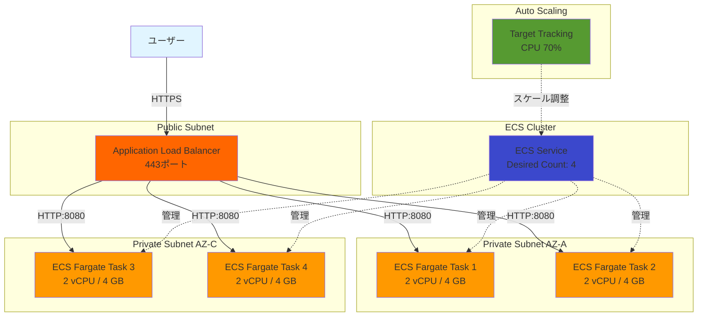

# コンピュート設計

## 概要

このドキュメントでは、新潟市介護保険サブシステムのコンピュートリソース（ECS Fargate、ALB、Auto Scaling）の設計を定義します。

---

## 設計方針

### 基本方針

1. **サーバーレスアーキテクチャ**: ECS Fargateでサーバー管理を不要に
2. **高可用性**: 2つのAZで冗長構成
3. **Auto Scaling**: 負荷に応じた自動スケーリング
4. **セキュリティ**: Private Subnet配置、最小権限の原則

---

## システム構成図



---

## Application Load Balancer (ALB) 設計

### ALB基本設定

| パラメータ | 本番環境 | ステージング環境 |
|----------|---------|---------------|
| 名前 | kaigo-prod-alb | kaigo-stg-alb |
| スキーム | internet-facing | internet-facing |
| IPアドレスタイプ | IPv4 | IPv4 |
| サブネット | kaigo-prod-public-subnet-a, kaigo-prod-public-subnet-c | kaigo-stg-public-subnet-a, kaigo-stg-public-subnet-c |
| セキュリティグループ | kaigo-prod-alb-sg | kaigo-stg-alb-sg |
| アクセスログ | 有効（S3保存） | 有効（S3保存） |
| Deletion Protection | 有効 | 無効 |
| タグ: Name | kaigo-prod-alb | kaigo-stg-alb |

### リスナー設定

**HTTPS リスナー（443ポート）**

| パラメータ | 値 |
|----------|-----|
| プロトコル | HTTPS |
| ポート | 443 |
| SSL証明書 | ACM証明書（api.kaigo.niigata.lg.jp） |
| SSL Policy | ELBSecurityPolicy-TLS13-1-2-2021-06 |
| デフォルトアクション | Forward to Target Group |

**HTTP リスナー（80ポート） - リダイレクト用**

| パラメータ | 値 |
|----------|-----|
| プロトコル | HTTP |
| ポート | 80 |
| デフォルトアクション | Redirect to HTTPS (301) |

### ターゲットグループ設定

| パラメータ | 本番環境 | ステージング環境 |
|----------|---------|---------------|
| 名前 | kaigo-prod-tg | kaigo-stg-tg |
| ターゲットタイプ | IP | IP |
| プロトコル | HTTP | HTTP |
| ポート | 8080 | 8080 |
| VPC | kaigo-prod-vpc | kaigo-stg-vpc |
| ヘルスチェックパス | /health | /health |
| ヘルスチェック間隔 | 30秒 | 30秒 |
| ヘルスチェックタイムアウト | 5秒 | 5秒 |
| 正常しきい値 | 2回 | 2回 |
| 異常しきい値 | 2回 | 2回 |
| 成功コード | 200 | 200 |
| Deregistration Delay | 30秒 | 30秒 |
| Stickiness | 有効（Cookie: 1時間） | 有効（Cookie: 1時間） |

### アクセスログ設定

| パラメータ | 値 |
|----------|-----|
| S3バケット | kaigo-prod-alb-logs |
| プレフィックス | alb-access-logs/ |
| 保管期間 | 90日 |
| 暗号化 | AES-256 |

---

## ECS Cluster 設計

### ECS Cluster

| パラメータ | 本番環境 | ステージング環境 |
|----------|---------|---------------|
| クラスター名 | kaigo-prod-cluster | kaigo-stg-cluster |
| キャパシティプロバイダー | FARGATE, FARGATE_SPOT | FARGATE |
| Container Insights | 有効 | 有効 |
| タグ: Name | kaigo-prod-cluster | kaigo-stg-cluster |
| タグ: Environment | production | staging |

### キャパシティプロバイダー戦略

**本番環境**

| キャパシティプロバイダー | 重み | ベース |
|-------------------|-----|-------|
| FARGATE | 4 | 2 |
| FARGATE_SPOT | 1 | 0 |

**説明**:
- 最低2タスクはFARGATE（高可用性）
- 追加タスクの80%はFARGATE、20%はFARGATE_SPOT（コスト削減）

**ステージング環境**

| キャパシティプロバイダー | 重み | ベース |
|-------------------|-----|-------|
| FARGATE | 1 | 1 |

**説明**:
- すべてFARGATEで安定性重視

---

## ECS Task Definition 設計

### タスク定義

| パラメータ | 本番環境 | ステージング環境 |
|----------|---------|---------------|
| タスク定義名 | kaigo-prod-task | kaigo-stg-task |
| 起動タイプ | FARGATE | FARGATE |
| CPU | 2 vCPU (2048) | 1 vCPU (1024) |
| メモリ | 4 GB (4096 MB) | 2 GB (2048 MB) |
| ネットワークモード | awsvpc | awsvpc |
| タスクロール | kaigo-prod-task-role | kaigo-stg-task-role |
| 実行ロール | kaigo-prod-execution-role | kaigo-stg-execution-role |
| ログドライバー | awslogs | awslogs |

### コンテナ定義

| パラメータ | 本番環境 | ステージング環境 |
|----------|---------|---------------|
| コンテナ名 | kaigo-app | kaigo-app |
| イメージ | {AccountId}.dkr.ecr.ap-northeast-1.amazonaws.com/kaigo-prod:latest | {AccountId}.dkr.ecr.ap-northeast-1.amazonaws.com/kaigo-stg:latest |
| ポートマッピング | 8080 (TCP) | 8080 (TCP) |
| 環境変数 | 環境変数シートを参照 | 環境変数シートを参照 |
| シークレット | Secrets Manager経由 | Secrets Manager経由 |
| ヘルスチェック | CMD-SHELL, curl -f http://localhost:8080/health \|\| exit 1 | 同左 |
| ヘルスチェック間隔 | 30秒 | 30秒 |
| ヘルスチェックタイムアウト | 5秒 | 5秒 |
| リトライ回数 | 3回 | 3回 |
| 起動開始時間 | 60秒 | 60秒 |

### ログ設定

| パラメータ | 値 |
|----------|-----|
| ログドライバー | awslogs |
| ロググループ | /ecs/kaigo-prod |
| ストリームプレフィックス | ecs |
| リージョン | ap-northeast-1 |
| 保管期間 | 90日 |

---

## ECS Service 設計

### サービス設定

| パラメータ | 本番環境 | ステージング環境 |
|----------|---------|---------------|
| サービス名 | kaigo-prod-service | kaigo-stg-service |
| タスク定義 | kaigo-prod-task:latest | kaigo-stg-task:latest |
| クラスター | kaigo-prod-cluster | kaigo-stg-cluster |
| 起動タイプ | FARGATE | FARGATE |
| プラットフォームバージョン | LATEST | LATEST |
| Desired Count | 4 | 2 |
| Minimum Healthy Percent | 100 | 50 |
| Maximum Percent | 200 | 200 |
| デプロイメントタイプ | Rolling Update | Rolling Update |
| サーキットブレーカー | 有効（ロールバック有効） | 有効（ロールバック有効） |

### ネットワーク設定

| パラメータ | 本番環境 | ステージング環境 |
|----------|---------|---------------|
| サブネット | kaigo-prod-private-subnet-a, kaigo-prod-private-subnet-c | kaigo-stg-private-subnet-a, kaigo-stg-private-subnet-c |
| セキュリティグループ | kaigo-prod-ecs-sg | kaigo-stg-ecs-sg |
| パブリックIPの自動割り当て | 無効 | 無効 |

### ロードバランサー設定

| パラメータ | 本番環境 | ステージング環境 |
|----------|---------|---------------|
| ロードバランサータイプ | Application Load Balancer | Application Load Balancer |
| ロードバランサー名 | kaigo-prod-alb | kaigo-stg-alb |
| ターゲットグループ | kaigo-prod-tg | kaigo-stg-tg |
| コンテナ名 | kaigo-app | kaigo-app |
| コンテナポート | 8080 | 8080 |
| ヘルスチェック猶予期間 | 60秒 | 60秒 |

---

## Auto Scaling 設計

### Auto Scaling設定

| パラメータ | 本番環境 | ステージング環境 |
|----------|---------|---------------|
| スケーリングポリシー | Target Tracking | Target Tracking |
| メトリクス | ECSServiceAverageCPUUtilization | ECSServiceAverageCPUUtilization |
| ターゲット値 | 70% | 70% |
| スケールアウトクールダウン | 60秒 | 60秒 |
| スケールインクールダウン | 300秒 | 300秒 |
| Minimum Capacity | 4 | 2 |
| Maximum Capacity | 20 | 10 |

### スケーリングシナリオ

**本番環境**

| 時間帯 | 想定CPU使用率 | タスク数 |
|-------|------------|---------|
| 深夜（0:00-6:00） | 20% | 4（最小） |
| 業務時間（9:00-17:00） | 60% | 4-8 |
| ピーク時（10:00-11:00） | 80% | 10-15 |
| 障害時 | 100% | 20（最大） |

**ステージング環境**

| 時間帯 | 想定CPU使用率 | タスク数 |
|-------|------------|---------|
| 常時 | 30% | 2（最小） |
| テスト実行時 | 70% | 4-6 |

### スケールアウトのトリガー

```yaml
# CloudWatch Alarm for Scale Out
MetricName: CPUUtilization
Namespace: AWS/ECS
Statistic: Average
Period: 60秒
EvaluationPeriods: 2
Threshold: 70%
ComparisonOperator: GreaterThanThreshold
```

### スケールインのトリガー

```yaml
# CloudWatch Alarm for Scale In
MetricName: CPUUtilization
Namespace: AWS/ECS
Statistic: Average
Period: 300秒
EvaluationPeriods: 3
Threshold: 30%
ComparisonOperator: LessThanThreshold
```

---

## IAM Role 設計

### タスクロール（Task Role）

| パラメータ | 値 |
|----------|-----|
| ロール名 | kaigo-prod-task-role |
| 信頼ポリシー | ecs-tasks.amazonaws.com |
| 説明 | Role for ECS task to access AWS services |

**アタッチするポリシー**

| ポリシー | 用途 |
|---------|------|
| AmazonS3ReadOnlyAccess | S3からの静的ファイル読み取り |
| CloudWatchLogsFullAccess | CloudWatch Logsへのログ送信 |
| AmazonSSMReadOnlyAccess | Systems Managerからのパラメータ取得 |
| SecretsManagerReadWrite | Secrets Managerからのシークレット取得 |
| カスタムポリシー（RDS接続） | RDS Proxyへの接続 |

**カスタムポリシー例（RDS接続）**

```json
{
  "Version": "2012-10-17",
  "Statement": [
    {
      "Effect": "Allow",
      "Action": [
        "rds-db:connect"
      ],
      "Resource": "arn:aws:rds-db:ap-northeast-1:{AccountId}:dbuser:prx-xxxxx/app_user"
    }
  ]
}
```

### 実行ロール（Execution Role）

| パラメータ | 値 |
|----------|-----|
| ロール名 | kaigo-prod-execution-role |
| 信頼ポリシー | ecs-tasks.amazonaws.com |
| 説明 | Role for ECS to pull images and send logs |

**アタッチするポリシー**

| ポリシー | 用途 |
|---------|------|
| AmazonECSTaskExecutionRolePolicy | ECRからのイメージプル、CloudWatch Logsへのログ送信 |
| SecretsManagerReadWrite | Secrets Managerからのシークレット取得 |

---

## デプロイ戦略

### ローリングアップデート

| パラメータ | 値 |
|----------|-----|
| Minimum Healthy Percent | 100% |
| Maximum Percent | 200% |
| デプロイメントタイプ | Rolling Update |

**動作**:
1. 新しいタスクを起動（Desired Count の100%追加）
2. 新しいタスクがヘルスチェック通過
3. 古いタスクを停止

**例**: Desired Count = 4の場合
- ステップ1: 新しいタスク4つを起動（合計8タスク）
- ステップ2: ヘルスチェック通過後、古いタスク4つを停止

### Blue/Green デプロイ（将来の拡張）

**現時点では未実装**: 初期フェーズはローリングアップデートで運用

**将来の拡張**:
- CodeDeployを使用したBlue/Greenデプロイ
- カナリアデプロイ（10%のトラフィックを新バージョンに流す）

---

## 監視とアラート

### CloudWatch メトリクス

| メトリクス | 閾値 | アラート |
|----------|------|---------|
| CPUUtilization | 80% | 警告 |
| CPUUtilization | 90% | 重大 |
| MemoryUtilization | 80% | 警告 |
| MemoryUtilization | 90% | 重大 |
| TargetResponseTime (ALB) | 1秒 | 警告 |
| TargetResponseTime (ALB) | 2秒 | 重大 |
| UnHealthyHostCount (ALB) | 1 | 警告 |
| UnHealthyHostCount (ALB) | 2 | 重大 |

### Container Insights

| 項目 | 設定値 |
|------|-------|
| 有効化 | 有効 |
| メトリクス収集間隔 | 60秒 |
| ログ収集 | 有効 |
| パフォーマンスログ | 有効 |

---

## セキュリティ考慮事項

### ネットワークセキュリティ

1. **Private Subnet配置**: すべてのECSタスクはPrivate Subnet
2. **最小権限のSecurity Group**: 必要最小限のポートのみ開放
3. **ALB経由のみ**: インターネットからの直接アクセス不可

### アプリケーションセキュリティ

1. **環境変数の暗号化**: Secrets Manager使用
2. **イメージスキャン**: ECRのイメージスキャン有効化
3. **最小権限のIAMロール**: 必要最小限のAWSサービスへのアクセス
4. **ログ記録**: すべてのアクセスログを記録

---

## コスト試算

### 本番環境（月額）

| 項目 | 単価 | 数量 | 月額コスト |
|------|------|------|-----------|
| ECS Fargate (2 vCPU / 4 GB) | $0.09648/時間 | 4タスク × 730時間 | $281.88 |
| ALB（時間課金） | $0.0243/時間 | 730時間 | $17.74 |
| ALB（LCU課金） | $0.008/LCU | 100 LCU | $0.80 |
| NAT Gateway（時間課金） | $0.062/時間 × 2 | 730時間 | $90.52 |
| NAT Gateway（データ転送） | $0.062/GB | 500 GB | $31.00 |
| **合計** | - | - | **$421.94** |

**年間コスト**: 約 $5,063.28（約 709,000円 @ $1=140円）

### ステージング環境（月額）

| 項目 | 単価 | 数量 | 月額コスト |
|------|------|------|-----------|
| ECS Fargate (1 vCPU / 2 GB) | $0.04824/時間 | 2タスク × 730時間 | $70.43 |
| ALB（時間課金） | $0.0243/時間 | 730時間 | $17.74 |
| NAT Gateway（時間課金） | $0.062/時間 × 2 | 730時間 | $90.52 |
| **合計** | - | - | **$178.69** |

**年間コスト**: 約 $2,144.28（約 300,000円 @ $1=140円）

---

## まとめ

- **高可用性**: 2つのAZ × 複数タスクで冗長構成
- **Auto Scaling**: CPU使用率70%でスケールアウト
- **セキュリティ**: Private Subnet + 最小権限
- **コスト効率**: FARGATE_SPOT活用で20%コスト削減

---

**作成者**: architect
**レビュー状態**: Draft
**関連ドキュメント**: [ecs_parameters.md](ecs_parameters.md), [alb_parameters.md](alb_parameters.md)
