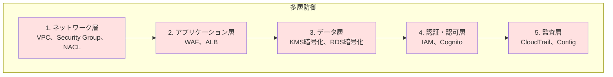
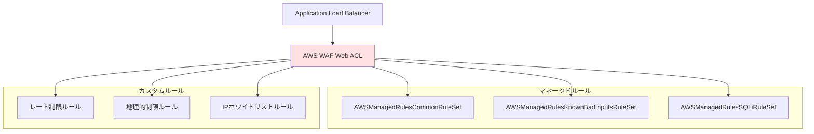
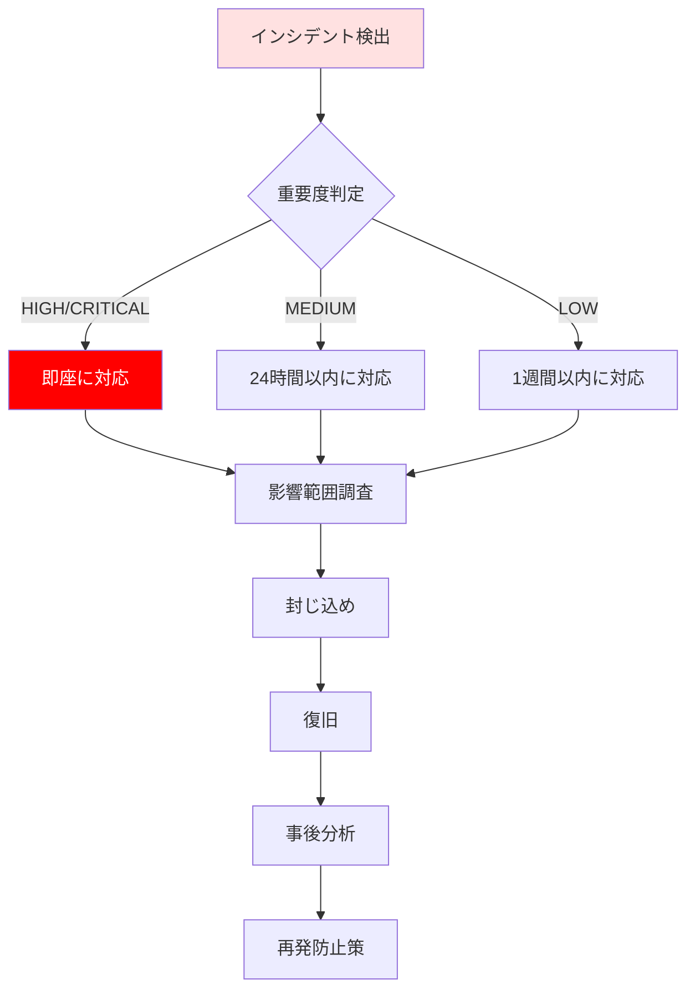

# セキュリティ設計

## 目次
1. [セキュリティ概要](#セキュリティ概要)
2. [ネットワークセキュリティ](#ネットワークセキュリティ)
3. [IAM設計](#iam設計)
4. [暗号化設計](#暗号化設計)
5. [WAF設計](#waf設計)
6. [監査ログ設計](#監査ログ設計)
7. [セキュリティ監視](#セキュリティ監視)

---

## セキュリティ概要

### セキュリティ方針



### セキュリティ要件

| 項目 | 要件 | 実装方法 |
|------|------|---------|
| 通信暗号化 | TLS 1.2以上 | ALB、CloudFront |
| データ暗号化 | 保存時暗号化必須 | KMS、RDS暗号化、S3暗号化 |
| アクセス制御 | 最小権限の原則 | IAMロール、Security Group |
| 監査ログ | すべてのAPI操作を記録 | CloudTrail、VPC Flow Logs |
| 脆弱性対策 | SQL injection、XSS対策 | WAF、アプリケーション実装 |
| 認証 | 多要素認証 | Cognito MFA |
| セッション管理 | セッションタイムアウト | ElastiCache TTL |

---

## ネットワークセキュリティ

### セキュリティグループ設計

詳細は [security_group_rules.md](./security_group_rules.md) を参照

#### 本番環境

##### 1. ALB セキュリティグループ

| 項目 | 値 |
|------|-----|
| グループ名 | `kaigo-subsys-prod-alb-sg` |
| 説明 | Application Load Balancer security group |

**インバウンドルール**:
| プロトコル | ポート | ソース | 説明 |
|-----------|------|--------|------|
| HTTPS | 443 | 0.0.0.0/0 | インターネットからのHTTPSアクセス |
| HTTP | 80 | 0.0.0.0/0 | HTTPリダイレクト用 |

**アウトバウンドルール**:
| プロトコル | ポート | 宛先 | 説明 |
|-----------|------|------|------|
| TCP | 8080 | `kaigo-subsys-prod-ecs-sg` | ECSタスクへの転送 |

##### 2. ECS セキュリティグループ

| 項目 | 値 |
|------|-----|
| グループ名 | `kaigo-subsys-prod-ecs-sg` |
| 説明 | ECS Fargate tasks security group |

**インバウンドルール**:
| プロトコル | ポート | ソース | 説明 |
|-----------|------|--------|------|
| TCP | 8080 | `kaigo-subsys-prod-alb-sg` | ALBからのトラフィック |

**アウトバウンドルール**:
| プロトコル | ポート | 宛先 | 説明 |
|-----------|------|------|------|
| TCP | 3306 | `kaigo-subsys-prod-rds-sg` | RDSへの接続 |
| TCP | 6379 | `kaigo-subsys-prod-elasticache-sg` | ElastiCacheへの接続 |
| TCP | 2049 | `kaigo-subsys-prod-efs-sg` | EFSへの接続 |
| HTTPS | 443 | 0.0.0.0/0 | 外部APIアクセス |

##### 3. RDS セキュリティグループ

| 項目 | 値 |
|------|-----|
| グループ名 | `kaigo-subsys-prod-rds-sg` |
| 説明 | RDS MySQL security group |

**インバウンドルール**:
| プロトコル | ポート | ソース | 説明 |
|-----------|------|--------|------|
| TCP | 3306 | `kaigo-subsys-prod-ecs-sg` | ECSタスクからの接続 |

**アウトバウンドルール**: なし（デフォルト拒否）

##### 4. ElastiCache セキュリティグループ

| 項目 | 値 |
|------|-----|
| グループ名 | `kaigo-subsys-prod-elasticache-sg` |
| 説明 | ElastiCache Redis security group |

**インバウンドルール**:
| プロトコル | ポート | ソース | 説明 |
|-----------|------|--------|------|
| TCP | 6379 | `kaigo-subsys-prod-ecs-sg` | ECSタスクからの接続 |

**アウトバウンドルール**: なし（デフォルト拒否）

##### 5. EFS セキュリティグループ

| 項目 | 値 |
|------|-----|
| グループ名 | `kaigo-subsys-prod-efs-sg` |
| 説明 | EFS file system security group |

**インバウンドルール**:
| プロトコル | ポート | ソース | 説明 |
|-----------|------|--------|------|
| TCP | 2049 | `kaigo-subsys-prod-ecs-sg` | ECSタスクからのNFSマウント |

**アウトバウンドルール**: なし（デフォルト拒否）

### NACL設計

| 項目 | 設定 | 理由 |
|------|------|------|
| デフォルトNACL | すべて許可 | Security Groupで制御 |
| カスタムNACL | 使用しない | 複雑性を避ける |

**判断理由**:
- Security Groupでステートフル制御が可能
- NACLはステートレスで管理が複雑
- 特殊な要件がない限り、Security Groupのみで十分

---

## IAM設計

### IAMロール一覧

詳細は [iam_policy_examples.json](./iam_policy_examples.json) を参照

#### 1. ECS Task Execution Role

**ロール名**: `kaigo-subsys-prod-ecs-task-execution-role`

**用途**: ECSタスクの起動・停止、ログ送信

**マネージドポリシー**:
- `AmazonECSTaskExecutionRolePolicy`

**カスタムポリシー**:
```json
{
  "Version": "2012-10-17",
  "Statement": [
    {
      "Effect": "Allow",
      "Action": [
        "ecr:GetAuthorizationToken",
        "ecr:BatchCheckLayerAvailability",
        "ecr:GetDownloadUrlForLayer",
        "ecr:BatchGetImage"
      ],
      "Resource": "*"
    },
    {
      "Effect": "Allow",
      "Action": [
        "logs:CreateLogStream",
        "logs:PutLogEvents"
      ],
      "Resource": "arn:aws:logs:us-east-1:123456789012:log-group:/ecs/kaigo-subsys-prod:*"
    },
    {
      "Effect": "Allow",
      "Action": [
        "ssm:GetParameters",
        "secretsmanager:GetSecretValue"
      ],
      "Resource": [
        "arn:aws:ssm:us-east-1:123456789012:parameter/kaigo-subsys/prod/*",
        "arn:aws:secretsmanager:us-east-1:123456789012:secret:kaigo-subsys/prod/*"
      ]
    }
  ]
}
```

#### 2. ECS Task Role

**ロール名**: `kaigo-subsys-prod-ecs-task-role`

**用途**: アプリケーションの実行、AWSリソースへのアクセス

**カスタムポリシー**:
```json
{
  "Version": "2012-10-17",
  "Statement": [
    {
      "Effect": "Allow",
      "Action": [
        "s3:PutObject",
        "s3:GetObject"
      ],
      "Resource": [
        "arn:aws:s3:::kaigo-subsys-prod-app-logs/*"
      ]
    },
    {
      "Effect": "Allow",
      "Action": [
        "dynamodb:GetItem",
        "dynamodb:PutItem",
        "dynamodb:UpdateItem",
        "dynamodb:Query"
      ],
      "Resource": [
        "arn:aws:dynamodb:us-east-1:123456789012:table/kaigo-subsys-prod-*"
      ]
    },
    {
      "Effect": "Allow",
      "Action": [
        "kms:Decrypt",
        "kms:DescribeKey"
      ],
      "Resource": [
        "arn:aws:kms:us-east-1:123456789012:key/*"
      ],
      "Condition": {
        "StringEquals": {
          "kms:ViaService": [
            "s3.us-east-1.amazonaws.com",
            "rds.us-east-1.amazonaws.com"
          ]
        }
      }
    }
  ]
}
```

#### 3. Lambda Execution Role (バックアップ用)

**ロール名**: `kaigo-subsys-prod-lambda-backup-role`

**用途**: RDSスナップショットのコピー、S3へのエクスポート

**マネージドポリシー**:
- `AWSLambdaBasicExecutionRole`

**カスタムポリシー**:
```json
{
  "Version": "2012-10-17",
  "Statement": [
    {
      "Effect": "Allow",
      "Action": [
        "rds:DescribeDBSnapshots",
        "rds:CopyDBSnapshot",
        "rds:DeleteDBSnapshot"
      ],
      "Resource": "*"
    },
    {
      "Effect": "Allow",
      "Action": [
        "s3:PutObject"
      ],
      "Resource": [
        "arn:aws:s3:::kaigo-subsys-prod-backups/*"
      ]
    }
  ]
}
```

#### 4. CloudWatch Logs Role

**ロール名**: `kaigo-subsys-prod-cloudwatch-logs-role`

**用途**: VPC Flow Logs、ALBログのCloudWatch Logsへの送信

**信頼ポリシー**:
```json
{
  "Version": "2012-10-17",
  "Statement": [
    {
      "Effect": "Allow",
      "Principal": {
        "Service": "vpc-flow-logs.amazonaws.com"
      },
      "Action": "sts:AssumeRole"
    }
  ]
}
```

**カスタムポリシー**:
```json
{
  "Version": "2012-10-17",
  "Statement": [
    {
      "Effect": "Allow",
      "Action": [
        "logs:CreateLogGroup",
        "logs:CreateLogStream",
        "logs:PutLogEvents",
        "logs:DescribeLogGroups",
        "logs:DescribeLogStreams"
      ],
      "Resource": "*"
    }
  ]
}
```

### IAMユーザー・グループ設計

| グループ名 | 権限 | メンバー |
|-----------|------|---------|
| `kaigo-subsys-admins` | フル管理者権限 | システム管理者 |
| `kaigo-subsys-developers` | 開発権限（本番読み取りのみ） | 開発者 |
| `kaigo-subsys-auditors` | 監査ログ読み取り専用 | 監査担当者 |
| `kaigo-subsys-operators` | 運用権限（デプロイ、監視） | 運用担当者 |

---

## 暗号化設計

### KMS キー設計

| キー用途 | キーエイリアス | ローテーション | 使用サービス |
|---------|--------------|--------------|-------------|
| RDS暗号化 | `alias/kaigo-subsys-prod-rds` | 有効（年次） | RDS MySQL |
| ElastiCache暗号化 | `alias/kaigo-subsys-prod-elasticache` | 有効（年次） | ElastiCache Redis |
| S3暗号化（アプリログ） | `alias/kaigo-subsys-prod-app-logs` | 有効（年次） | S3 |
| S3暗号化（監査ログ） | `alias/kaigo-subsys-prod-audit-logs` | 有効（年次） | S3、CloudTrail |
| S3暗号化（バックアップ） | `alias/kaigo-subsys-prod-backups` | 有効（年次） | S3、AWS Backup |
| EFS暗号化 | `alias/kaigo-subsys-prod-efs` | 有効（年次） | EFS |
| Secrets Manager | `alias/kaigo-subsys-prod-secrets` | 有効（年次） | Secrets Manager |

### キーポリシー（RDS用例）

```json
{
  "Version": "2012-10-17",
  "Statement": [
    {
      "Sid": "Enable IAM User Permissions",
      "Effect": "Allow",
      "Principal": {
        "AWS": "arn:aws:iam::123456789012:root"
      },
      "Action": "kms:*",
      "Resource": "*"
    },
    {
      "Sid": "Allow RDS to use the key",
      "Effect": "Allow",
      "Principal": {
        "Service": "rds.amazonaws.com"
      },
      "Action": [
        "kms:Decrypt",
        "kms:DescribeKey",
        "kms:CreateGrant"
      ],
      "Resource": "*",
      "Condition": {
        "StringEquals": {
          "kms:ViaService": "rds.us-east-1.amazonaws.com"
        }
      }
    },
    {
      "Sid": "Allow ECS Task to decrypt",
      "Effect": "Allow",
      "Principal": {
        "AWS": "arn:aws:iam::123456789012:role/kaigo-subsys-prod-ecs-task-role"
      },
      "Action": [
        "kms:Decrypt",
        "kms:DescribeKey"
      ],
      "Resource": "*"
    }
  ]
}
```

### 暗号化要件

| リソース | 暗号化方式 | 鍵管理 |
|---------|-----------|--------|
| RDS | AES-256 | KMS (CMK) |
| ElastiCache | AES-256 | KMS (CMK) |
| S3 | SSE-KMS | KMS (CMK) |
| EFS | AES-256 | KMS (CMK) |
| EBS | AES-256 | KMS (CMK) |
| Secrets Manager | AES-256 | KMS (CMK) |
| ALB通信 | TLS 1.2以上 | ACM証明書 |

---

## WAF設計

### WAF ルール設計

詳細は [waf_rules.json](./waf_rules.json) を参照

#### Web ACL構成



#### ルール詳細

##### 1. マネージドルール

| ルールグループ | 優先度 | アクション | 説明 |
|--------------|--------|----------|------|
| `AWSManagedRulesCommonRuleSet` | 10 | Block | OWASP Top 10対策 |
| `AWSManagedRulesKnownBadInputsRuleSet` | 20 | Block | 既知の脆弱性対策 |
| `AWSManagedRulesSQLiRuleSet` | 30 | Block | SQL injection対策 |

##### 2. カスタムルール

| ルール名 | 優先度 | アクション | 条件 | 説明 |
|---------|--------|----------|------|------|
| `RateLimitRule` | 100 | Block | 5分間に2000リクエスト超過 | DDoS対策 |
| `GeoBlockRule` | 200 | Block | 日本以外からのアクセス | 地理的制限 |
| `IPWhitelistRule` | 300 | Allow | ホワイトリストIP | 管理者アクセス |

#### WAF ログ設定

| 項目 | 設定 |
|------|------|
| ログ出力先 | S3バケット: `kaigo-subsys-prod-waf-logs` |
| ログ形式 | JSON |
| 保持期間 | 90日 |
| ログ内容 | すべてのリクエスト（Allow/Block） |

---

## 監査ログ設計

### CloudTrail設定

| 項目 | 本番環境 | ステージング環境 |
|------|----------|-----------------|
| 証跡名 | `kaigo-subsys-prod-trail` | `kaigo-subsys-stg-trail` |
| S3バケット | `kaigo-subsys-prod-audit-logs` | `kaigo-subsys-stg-audit-logs` |
| ログ検証 | 有効 | 有効 |
| マルチリージョン | 有効 | 有効 |
| 組織全体 | 有効 | 無効 |
| KMS暗号化 | 有効 | 有効 |
| CloudWatch Logs連携 | 有効 | 有効 |

### VPC Flow Logs設定

| 項目 | 本番環境 | ステージング環境 |
|------|----------|-----------------|
| 対象VPC | `kaigo-subsys-prod-vpc` | `kaigo-subsys-stg-vpc` |
| ログ出力先 | CloudWatch Logs | CloudWatch Logs |
| トラフィックタイプ | ALL (Accept/Reject) | ALL |
| ログ形式 | カスタム | デフォルト |
| 保持期間 | 90日 | 30日 |

**カスタムログ形式**:
```
${version} ${account-id} ${interface-id} ${srcaddr} ${dstaddr} ${srcport} ${dstport} ${protocol} ${packets} ${bytes} ${start} ${end} ${action} ${log-status}
```

### AWS Config設定

| 項目 | 設定 |
|------|------|
| レコーダー名 | `kaigo-subsys-prod-config-recorder` |
| 記録対象 | すべてのリソース |
| S3バケット | `kaigo-subsys-prod-audit-logs` |
| SNS通知 | 有効 |
| 保持期間 | 7年 |

#### Config Rules

| ルール名 | 説明 |
|---------|------|
| `encrypted-volumes` | EBSボリュームが暗号化されているか |
| `rds-encryption-enabled` | RDSが暗号化されているか |
| `s3-bucket-public-read-prohibited` | S3バケットがパブリック読み取り不可か |
| `vpc-flow-logs-enabled` | VPC Flow Logsが有効か |
| `cloudtrail-enabled` | CloudTrailが有効か |
| `iam-password-policy` | IAMパスワードポリシーが適切か |

---

## セキュリティ監視

### GuardDuty設定

| 項目 | 設定 |
|------|------|
| 有効化リージョン | us-east-1, us-west-2 |
| データソース | VPC Flow Logs, CloudTrail, DNS Logs |
| 検出結果通知 | SNS → Email |
| 重要度フィルタ | HIGH以上 |

### Security Hub設定

| 項目 | 設定 |
|------|------|
| 有効化 | 有効 |
| セキュリティ標準 | AWS Foundational Security Best Practices |
| CIS AWS Foundations Benchmark | v1.4.0 |
| 統合サービス | GuardDuty, Config, Inspector |
| アラート通知 | SNS → Email |

### CloudWatch アラーム（セキュリティ関連）

| アラーム名 | メトリクス | 閾値 | アクション |
|-----------|-----------|------|----------|
| `UnauthorizedAPICalls` | CloudTrailメトリクスフィルタ | 1回 | SNS通知 |
| `RootAccountUsage` | CloudTrailメトリクスフィルタ | 1回 | SNS通知 |
| `IAMPolicyChanges` | CloudTrailメトリクスフィルタ | 1回 | SNS通知 |
| `SecurityGroupChanges` | CloudTrailメトリクスフィルタ | 1回 | SNS通知 |
| `WAFBlockedRequests` | WAFメトリクス | 100/5分 | SNS通知 |

---

## インシデントレスポンス

### セキュリティインシデント対応フロー



### インシデント対応チーム

| 役割 | 責任 |
|------|------|
| インシデントリーダー | 全体統括、意思決定 |
| セキュリティアナリスト | ログ分析、影響範囲調査 |
| システム管理者 | 封じ込め、復旧作業 |
| 広報担当 | 外部コミュニケーション |

---

## コンプライアンス

### 準拠法令

- 個人情報保護法
- マイナンバー法
- 地方公共団体の情報セキュリティポリシー

### セキュリティ監査

| 監査項目 | 頻度 | 実施者 |
|---------|------|--------|
| 脆弱性診断 | 年2回 | 外部ベンダー |
| ペネトレーションテスト | 年1回 | 外部ベンダー |
| 設定レビュー | 四半期ごと | 社内セキュリティチーム |
| アクセスログ監査 | 月次 | 社内監査チーム |

---

## 関連ドキュメント

- [security_group_rules.md](./security_group_rules.md)
- [iam_policy_examples.json](./iam_policy_examples.json)
- [waf_rules.json](./waf_rules.json)
- [ネットワーク設計](../03_network/network_design.md)
- [監視設計](../08_monitoring/monitoring_design.md)

---

**作成日**: 2025-11-05
**作成者**: Architect
**バージョン**: 1.0
