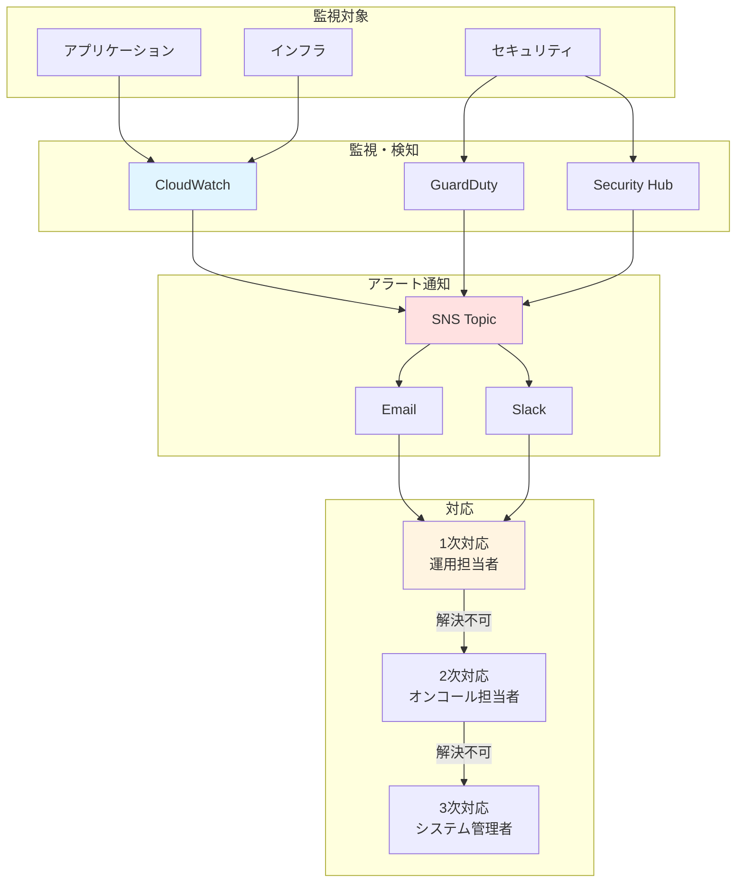
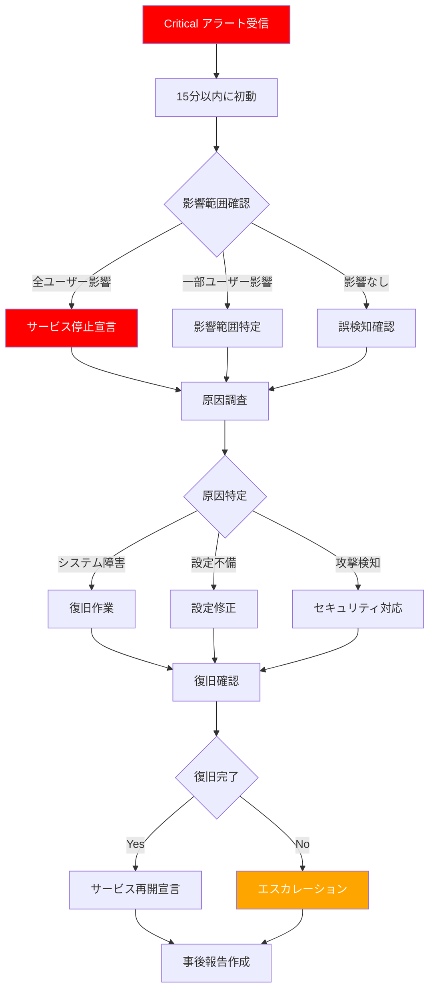
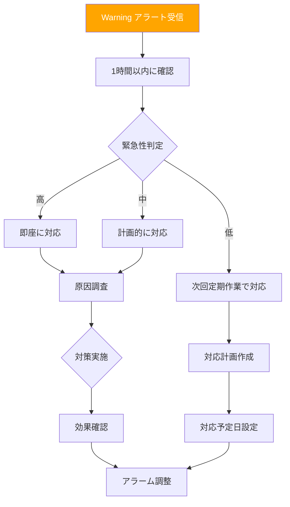
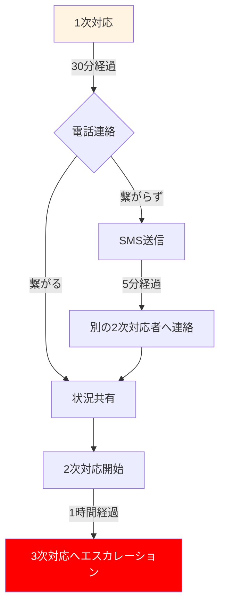

# 監視フロー

## 目次
1. [監視フロー概要](#監視フロー概要)
2. [アラート対応フロー](#アラート対応フロー)
3. [インシデント対応](#インシデント対応)
4. [定期監視タスク](#定期監視タスク)

---

## 監視フロー概要

### 全体フロー



---

## アラート対応フロー

### Critical アラート対応



#### 対応時間目標

| アクション | 目標時間 |
|-----------|---------|
| 初動 (状況確認) | 15分以内 |
| 影響範囲特定 | 30分以内 |
| 原因特定 | 1時間以内 |
| 復旧完了 | 2時間以内 |

### Warning アラート対応



---

## インシデント対応

### インシデントレベル定義

| レベル | 説明 | 例 | 対応時間 |
|--------|------|-----|---------|
| **P1 (Critical)** | サービス全停止、データ損失の可能性 | RDS停止、全ECSタスク停止 | 15分以内 |
| **P2 (High)** | 重要機能停止、性能大幅劣化 | 特定機能エラー、レスポンス5秒超 | 1時間以内 |
| **P3 (Medium)** | 一部機能停止、性能劣化 | 非重要機能エラー、レスポンス3秒超 | 4時間以内 |
| **P4 (Low)** | 軽微な不具合、性能への影響なし | ログエラー、軽微な設定ミス | 1営業日以内 |

### インシデント対応手順

#### フェーズ1: 検知・初動 (15分以内)

**担当**: 1次対応 (運用担当者)

1. **アラート受信**
   - Email, Slack で通知受信
   - ダッシュボード確認

2. **影響範囲確認**
   - サービス稼働状況確認
   - ユーザー影響の有無確認
   - CloudWatch メトリクス確認

3. **初動報告**
   - インシデント管理システムに登録
   - 関係者へ第一報送信

#### フェーズ2: 調査・対応 (1時間以内)

**担当**: 1次対応 → 2次対応 (必要に応じてエスカレーション)

1. **原因調査**
   - CloudWatch Logs 確認
   - X-Ray トレース確認
   - VPC Flow Logs 確認 (ネットワーク問題の場合)

2. **対応方針決定**
   - 即座の復旧が可能か判断
   - エスカレーションの必要性判断

3. **復旧作業**
   - 手順書に従った復旧作業
   - 作業ログの記録

#### フェーズ3: 復旧確認 (2時間以内)

**担当**: 2次対応 → 3次対応 (システム管理者)

1. **復旧確認**
   - サービス稼働状況確認
   - メトリクス正常化確認
   - ユーザーアクセス確認

2. **監視強化**
   - 一時的にアラーム閾値を厳しく設定
   - ログ監視強化

3. **関係者への報告**
   - 復旧完了報告
   - 影響範囲、原因、対応内容の報告

#### フェーズ4: 事後対応 (1週間以内)

**担当**: システム管理者、開発チーム

1. **事後報告書作成**
   - 発生日時、検知方法
   - 影響範囲、影響時間
   - 原因分析
   - 対応内容
   - 再発防止策

2. **再発防止策実施**
   - アラーム調整
   - 運用手順書更新
   - システム改善

3. **振り返りミーティング**
   - 対応の改善点議論
   - 手順書の見直し

---

## 定期監視タスク

### 日次タスク

#### 朝 (9:00)

**担当**: 運用担当者
**所要時間**: 30分

| タスク | 内容 | ツール |
|-------|------|--------|
| ダッシュボード確認 | 夜間のメトリクス異常確認 | CloudWatch Dashboard |
| ログレビュー | エラーログ、警告ログ確認 | CloudWatch Logs Insights |
| バックアップ確認 | 前日のバックアップ成功確認 | AWS Backup, S3 |
| アラーム履歴確認 | 過去24時間のアラーム確認 | CloudWatch Alarms |

**確認クエリ例**:

```sql
-- エラーログ確認
fields @timestamp, @message
| filter @message like /ERROR|FATAL/
| filter @timestamp > ago(24h)
| sort @timestamp desc
| limit 100
```

#### 夜 (18:00)

**担当**: 運用担当者
**所要時間**: 15分

| タスク | 内容 | ツール |
|-------|------|--------|
| リソース使用状況確認 | CPU/メモリ/ストレージの傾向確認 | CloudWatch Dashboard |
| アクセス数確認 | 日次アクセス数の記録 | ALB Metrics |
| オンコール引き継ぎ | 当日の状況をオンコール担当者に共有 | Slack |

### 週次タスク

#### 月曜日 (10:00)

**担当**: 運用管理者
**所要時間**: 1時間

| タスク | 内容 | ツール |
|-------|------|--------|
| 週次レポート作成 | 前週のサービス稼働率、インシデント件数 | CloudWatch, 独自ツール |
| コスト確認 | 前週のAWS利用料金確認 | AWS Cost Explorer |
| パフォーマンスレビュー | レスポンスタイムの傾向分析 | CloudWatch, X-Ray |
| アラーム調整検討 | 誤検知アラームの調整 | CloudWatch Alarms |

### 月次タスク

#### 毎月第1営業日 (14:00)

**担当**: システム管理者
**所要時間**: 2時間

| タスク | 内容 | ツール |
|-------|------|--------|
| 月次レポート作成 | 前月のサービス稼働率、インシデント分析 | CloudWatch, 独自ツール |
| コストレビュー | 前月のAWS利用料金詳細分析 | AWS Cost Explorer |
| セキュリティログレビュー | GuardDuty, Security Hub の検出結果確認 | GuardDuty, Security Hub |
| リソース最適化提案 | 使用率に基づくリソース調整提案 | Compute Optimizer |

---

## エスカレーションフロー

### エスカレーション基準

| 条件 | エスカレーション先 |
|------|------------------|
| 1次対応で30分以内に解決できない | 2次対応 (オンコール担当者) |
| 2次対応で1時間以内に解決できない | 3次対応 (システム管理者) |
| サービス全停止 | 即座に3次対応 + 管理職 |
| データ損失の可能性 | 即座に3次対応 + 管理職 + ベンダー |
| セキュリティインシデント | 即座にセキュリティチーム + 管理職 |

### エスカレーション連絡方法



---

## 関連ドキュメント

- [監視設計](./monitoring_design.md)
- [CloudWatch アラーム](./cloudwatch_alarms.md)
- [セキュリティ設計](../07_security/security_design.md)

---

**作成日**: 2025-11-05
**作成者**: Architect
**バージョン**: 1.0
