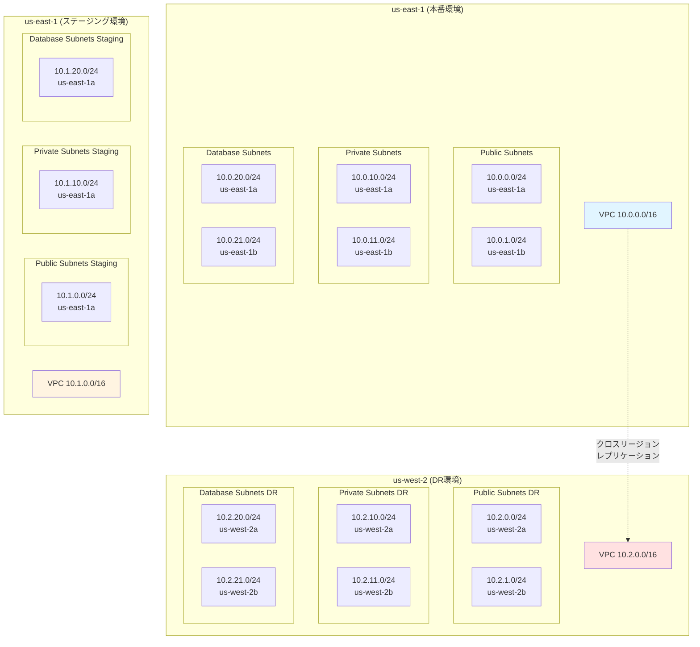
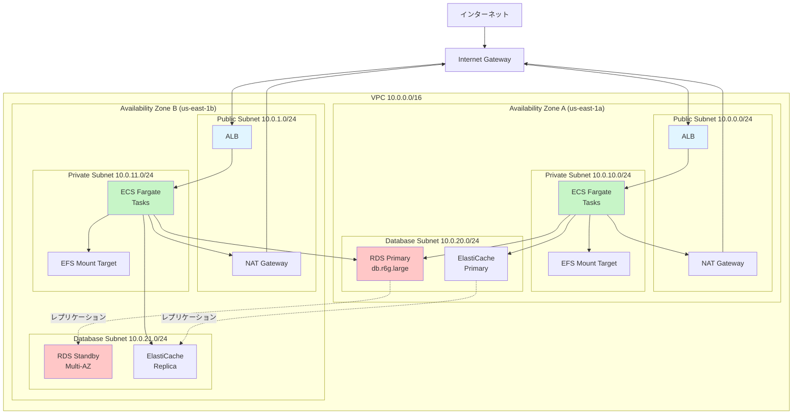
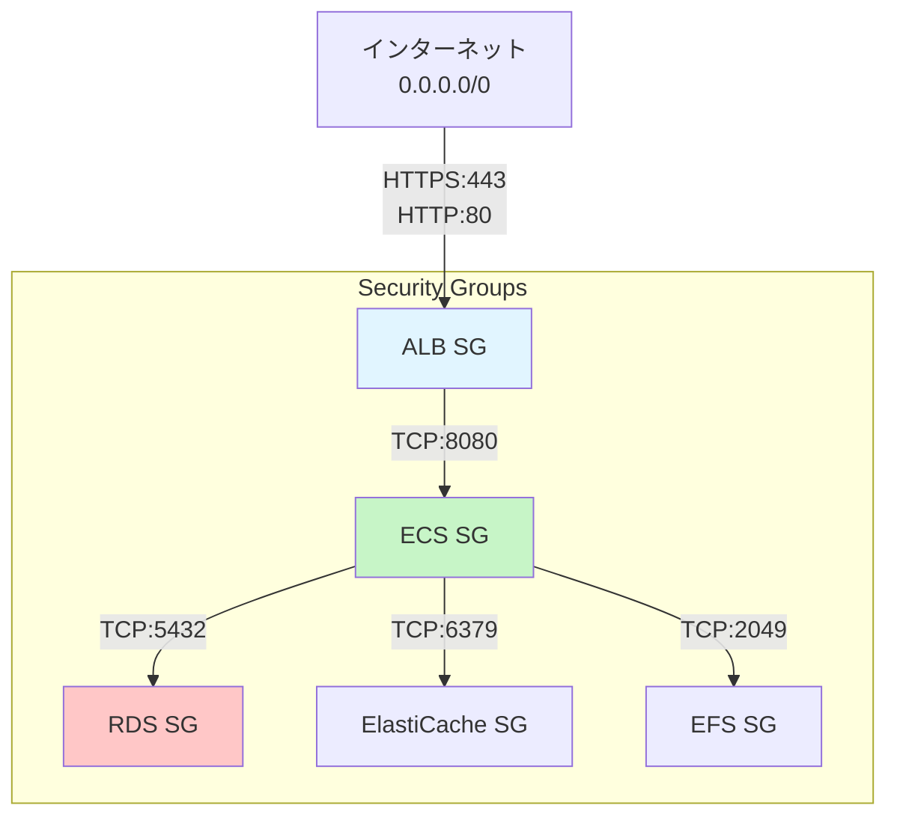
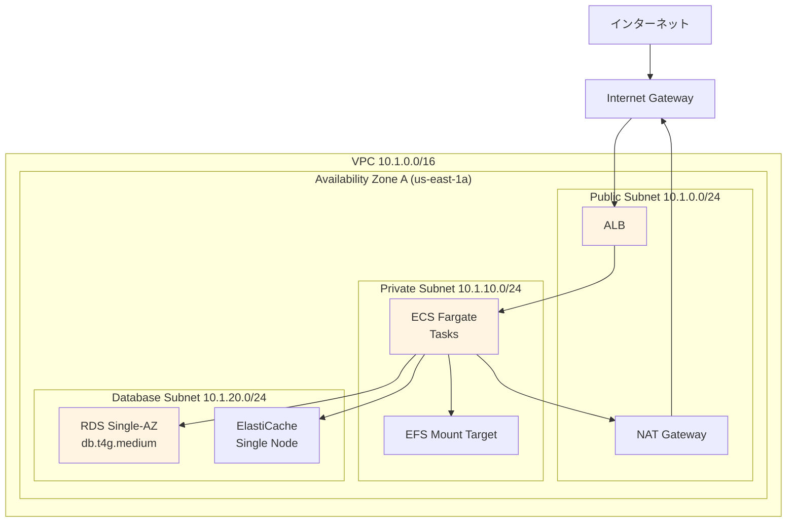
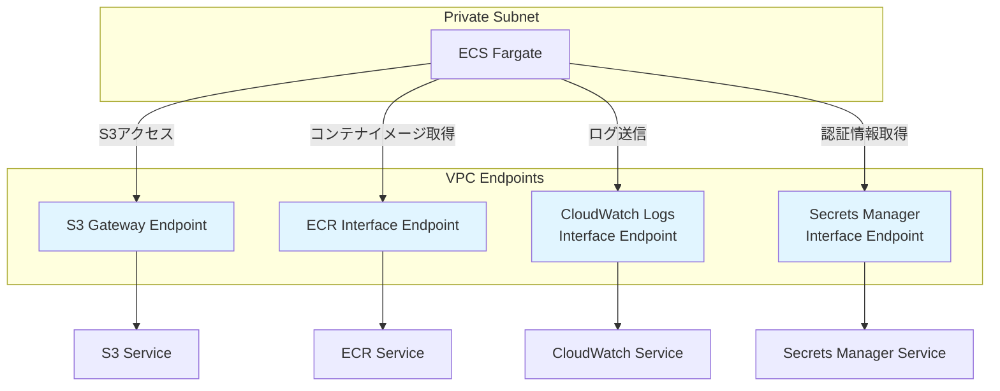

# ネットワーク図

## 目次
1. [全体ネットワーク構成](#全体ネットワーク構成)
2. [本番環境ネットワーク](#本番環境ネットワーク)
3. [ステージング環境ネットワーク](#ステージング環境ネットワーク)
4. [DR環境ネットワーク](#dr環境ネットワーク)

---

## 全体ネットワーク構成

### リージョン間接続



---

## 本番環境ネットワーク

### VPC構成 (us-east-1)



### セキュリティグループ



### ルートテーブル

#### Public Subnet Route Table

| 宛先 | ターゲット | 説明 |
|------|----------|------|
| 10.0.0.0/16 | local | VPC内通信 |
| 0.0.0.0/0 | igw-xxxxx | インターネット通信 |

#### Private Subnet Route Table (AZ-A)

| 宛先 | ターゲット | 説明 |
|------|----------|------|
| 10.0.0.0/16 | local | VPC内通信 |
| 0.0.0.0/0 | nat-gateway-a | インターネット通信 (NAT Gateway経由) |

#### Private Subnet Route Table (AZ-B)

| 宛先 | ターゲット | 説明 |
|------|----------|------|
| 10.0.0.0/16 | local | VPC内通信 |
| 0.0.0.0/0 | nat-gateway-b | インターネット通信 (NAT Gateway経由) |

#### Database Subnet Route Table

| 宛先 | ターゲット | 説明 |
|------|----------|------|
| 10.0.0.0/16 | local | VPC内通信のみ（インターネットアクセスなし） |

---

## ステージング環境ネットワーク

### VPC構成 (us-east-1)



**注**: ステージング環境はコスト削減のためシングルAZ構成

---

## DR環境ネットワーク

### VPC構成 (us-west-2)

```mermaid
graph TB
    INTERNET[インターネット]
    IGW[Internet Gateway]

    subgraph "VPC 10.2.0.0/16"
        subgraph "Availability Zone A (us-west-2a)"
            subgraph "Public Subnet 10.2.0.0/24"
                ALB_DR_A[ALB<br/>(DR発動時起動)]
                NAT_DR_A[NAT Gateway]
            end
            subgraph "Private Subnet 10.2.10.0/24"
                ECS_DR_A[ECS Fargate<br/>(DR発動時起動)]
                EFS_MT_DR_A[EFS Mount Target]
            end
            subgraph "Database Subnet 10.2.20.0/24"
                RDS_DR_PRIMARY[RDS<br/>(DR発動時復元)]
                ELASTICACHE_DR_A[ElastiCache<br/>(DR発動時起動)]
            end
        end

        subgraph "Availability Zone B (us-west-2b)"
            subgraph "Public Subnet 10.2.1.0/24"
                ALB_DR_B[ALB<br/>(DR発動時起動)]
                NAT_DR_B[NAT Gateway]
            end
            subgraph "Private Subnet 10.2.11.0/24"
                ECS_DR_B[ECS Fargate<br/>(DR発動時起動)]
                EFS_MT_DR_B[EFS Mount Target]
            end
            subgraph "Database Subnet 10.2.21.0/24"
                RDS_DR_STANDBY[RDS Standby<br/>Multi-AZ]
                ELASTICACHE_DR_B[ElastiCache<br/>Replica]
            end
        end
    end

    INTERNET -.DR発動時.-> IGW
    IGW -.DR発動時.-> ALB_DR_A
    IGW -.DR発動時.-> ALB_DR_B

    style ALB_DR_A fill:#ffe1e1
    style ALB_DR_B fill:#ffe1e1
    style ECS_DR_A fill:#ffe1e1
    style ECS_DR_B fill:#ffe1e1
    style RDS_DR_PRIMARY fill:#ffe1e1
```

**注**: DR環境はVPC、サブネット、セキュリティグループのみ事前構築、リソースはDR発動時に起動

---

## ネットワークACL

### 設計方針

- **NACL**: デフォルトNACL（すべて許可）を使用
- **Security Group**: ステートフルなSecurity Groupで制御

**理由**:
- Security Groupで十分な制御が可能
- NACLはステートレスで管理が複雑
- 将来的に厳格な制御が必要になった場合のみ、カスタムNACLを検討

---

## DNS設計

### Route 53 設定

| レコード名 | タイプ | 値 | TTL | ルーティングポリシー |
|-----------|------|-----|-----|-------------------|
| `api.kaigo-subsys.example.com` | A (ALIAS) | ALB (本番) | 60秒 | Simple |
| `api-stg.kaigo-subsys.example.com` | A (ALIAS) | ALB (ステージング) | 60秒 | Simple |

**DR発動時**:
- `api.kaigo-subsys.example.com` のエイリアスターゲットを DR環境のALBに変更
- TTL 60秒のため、最大1分で切り替わる

---

## VPCエンドポイント

### プライベートサブネットからAWSサービスへのアクセス

| サービス | エンドポイントタイプ | 理由 |
|---------|------------------|------|
| S3 | Gateway型 | コスト削減 |
| ECR | Interface型 | ECSコンテナイメージ取得 |
| CloudWatch Logs | Interface型 | ログ送信 |
| Secrets Manager | Interface型 | 認証情報取得 |

### VPCエンドポイント設定



**メリット**:
- NAT Gateway経由のコストを削減
- AWSサービスへのアクセスがインターネットを経由しない（セキュリティ向上）

---

## 関連ドキュメント

- [ネットワーク設計](../03_network/network_design.md)
- [VPC設計](../03_network/vpc_design.md)
- [セキュリティ設計](../07_security/security_design.md)

---

**作成日**: 2025-11-05
**作成者**: Architect
**バージョン**: 1.0
