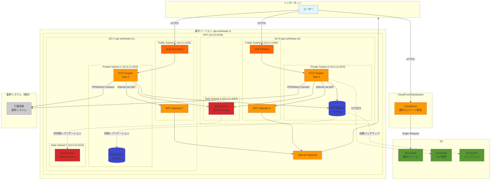
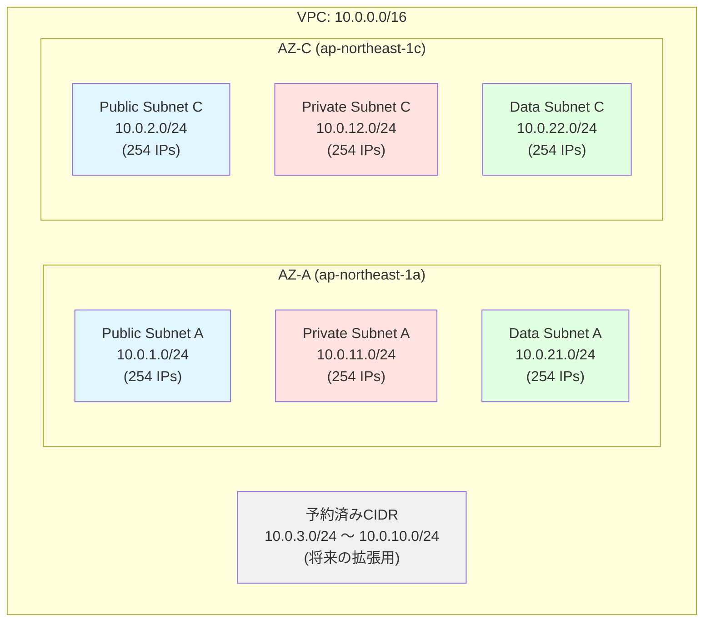
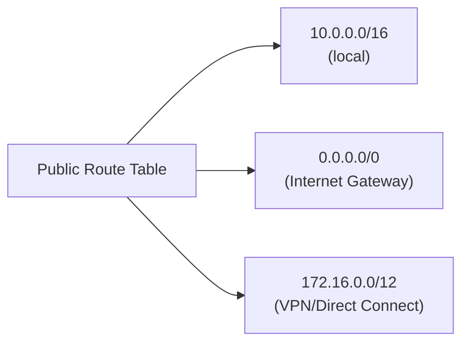
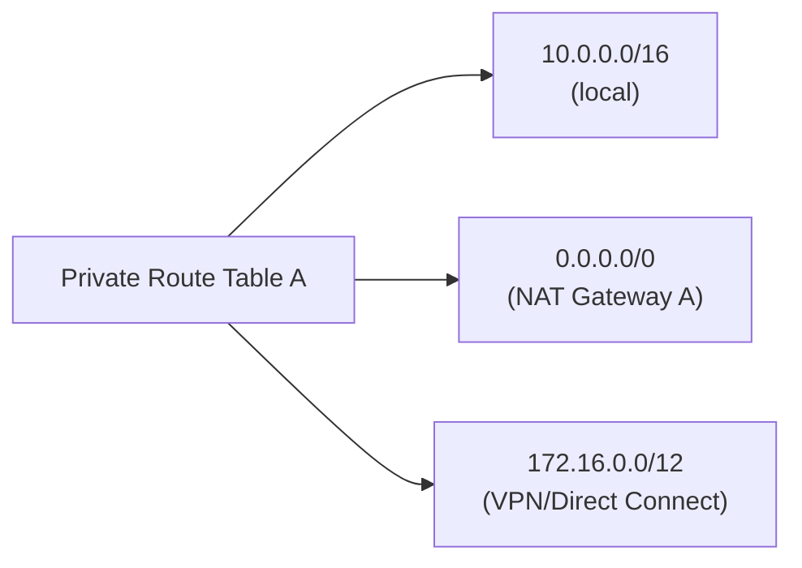
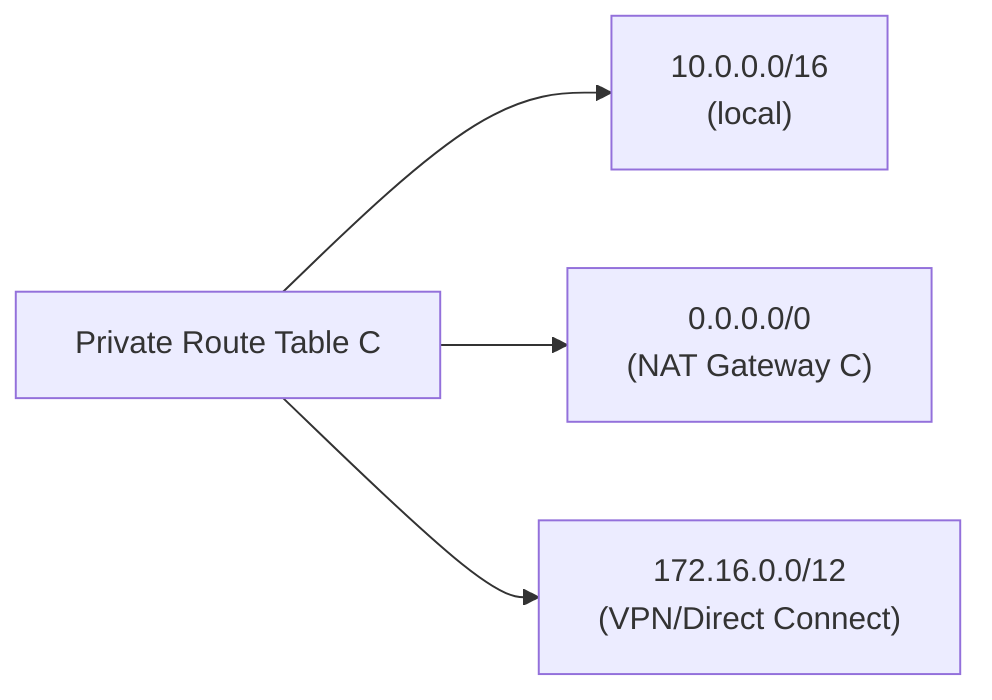
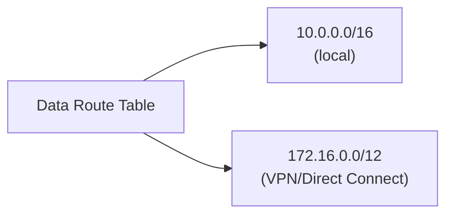
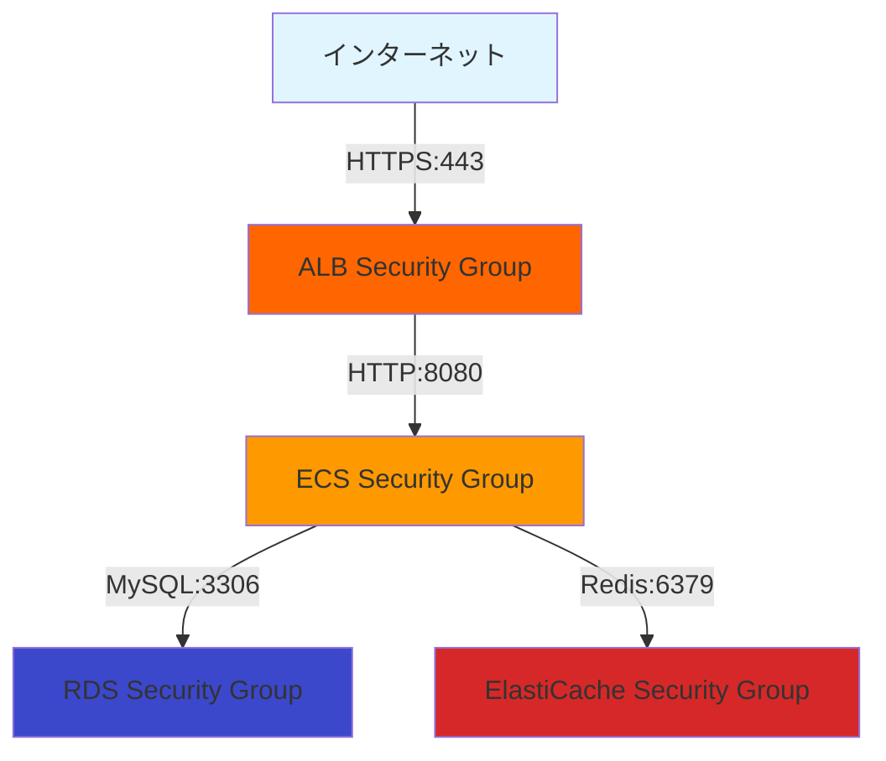
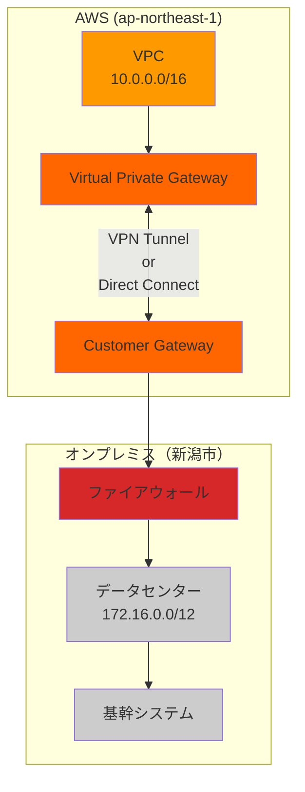
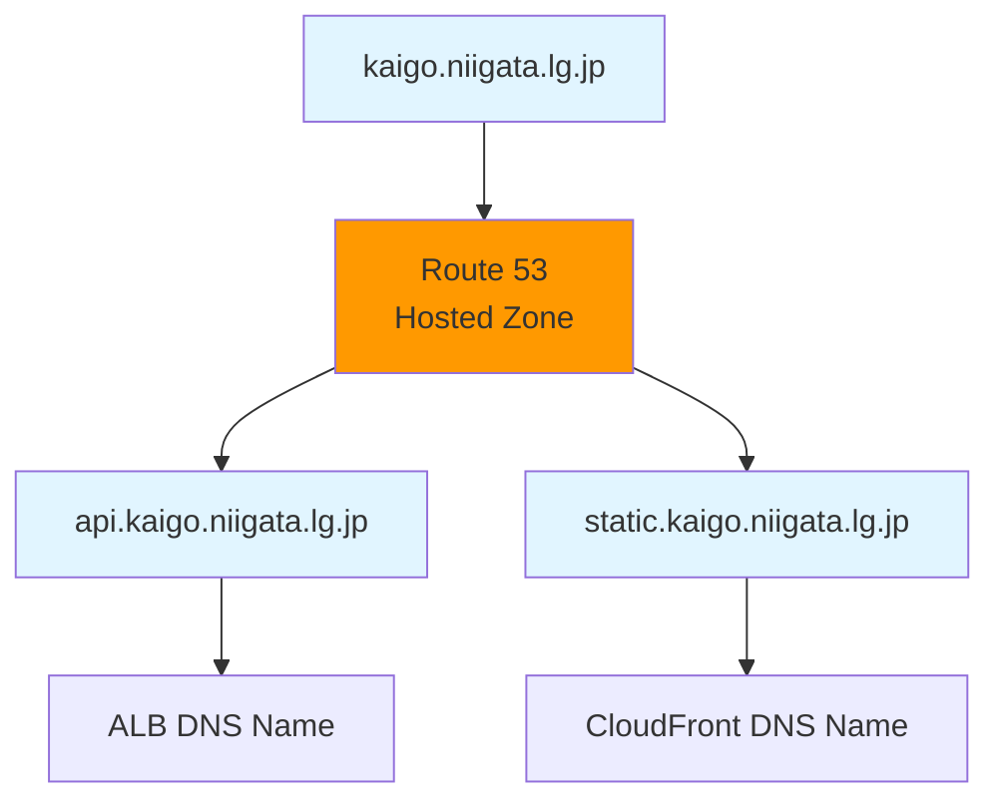

# ネットワーク構成図

## 概要

このドキュメントでは、新潟市介護保険サブシステムのネットワーク構成を図で示します。

---

## 全体ネットワーク構成図

---

## VPC CIDR とサブネット構成

---

## ルーティング構成

### Public Subnet のルートテーブル

| Destination | Target | 用途 |
|------------|--------|------|
| 10.0.0.0/16 | local | VPC内通信 |
| 0.0.0.0/0 | igw-xxxxx | インターネット通信 |
| 172.16.0.0/12 | vgw-xxxxx | 基幹システム通信 |

### Private Subnet のルートテーブル（AZ-A）

| Destination | Target | 用途 |
|------------|--------|------|
| 10.0.0.0/16 | local | VPC内通信 |
| 0.0.0.0/0 | nat-xxxxx (AZ-A) | インターネット通信（Egress） |
| 172.16.0.0/12 | vgw-xxxxx | 基幹システム通信 |

### Private Subnet のルートテーブル（AZ-C）

| Destination | Target | 用途 |
|------------|--------|------|
| 10.0.0.0/16 | local | VPC内通信 |
| 0.0.0.0/0 | nat-xxxxx (AZ-C) | インターネット通信（Egress） |
| 172.16.0.0/12 | vgw-xxxxx | 基幹システム通信 |

### Data Subnet のルートテーブル

| Destination | Target | 用途 |
|------------|--------|------|
| 10.0.0.0/16 | local | VPC内通信 |
| 172.16.0.0/12 | vgw-xxxxx | 基幹システム通信（必要な場合） |

**注意**: Data Subnetはインターネットへの直接アクセスを持たない（セキュリティ強化）

---

## セキュリティグループの通信フロー

### 通信許可ルール

| Source | Destination | Protocol | Port | 説明 |
|--------|-------------|----------|------|------|
| 0.0.0.0/0 | ALB | TCP | 443 | インターネットからのHTTPS |
| ALB SG | ECS SG | TCP | 8080 | ALBからECSへのHTTP |
| ECS SG | RDS SG | TCP | 3306 | ECSからRDSへのMySQL |
| ECS SG | ElastiCache SG | TCP | 6379 | ECSからRedisへのアクセス |
| ECS SG | 0.0.0.0/0 | TCP | 443 | ECSから外部APIへのHTTPS |

---

## VPN / Direct Connect 構成（基幹システム連携）

### VPN接続パラメータ（仮値）

| パラメータ | 値 |
|----------|-----|
| VPN接続タイプ | Site-to-Site VPN |
| ルーティング | Dynamic (BGP) |
| トンネル冗長化 | 2つのトンネル（Active/Standby） |
| 暗号化 | AES-256 |
| IKE バージョン | IKEv2 |
| オンプレミスCIDR | 172.16.0.0/12 |
| AWS CIDR | 10.0.0.0/16 |

---

## ネットワークACL（NACL）構成

### Public Subnet NACL

**Inbound Rules**

| Rule # | Type | Protocol | Port Range | Source | Allow/Deny |
|--------|------|----------|-----------|--------|------------|
| 100 | HTTPS | TCP | 443 | 0.0.0.0/0 | ALLOW |
| 110 | HTTP | TCP | 80 | 0.0.0.0/0 | ALLOW |
| 120 | Ephemeral | TCP | 1024-65535 | 0.0.0.0/0 | ALLOW |
| * | All | All | All | 0.0.0.0/0 | DENY |

**Outbound Rules**

| Rule # | Type | Protocol | Port Range | Destination | Allow/Deny |
|--------|------|----------|-----------|-------------|------------|
| 100 | HTTP | TCP | 80 | 0.0.0.0/0 | ALLOW |
| 110 | HTTPS | TCP | 443 | 0.0.0.0/0 | ALLOW |
| 120 | Ephemeral | TCP | 1024-65535 | 0.0.0.0/0 | ALLOW |
| * | All | All | All | 0.0.0.0/0 | DENY |

### Private Subnet NACL

**Inbound Rules**

| Rule # | Type | Protocol | Port Range | Source | Allow/Deny |
|--------|------|----------|-----------|--------|------------|
| 100 | Custom TCP | TCP | 8080 | 10.0.1.0/24 | ALLOW |
| 110 | Custom TCP | TCP | 8080 | 10.0.2.0/24 | ALLOW |
| 120 | Ephemeral | TCP | 1024-65535 | 0.0.0.0/0 | ALLOW |
| * | All | All | All | 0.0.0.0/0 | DENY |

**Outbound Rules**

| Rule # | Type | Protocol | Port Range | Destination | Allow/Deny |
|--------|------|----------|-----------|-------------|------------|
| 100 | MySQL | TCP | 3306 | 10.0.21.0/24 | ALLOW |
| 110 | MySQL | TCP | 3306 | 10.0.22.0/24 | ALLOW |
| 120 | Redis | TCP | 6379 | 10.0.21.0/24 | ALLOW |
| 130 | Redis | TCP | 6379 | 10.0.22.0/24 | ALLOW |
| 140 | HTTPS | TCP | 443 | 0.0.0.0/0 | ALLOW |
| 150 | Ephemeral | TCP | 1024-65535 | 0.0.0.0/0 | ALLOW |
| * | All | All | All | 0.0.0.0/0 | DENY |

### Data Subnet NACL

**Inbound Rules**

| Rule # | Type | Protocol | Port Range | Source | Allow/Deny |
|--------|------|----------|-----------|--------|------------|
| 100 | MySQL | TCP | 3306 | 10.0.11.0/24 | ALLOW |
| 110 | MySQL | TCP | 3306 | 10.0.12.0/24 | ALLOW |
| 120 | Redis | TCP | 6379 | 10.0.11.0/24 | ALLOW |
| 130 | Redis | TCP | 6379 | 10.0.12.0/24 | ALLOW |
| * | All | All | All | 0.0.0.0/0 | DENY |

**Outbound Rules**

| Rule # | Type | Protocol | Port Range | Destination | Allow/Deny |
|--------|------|----------|-----------|-------------|------------|
| 100 | Ephemeral | TCP | 1024-65535 | 10.0.11.0/24 | ALLOW |
| 110 | Ephemeral | TCP | 1024-65535 | 10.0.12.0/24 | ALLOW |
| 120 | MySQL Replication | TCP | 3306 | 10.0.22.0/24 | ALLOW |
| 130 | Redis Replication | TCP | 6379 | 10.0.22.0/24 | ALLOW |
| * | All | All | All | 0.0.0.0/0 | DENY |

---

## DNS構成

### Route 53 レコード

| Name | Type | Value | TTL |
|------|------|-------|-----|
| kaigo.niigata.lg.jp | A | Alias to CloudFront | 300 |
| api.kaigo.niigata.lg.jp | A | Alias to ALB | 60 |
| static.kaigo.niigata.lg.jp | A | Alias to CloudFront | 3600 |

---

## ネットワーク帯域とスループット

### 想定トラフィック

| 項目 | ピーク時 | 平均 |
|------|---------|------|
| ユーザーリクエスト | 1,000 req/min | 300 req/min |
| ALB → ECS トラフィック | 50 Mbps | 15 Mbps |
| ECS → RDS トラフィック | 20 Mbps | 5 Mbps |
| CloudFront → S3 トラフィック | 100 Mbps | 30 Mbps |

### NAT Gateway 構成

| AZ | NAT Gateway | 帯域 | 備考 |
|----|-------------|------|------|
| ap-northeast-1a | NAT Gateway A | 最大5 Gbps | ECS Egress通信用 |
| ap-northeast-1c | NAT Gateway C | 最大5 Gbps | ECS Egress通信用 |

**冗長化**: 各AZに独立したNAT Gatewayを配置し、片方のAZ障害時も通信継続

---

## ネットワーク監視

### CloudWatch メトリクス

| リソース | メトリクス | 閾値 |
|---------|----------|------|
| NAT Gateway | BytesOutToDestination | 1 GB/5min（警告） |
| NAT Gateway | PacketsDropCount | 100 packets/min（警告） |
| VPN Connection | TunnelState | 1つでもDOWN（重大） |
| ALB | ActiveConnectionCount | 1,000（警告） |

### VPC Flow Logs

| 項目 | 設定値 |
|------|-------|
| 対象 | VPC全体 |
| フィルター | すべてのトラフィック（ACCEPT/REJECT） |
| 保存先 | CloudWatch Logs |
| 保管期間 | 90日 |
| 分析ツール | CloudWatch Logs Insights |

---

## セキュリティ考慮事項

### ネットワークセキュリティ

1. **最小権限の原則**: Security Groupは必要最小限のポートのみ開放
2. **多層防御**: NACL + Security Group の2層で防御
3. **Private Subnet配置**: アプリケーション・データベースはすべてPrivate Subnet
4. **NAT Gateway経由**: インターネットへのEgressはNAT Gateway経由のみ
5. **VPC Flow Logs**: すべての通信をログ記録

### 基幹システム連携のセキュリティ

1. **VPN/Direct Connect**: 専用線で暗号化通信
2. **送信元IP制限**: 基幹システム側で送信元IPを制限
3. **相互認証**: VPN接続時の相互認証
4. **定期的な鍵更新**: VPN鍵の定期更新（年1回）

---

## ネットワーク拡張計画

### CIDR予約

| 用途 | CIDR | 状態 |
|------|------|------|
| 現在使用中 | 10.0.1.0/24, 10.0.2.0/24, 10.0.11.0/24, 10.0.12.0/24, 10.0.21.0/24, 10.0.22.0/24 | 使用中 |
| 将来の拡張用 | 10.0.3.0/24 ～ 10.0.10.0/24 | 予約済み |
| AZ追加用（ap-northeast-1d） | 10.0.3.0/24, 10.0.13.0/24, 10.0.23.0/24 | 予約済み |

### 将来的な拡張シナリオ

1. **3つ目のAZ追加**: 可用性向上のため、ap-northeast-1d を追加
2. **VPCピアリング**: 他の市町村との連携が必要な場合
3. **Transit Gateway**: 複数VPCを統合管理する場合

---

## まとめ

- **高可用性**: 2つのAZに冗長構成
- **セキュリティ**: 多層防御（NACL + Security Group）
- **拡張性**: CIDR予約により将来の拡張に対応
- **監視**: VPC Flow Logs で通信の可視化

---

**作成者**: architect
**レビュー状態**: Draft
**関連ドキュメント**: [network_design.md](network_design.md), [vpc_parameters.md](vpc_parameters.md)
