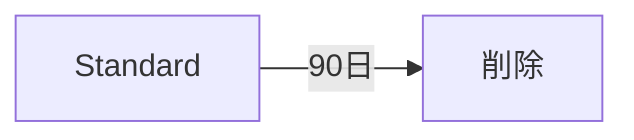
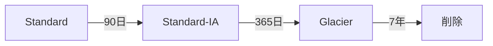
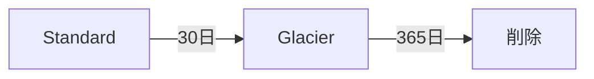

# ストレージ設計

## 目次
1. [ストレージ概要](#ストレージ概要)
2. [S3バケット設計](#s3バケット設計)
3. [EFSボリューム設計](#efsボリューム設計)
4. [ライフサイクル管理](#ライフサイクル管理)
5. [セキュリティ設計](#セキュリティ設計)
6. [バックアップ設計](#バックアップ設計)

---

## ストレージ概要

### ストレージ構成図

```mermaid
graph TB
    subgraph "本番環境 (us-east-1)"
        subgraph "S3バケット"
            S3_APP[アプリケーションログ<br/>kaigo-subsys-prod-app-logs]
            S3_AUDIT[監査ログ<br/>kaigo-subsys-prod-audit-logs]
            S3_BACKUP[バックアップ<br/>kaigo-subsys-prod-backups]
            S3_ARCHIVE[アーカイブ<br/>kaigo-subsys-prod-archives]
        end

        subgraph "EFS"
            EFS1[共有ファイル<br/>kaigo-subsys-prod-shared]
        end

        subgraph "ECS"
            ECS[ECS Fargate<br/>コンテナ]
        end

        ECS --> S3_APP
        ECS --> S3_AUDIT
        ECS --> EFS1
        RDS[RDS] -.バックアップ.-> S3_BACKUP
    end

    subgraph "DR環境 (us-west-2)"
        S3_DR[レプリケーション先<br/>kaigo-subsys-dr-backups]
    end

    S3_BACKUP -.クロスリージョン<br/>レプリケーション.-> S3_DR

    style S3_APP fill:#e1f5ff
    style S3_AUDIT fill:#ffe1e1
    style S3_BACKUP fill:#e1ffe1
    style S3_DR fill:#fff4e1
```

### ストレージ要件

| 項目 | 本番環境 | ステージング環境 | 理由 |
|------|----------|-----------------|------|
| S3バケット数 | 4 | 4 | 用途別に分離 |
| EFSボリューム数 | 1 | 1 | 共有ファイル用 |
| 暗号化 | 必須 (KMS) | 必須 (KMS) | セキュリティ要件 |
| バージョニング | 有効 | 有効 | 誤削除対策 |
| クロスリージョンレプリケーション | 有効 | 無効 | DR要件 |
| ライフサイクルルール | 有効 | 有効 | コスト最適化 |

---

## S3バケット設計

### バケット一覧

#### 本番環境

| バケット名 | 用途 | 暗号化 | バージョニング | CRR | ライフサイクル |
|-----------|------|--------|---------------|-----|--------------|
| `kaigo-subsys-prod-app-logs` | アプリケーションログ | KMS | 有効 | 無効 | 90日後削除 |
| `kaigo-subsys-prod-audit-logs` | 監査ログ | KMS | 有効 | 無効 | 7年保管後Glacier |
| `kaigo-subsys-prod-backups` | DBバックアップ | KMS | 有効 | 有効 | 30日後Glacier |
| `kaigo-subsys-prod-archives` | アーカイブ | KMS | 有効 | 無効 | 即時Glacier |

#### ステージング環境

| バケット名 | 用途 | 暗号化 | バージョニング | CRR | ライフサイクル |
|-----------|------|--------|---------------|-----|--------------|
| `kaigo-subsys-stg-app-logs` | アプリケーションログ | KMS | 有効 | 無効 | 30日後削除 |
| `kaigo-subsys-stg-audit-logs` | 監査ログ | KMS | 有効 | 無効 | 1年保管後削除 |
| `kaigo-subsys-stg-backups` | DBバックアップ | KMS | 有効 | 無効 | 7日後削除 |
| `kaigo-subsys-stg-archives` | アーカイブ | KMS | 有効 | 無効 | 30日後削除 |

#### DR環境

| バケット名 | 用途 | 暗号化 | バージョニング | CRR | ライフサイクル |
|-----------|------|--------|---------------|-----|--------------|
| `kaigo-subsys-dr-backups` | DBバックアップ（レプリカ） | KMS | 有効 | - | 30日後Glacier |

### バケット設定詳細

#### 1. アプリケーションログバケット

**用途**:
- ECSコンテナからのアプリケーションログ
- CloudWatch Logsからのエクスポート
- アクセスログ

**設定**:
```json
{
  "Bucket": "kaigo-subsys-prod-app-logs",
  "Versioning": "Enabled",
  "Encryption": {
    "Type": "KMS",
    "KmsKeyId": "arn:aws:kms:us-east-1:123456789012:key/app-logs-key"
  },
  "LifecycleRules": [
    {
      "Id": "DeleteOldLogs",
      "Status": "Enabled",
      "ExpirationDays": 90
    }
  ],
  "PublicAccessBlock": {
    "BlockPublicAcls": true,
    "IgnorePublicAcls": true,
    "BlockPublicPolicy": true,
    "RestrictPublicBuckets": true
  }
}
```

#### 2. 監査ログバケット

**用途**:
- CloudTrailログ
- VPCフローログ
- WAFログ
- ALBアクセスログ

**設定**:
```json
{
  "Bucket": "kaigo-subsys-prod-audit-logs",
  "Versioning": "Enabled",
  "Encryption": {
    "Type": "KMS",
    "KmsKeyId": "arn:aws:kms:us-east-1:123456789012:key/audit-logs-key"
  },
  "LifecycleRules": [
    {
      "Id": "MoveToGlacier",
      "Status": "Enabled",
      "Transitions": [
        {
          "Days": 90,
          "StorageClass": "STANDARD_IA"
        },
        {
          "Days": 365,
          "StorageClass": "GLACIER"
        }
      ],
      "ExpirationDays": 2555
    }
  ],
  "ObjectLock": {
    "Enabled": true,
    "Rule": {
      "DefaultRetention": {
        "Mode": "COMPLIANCE",
        "Years": 7
      }
    }
  }
}
```

**オブジェクトロック理由**:
- 監査ログは法令により7年間保管義務
- COMPLIANCE モードで改ざん防止

#### 3. バックアップバケット

**用途**:
- RDS自動バックアップのエクスポート
- EBS スナップショットのエクスポート
- EFS バックアップ

**設定**:
```json
{
  "Bucket": "kaigo-subsys-prod-backups",
  "Versioning": "Enabled",
  "Encryption": {
    "Type": "KMS",
    "KmsKeyId": "arn:aws:kms:us-east-1:123456789012:key/backup-key"
  },
  "ReplicationConfiguration": {
    "Role": "arn:aws:iam::123456789012:role/s3-replication-role",
    "Rules": [
      {
        "Status": "Enabled",
        "Priority": 1,
        "Filter": {},
        "Destination": {
          "Bucket": "arn:aws:s3:::kaigo-subsys-dr-backups",
          "ReplicaKmsKeyID": "arn:aws:kms:us-west-2:123456789012:key/dr-backup-key"
        }
      }
    ]
  },
  "LifecycleRules": [
    {
      "Id": "MoveToGlacier",
      "Status": "Enabled",
      "Transitions": [
        {
          "Days": 30,
          "StorageClass": "GLACIER"
        }
      ],
      "ExpirationDays": 365
    }
  ]
}
```

#### 4. アーカイブバケット

**用途**:
- 長期保管が必要なファイル
- 過去年度のデータアーカイブ

**設定**:
```json
{
  "Bucket": "kaigo-subsys-prod-archives",
  "Versioning": "Enabled",
  "Encryption": {
    "Type": "KMS",
    "KmsKeyId": "arn:aws:kms:us-east-1:123456789012:key/archive-key"
  },
  "LifecycleRules": [
    {
      "Id": "ImmediateGlacier",
      "Status": "Enabled",
      "Transitions": [
        {
          "Days": 0,
          "StorageClass": "GLACIER"
        }
      ]
    }
  ]
}
```

---

## EFSボリューム設計

### EFS概要

| 項目 | 本番環境 | ステージング環境 |
|------|----------|-----------------|
| ファイルシステム名 | `kaigo-subsys-prod-shared` | `kaigo-subsys-stg-shared` |
| パフォーマンスモード | 汎用 (General Purpose) | 汎用 (General Purpose) |
| スループットモード | バースト | バースト |
| 暗号化 | 有効 (KMS) | 有効 (KMS) |
| ライフサイクル管理 | 30日後IA | 30日後IA |
| バックアップ | AWS Backup (毎日) | AWS Backup (毎週) |

### マウントターゲット

#### 本番環境

| AZ | サブネット | セキュリティグループ |
|----|-----------|-------------------|
| us-east-1a | `kaigo-subsys-prod-private-us-east-1a` | `kaigo-subsys-prod-efs-sg` |
| us-east-1b | `kaigo-subsys-prod-private-us-east-1b` | `kaigo-subsys-prod-efs-sg` |

#### ステージング環境

| AZ | サブネット | セキュリティグループ |
|----|-----------|-------------------|
| us-east-1a | `kaigo-subsys-stg-private-us-east-1a` | `kaigo-subsys-stg-efs-sg` |

### EFS用セキュリティグループ

```json
{
  "GroupName": "kaigo-subsys-prod-efs-sg",
  "InboundRules": [
    {
      "Protocol": "TCP",
      "Port": 2049,
      "Source": "kaigo-subsys-prod-ecs-sg",
      "Description": "NFS from ECS tasks"
    }
  ],
  "OutboundRules": []
}
```

### ECSタスクからのマウント

**ECS タスク定義例**:
```json
{
  "volumes": [
    {
      "name": "shared-data",
      "efsVolumeConfiguration": {
        "fileSystemId": "fs-0123456789abcdef",
        "transitEncryption": "ENABLED",
        "transitEncryptionPort": 2049,
        "authorizationConfig": {
          "iam": "ENABLED"
        }
      }
    }
  ],
  "containerDefinitions": [
    {
      "name": "app",
      "mountPoints": [
        {
          "sourceVolume": "shared-data",
          "containerPath": "/mnt/shared",
          "readOnly": false
        }
      ]
    }
  ]
}
```

---

## ライフサイクル管理

### S3ライフサイクルルール詳細

詳細は [s3_lifecycle_policy.json](./s3_lifecycle_policy.json) を参照

#### アプリケーションログ



#### 監査ログ



#### バックアップ



### EFSライフサイクル管理

| 項目 | 設定 |
|------|------|
| IA移行ポリシー | 30日間アクセスなし |
| IA ストレージクラス | Standard-IA (85%コスト削減) |

---

## セキュリティ設計

### S3バケットポリシー

#### 監査ログバケットポリシー例

```json
{
  "Version": "2012-10-17",
  "Statement": [
    {
      "Sid": "DenyUnencryptedObjectUploads",
      "Effect": "Deny",
      "Principal": "*",
      "Action": "s3:PutObject",
      "Resource": "arn:aws:s3:::kaigo-subsys-prod-audit-logs/*",
      "Condition": {
        "StringNotEquals": {
          "s3:x-amz-server-side-encryption": "aws:kms"
        }
      }
    },
    {
      "Sid": "DenyInsecureTransport",
      "Effect": "Deny",
      "Principal": "*",
      "Action": "s3:*",
      "Resource": [
        "arn:aws:s3:::kaigo-subsys-prod-audit-logs",
        "arn:aws:s3:::kaigo-subsys-prod-audit-logs/*"
      ],
      "Condition": {
        "Bool": {
          "aws:SecureTransport": "false"
        }
      }
    },
    {
      "Sid": "AllowCloudTrailAclCheck",
      "Effect": "Allow",
      "Principal": {
        "Service": "cloudtrail.amazonaws.com"
      },
      "Action": "s3:GetBucketAcl",
      "Resource": "arn:aws:s3:::kaigo-subsys-prod-audit-logs"
    },
    {
      "Sid": "AllowCloudTrailWrite",
      "Effect": "Allow",
      "Principal": {
        "Service": "cloudtrail.amazonaws.com"
      },
      "Action": "s3:PutObject",
      "Resource": "arn:aws:s3:::kaigo-subsys-prod-audit-logs/AWSLogs/123456789012/*",
      "Condition": {
        "StringEquals": {
          "s3:x-amz-acl": "bucket-owner-full-control"
        }
      }
    }
  ]
}
```

### KMS暗号化キー

| キー用途 | キーエイリアス | ローテーション |
|---------|--------------|--------------|
| アプリケーションログ | `alias/kaigo-subsys-prod-app-logs` | 有効 (年次) |
| 監査ログ | `alias/kaigo-subsys-prod-audit-logs` | 有効 (年次) |
| バックアップ | `alias/kaigo-subsys-prod-backups` | 有効 (年次) |
| EFS | `alias/kaigo-subsys-prod-efs` | 有効 (年次) |

### アクセス制御

#### IAMロールベースのアクセス制御

| ロール | S3アクセス | EFSアクセス |
|-------|-----------|-----------|
| ECS Task Role | アプリログ書き込み | 読み書き可能 |
| Lambda Function Role | バックアップ読み書き | アクセス不可 |
| Admin Role | すべて読み書き可能 | すべて読み書き可能 |
| Auditor Role | 監査ログ読み取りのみ | アクセス不可 |

---

## バックアップ設計

### S3バケットのバックアップ

| バケット | バージョニング | クロスリージョンレプリケーション | オブジェクトロック |
|---------|--------------|------------------------------|------------------|
| アプリケーションログ | 有効 | 無効 | 無効 |
| 監査ログ | 有効 | 無効 | 有効 (7年) |
| バックアップ | 有効 | 有効 (us-west-2) | 無効 |
| アーカイブ | 有効 | 無効 | 無効 |

### EFSバックアップ (AWS Backup)

#### 本番環境

| 項目 | 設定 |
|------|------|
| バックアップ頻度 | 毎日 04:00 JST |
| 保持期間 | 30日 |
| コピー先 | us-west-2 (DR) |
| バックアップウィンドウ | 1時間 |
| 完了ウィンドウ | 8時間 |

#### ステージング環境

| 項目 | 設定 |
|------|------|
| バックアップ頻度 | 毎週日曜 |
| 保持期間 | 7日 |
| コピー先 | なし |

---

## コスト見積もり

### 本番環境 (月額)

| 項目 | 容量/使用量 | 単価 | 月額費用 |
|------|-----------|------|---------|
| S3 Standard (アプリログ) | 100 GB | $0.023/GB | $2.30 |
| S3 Standard-IA (監査ログ) | 500 GB | $0.0125/GB | $6.25 |
| S3 Glacier (監査ログ) | 2 TB | $0.004/GB | $8.19 |
| S3 Standard (バックアップ) | 50 GB | $0.023/GB | $1.15 |
| S3 Glacier (バックアップ) | 500 GB | $0.004/GB | $2.05 |
| CRR データ転送 | 10 GB/日 | $0.02/GB | $6.00 |
| EFS Standard | 100 GB | $0.30/GB | $30.00 |
| EFS Standard-IA | 200 GB | $0.043/GB | $8.60 |
| AWS Backup (EFS) | 300 GB | $0.05/GB | $15.00 |
| **合計** | - | - | **$79.54** |

### ステージング環境 (月額)

| 項目 | 容量/使用量 | 単価 | 月額費用 |
|------|-----------|------|---------|
| S3 Standard (アプリログ) | 20 GB | $0.023/GB | $0.46 |
| S3 Standard (監査ログ) | 50 GB | $0.023/GB | $1.15 |
| S3 Standard (バックアップ) | 10 GB | $0.023/GB | $0.23 |
| EFS Standard | 20 GB | $0.30/GB | $6.00 |
| EFS Standard-IA | 30 GB | $0.043/GB | $1.29 |
| AWS Backup (EFS) | 50 GB | $0.05/GB | $2.50 |
| **合計** | - | - | **$11.63** |

---

## 運用手順

### S3バケットの作成

```bash
# CloudFormation で一括作成
aws cloudformation create-stack \
  --stack-name kaigo-subsys-prod-storage \
  --template-body file://storage.yaml \
  --parameters ParameterKey=Environment,ParameterValue=prod
```

### EFSファイルシステムの作成

```bash
# CloudFormation で作成
aws cloudformation create-stack \
  --stack-name kaigo-subsys-prod-efs \
  --template-body file://efs.yaml \
  --parameters ParameterKey=Environment,ParameterValue=prod
```

### バックアップの復元

#### S3バージョニングから復元

```bash
# 削除されたオブジェクトを復元
aws s3api list-object-versions \
  --bucket kaigo-subsys-prod-backups \
  --prefix backup-2025-01-01

aws s3api copy-object \
  --bucket kaigo-subsys-prod-backups \
  --copy-source kaigo-subsys-prod-backups/backup-2025-01-01?versionId=xxx \
  --key backup-2025-01-01-restored
```

#### EFS バックアップから復元

```bash
# AWS Backup コンソールから復元
# または CLI
aws backup start-restore-job \
  --recovery-point-arn arn:aws:backup:us-east-1:123456789012:recovery-point:xxx \
  --metadata file-system-id=fs-0123456789abcdef
```

---

## 関連ドキュメント

- [S3 ライフサイクルポリシー](./s3_lifecycle_policy.json)
- [セキュリティ設計](../07_security/security_design.md)
- [バックアップ設計](../09_backup_dr/backup_dr_design.md)
- [監視設計](../08_monitoring/monitoring_design.md)

---

**作成日**: 2025-11-05
**作成者**: Architect
**バージョン**: 1.0
