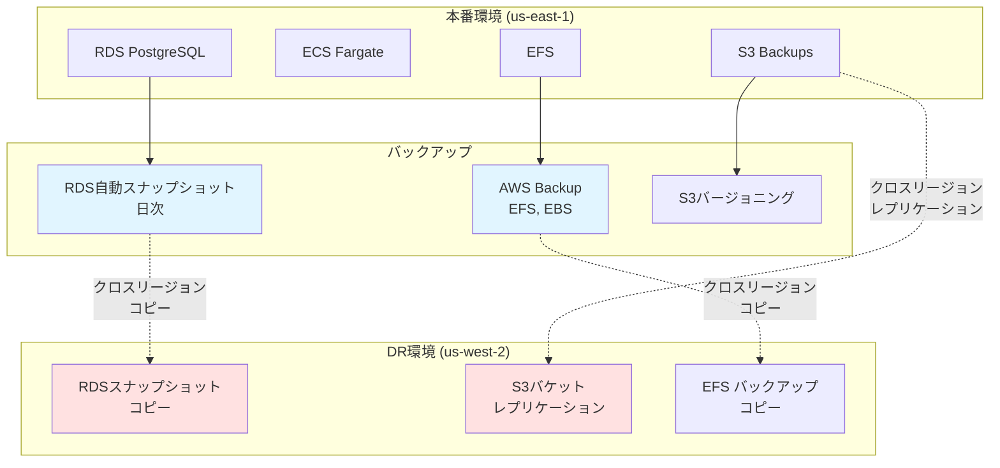
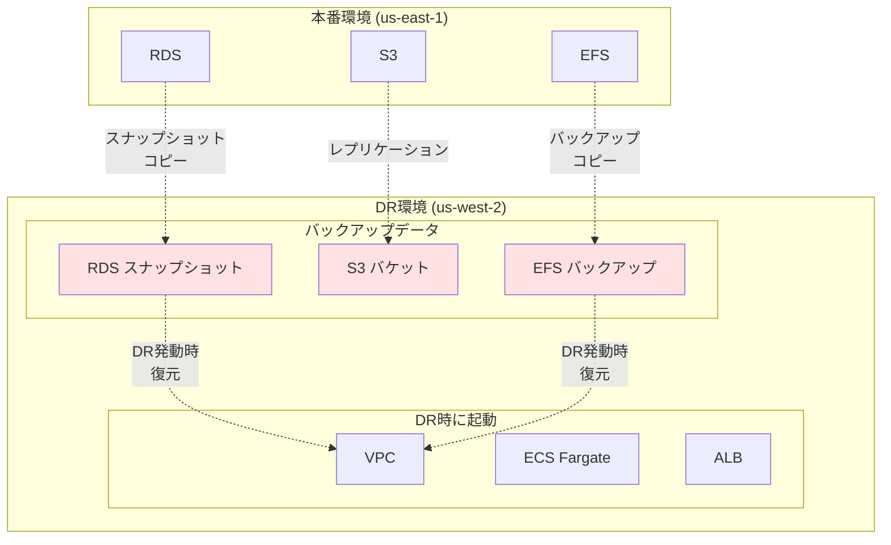

# バックアップ・DR設計

## 目次
1. [バックアップ・DR概要](#バックアップdr概要)
2. [バックアップ設計](#バックアップ設計)
3. [DR (災害復旧) 設計](#dr災害復旧設計)
4. [BCP (事業継続計画)](#bcp事業継続計画)
5. [復旧手順](#復旧手順)

---

## バックアップ・DR概要

### 要件

| 項目 | 要件 | 実装方法 |
|------|------|---------|
| RPO (Recovery Point Objective) | 1時間 | RDS自動バックアップ、AWS Backup |
| RTO (Recovery Time Objective) | 4時間 | クロスリージョンレプリケーション、DR環境 |
| バックアップ保持期間 | 30日 (本番)、7日 (ステージング) | RDS、AWS Backup設定 |
| DR環境 | us-west-2 | クロスリージョンレプリケーション |

### バックアップ・DR戦略



---

## バックアップ設計

### RDSバックアップ

#### 自動バックアップ設定

| 項目 | 本番環境 | ステージング環境 |
|------|----------|-----------------|
| バックアップ保持期間 | 30日 | 7日 |
| バックアップウィンドウ | 03:00-04:00 JST | 任意 |
| スナップショット頻度 | 日次 | 日次 |
| ポイントインタイムリカバリ (PITR) | 有効 | 有効 |
| PITR保持期間 | 7日 | 1日 |
| クロスリージョンコピー | 有効 (us-west-2) | 無効 |

#### 手動スナップショット

| タイミング | 保持期間 | 用途 |
|-----------|---------|------|
| 本番リリース前 | 永久 | ロールバック用 |
| 大規模データ変更前 | 永久 | ロールバック用 |
| 月次バックアップ | 1年 | 長期保管 |

### ElastiCacheバックアップ

| 項目 | 本番環境 | ステージング環境 |
|------|----------|-----------------|
| バックアップ保持期間 | 7日 | 3日 |
| バックアップウィンドウ | 04:00-05:00 JST | 任意 |
| スナップショット頻度 | 日次 | 日次 |

**注意**: ElastiCacheのバックアップは復旧に時間がかかるため、キャッシュ再構築を前提とする。

### EFSバックアップ (AWS Backup)

#### バックアッププラン

**本番環境**:

| 項目 | 設定 |
|------|------|
| バックアップ頻度 | 毎日 04:00 JST |
| 保持期間 | 30日 |
| バックアップウィンドウ | 1時間 |
| 完了ウィンドウ | 8時間 |
| コピー先 | us-west-2 (DR) |
| コピー保持期間 | 30日 |

**ステージング環境**:

| 項目 | 設定 |
|------|------|
| バックアップ頻度 | 毎週日曜 |
| 保持期間 | 7日 |
| コピー先 | なし |

### S3バックアップ

#### バージョニング

| バケット | バージョニング | 保持期間 |
|---------|--------------|---------|
| アプリケーションログ | 有効 | 非現行バージョン30日後削除 |
| 監査ログ | 有効 | 非現行バージョン7年保管 |
| バックアップ | 有効 | 非現行バージョン90日後削除 |

#### クロスリージョンレプリケーション

| 項目 | 設定 |
|------|------|
| レプリケーション元 | `kaigo-subsys-prod-backups` (us-east-1) |
| レプリケーション先 | `kaigo-subsys-dr-backups` (us-west-2) |
| レプリケーション対象 | すべてのオブジェクト |
| レプリケーション時間 | リアルタイム (数分以内) |
| 暗号化 | KMS (レプリケーション先も暗号化) |

---

## DR (災害復旧) 設計

### DR環境構成

#### DR環境 (us-west-2)



### DR発動基準

| シナリオ | RTO | RPO | DR発動判断 |
|---------|-----|-----|----------|
| リージョン全停止 | 4時間 | 1時間 | AWS公式発表で4時間以上の復旧見込み |
| AZ障害 (複数AZ) | 2時間 | 1時間 | 2つ以上のAZで障害、2時間以上の復旧見込み |
| データセンター火災 | 4時間 | 1時間 | AWS公式発表で災害レベルの障害 |
| サイバー攻撃 | 8時間 | 1時間 | ランサムウェア等、データ復旧が必要 |

### DR環境の事前準備

#### CloudFormationテンプレート

- VPC、サブネット、セキュリティグループ
- ALB、ECS クラスター（サービスは0タスク）
- RDS パラメータグループ、オプショングループ

#### 事前構築するリソース

| リソース | 事前構築 | DR発動時に構築 |
|---------|---------|--------------|
| VPC | ✅ | - |
| サブネット | ✅ | - |
| セキュリティグループ | ✅ | - |
| ALB | ✅ (停止状態) | 起動 |
| ECS クラスター | ✅ (0タスク) | タスク起動 |
| RDS | ❌ | スナップショットから復元 |
| ElastiCache | ❌ | 新規作成 |
| EFS | ❌ | バックアップから復元 |

---

## BCP (事業継続計画)

### 障害シナリオと対応

#### シナリオ1: RDS障害

**想定**: RDSインスタンス停止、データ破損

**対応手順**:

1. **影響確認** (5分)
   - RDS接続不可を確認
   - アプリケーションエラーログ確認

2. **初動対応** (10分)
   - ユーザーへメンテナンス通知
   - 開発チームへ連絡

3. **復旧作業** (1-2時間)
   - 最新スナップショットから復元
   - または PITR で1時間前の状態に復旧

4. **動作確認** (30分)
   - アプリケーション接続確認
   - データ整合性確認

**RTO**: 2時間
**RPO**: 1時間

#### シナリオ2: ECS全タスク停止

**想定**: ECSタスクが何らかの理由で全停止

**対応手順**:

1. **影響確認** (5分)
   - ECS タスク数確認
   - CloudWatch Logs確認

2. **復旧作業** (15分)
   - ECS サービス更新 (desired count を増やす)
   - または手動でタスク起動

3. **動作確認** (10分)
   - ヘルスチェック確認
   - アクセステスト

**RTO**: 30分
**RPO**: 0 (データ損失なし)

#### シナリオ3: リージョン全停止 (DR発動)

**想定**: us-east-1 リージョン全体が4時間以上停止

**対応手順**:

1. **DR発動判断** (30分)
   - AWS公式発表確認
   - 経営層承認

2. **DR環境構築** (2時間)
   - RDS スナップショットから復元 (us-west-2)
   - EFS バックアップから復元
   - ECS タスク起動
   - ALB 起動

3. **DNS切り替え** (30分)
   - Route 53 で us-west-2 のALBを向くように変更
   - TTL 60秒のため、最大1分で切り替わる

4. **動作確認** (1時間)
   - 全機能の動作確認
   - パフォーマンステスト

**RTO**: 4時間
**RPO**: 1時間

### 復旧優先順位

| 優先度 | システム | 理由 |
|--------|---------|------|
| 1 | 認証システム | すべての機能に必要 |
| 2 | データベース (RDS) | データの中核 |
| 3 | アプリケーション (ECS) | サービス提供 |
| 4 | キャッシュ (ElastiCache) | 性能向上（再構築可能） |

---

## 復旧手順

詳細は [dr_procedure.md](./dr_procedure.md) を参照

### RDS復旧手順

#### 自動バックアップからの復旧

```bash
# 1. 最新スナップショット確認
aws rds describe-db-snapshots \
  --db-instance-identifier kaigo-subsys-prod \
  --query "DBSnapshots[?Status=='available'] | sort_by(@, &SnapshotCreateTime)[-1]"

# 2. スナップショットから復元
aws rds restore-db-instance-from-db-snapshot \
  --db-instance-identifier kaigo-subsys-prod-restored \
  --db-snapshot-identifier rds:kaigo-subsys-prod-2025-01-15-03-00 \
  --db-instance-class db.r6g.large \
  --vpc-security-group-ids sg-xxxxx \
  --db-subnet-group-name kaigo-subsys-prod-db-subnet-group

# 3. エンドポイント変更 (DNSまたはアプリケーション設定)
# 4. 動作確認
```

#### ポイントインタイムリカバリ (PITR)

```bash
# 特定時刻に復旧
aws rds restore-db-instance-to-point-in-time \
  --source-db-instance-identifier kaigo-subsys-prod \
  --target-db-instance-identifier kaigo-subsys-prod-pitr \
  --restore-time 2025-01-15T12:00:00Z \
  --db-instance-class db.r6g.large \
  --vpc-security-group-ids sg-xxxxx \
  --db-subnet-group-name kaigo-subsys-prod-db-subnet-group
```

### DR環境への切り替え手順

詳細は [dr_procedure.md](./dr_procedure.md) を参照

---

## バックアップ・DR テスト

### テスト計画

| テスト種別 | 頻度 | 内容 |
|-----------|------|------|
| バックアップ復元テスト | 四半期ごと | ステージング環境でRDSスナップショット復元 |
| DR訓練 | 半年ごと | DR環境での全システム起動テスト |
| フルスケールDR訓練 | 年1回 | 本番と同等のDR環境での業務シミュレーション |

### 直近のテスト予定

| テスト日 | テスト種別 | 担当 |
|---------|-----------|------|
| 2025-03-15 | バックアップ復元テスト | システム管理者 |
| 2025-06-01 | DR訓練 | 全チーム |
| 2025-12-01 | フルスケールDR訓練 | 全チーム + 経営層 |

---

## コスト見積もり

### バックアップコスト (月額)

| 項目 | 本番環境 | ステージング環境 |
|------|----------|-----------------|
| RDS スナップショット (30日保持) | $50 | $10 |
| RDS PITR (7日保持) | $20 | $5 |
| ElastiCache スナップショット | $5 | $2 |
| AWS Backup (EFS) | $15 | $3 |
| S3 クロスリージョンレプリケーション | $6 | - |
| **合計** | **$96** | **$20** |

### DR環境コスト (月額)

| 項目 | 常時稼働コスト | DR発動時コスト (1日) |
|------|--------------|-------------------|
| VPC、サブネット | $0 | $0 |
| セキュリティグループ | $0 | $0 |
| RDS (停止中) | $0 | $30 |
| ALB (停止中) | $0 | $1 |
| ECS Fargate (0タスク) | $0 | $10 |
| S3 (レプリケーション済み) | $2 | $2 |
| **合計** | **$2** | **$43** |

**年間コスト**: 約 $24/年（常時稼働分のみ）

---

## 関連ドキュメント

- [dr_procedure.md](./dr_procedure.md)
- [backup_flow.md](./backup_flow.md)
- [データベース設計](../05_database/rds_design.md)
- [監視設計](../08_monitoring/monitoring_design.md)

---

**作成日**: 2025-11-05
**作成者**: Architect
**バージョン**: 1.0
