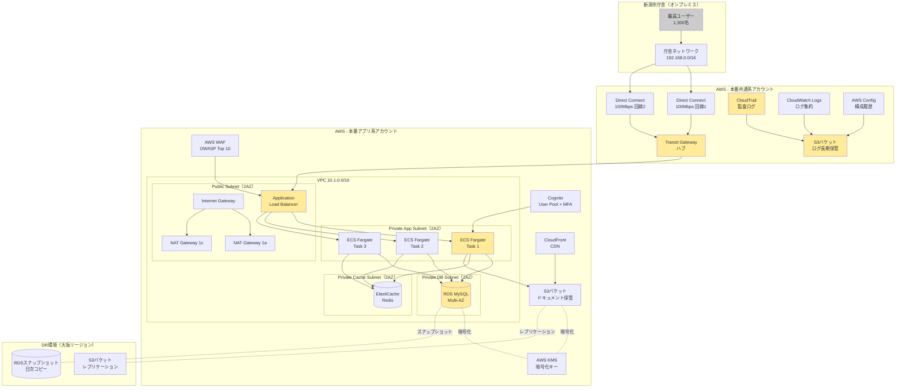
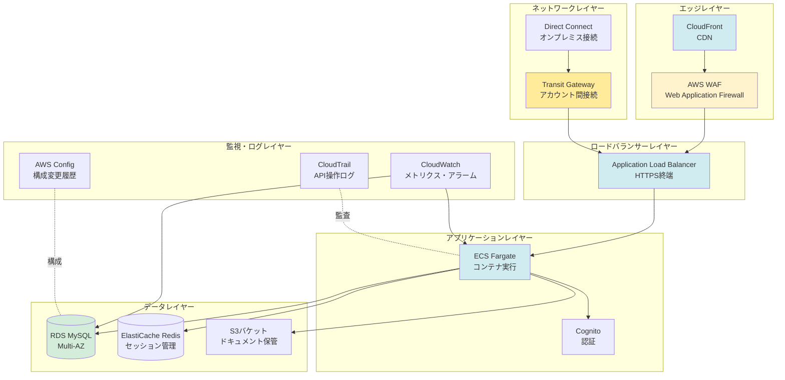
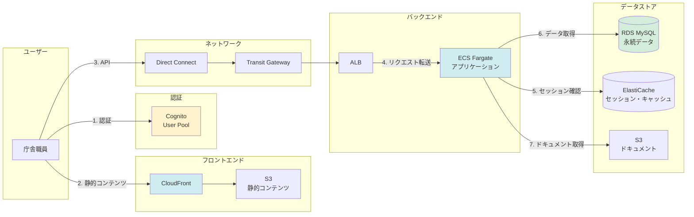
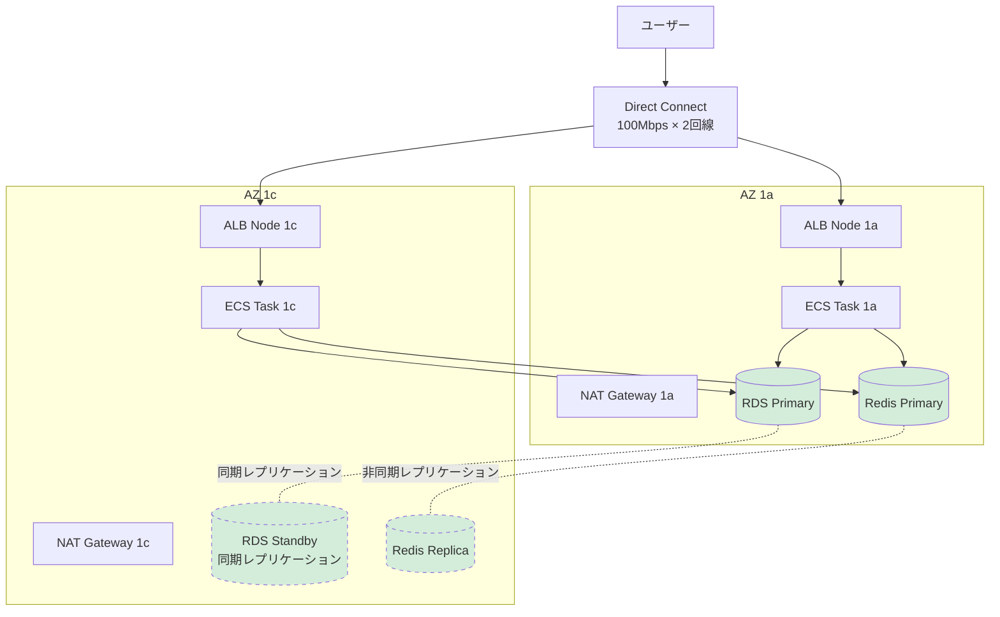
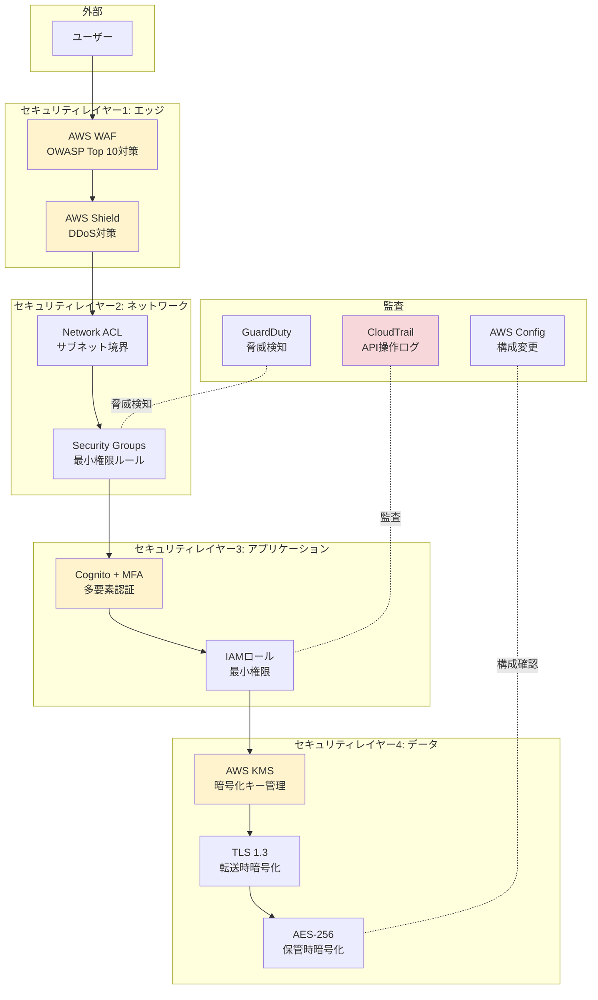
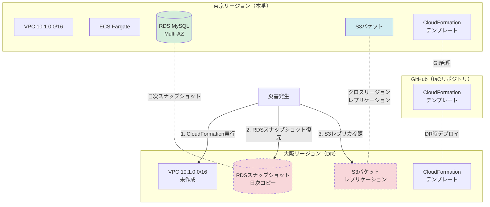

# 全体構成図

## システム全体構成（本番環境）

---

## レイヤー別構成図

---

## コンポーネント相互関係図

---

## 可用性構成図

---

## セキュリティ構成図

---

## DR構成図

---

## 次のステップ

- [ネットワーク詳細図を確認](./network_diagram.md)
- [データフロー図を確認](./dataflow_diagram.md)
