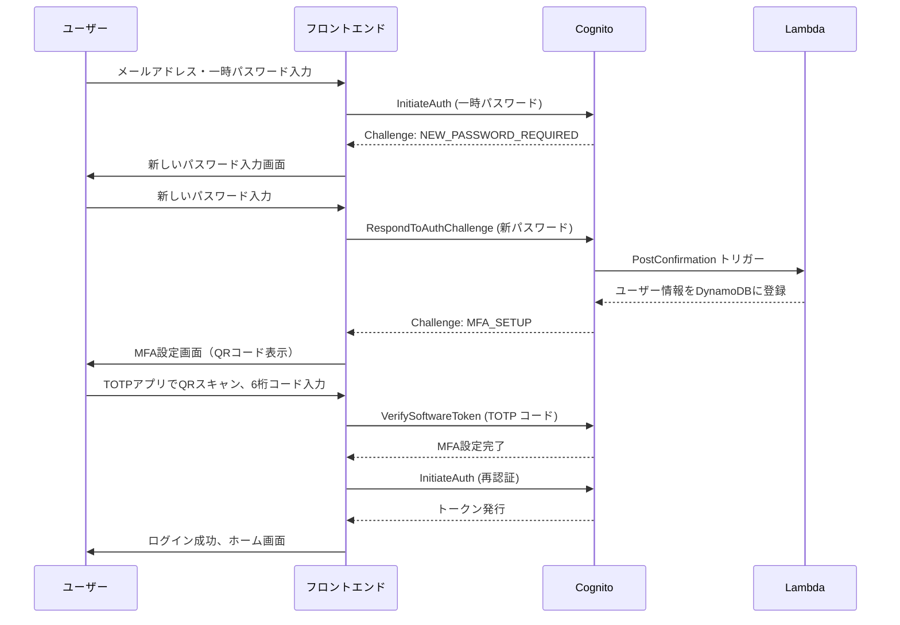
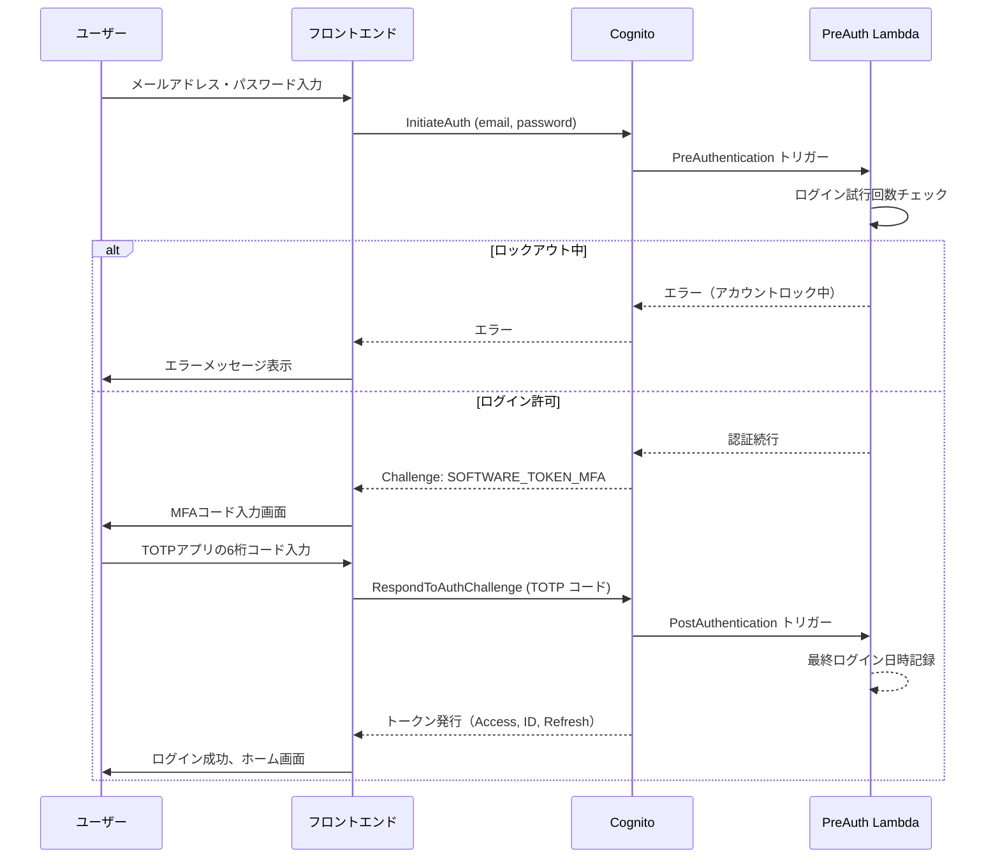
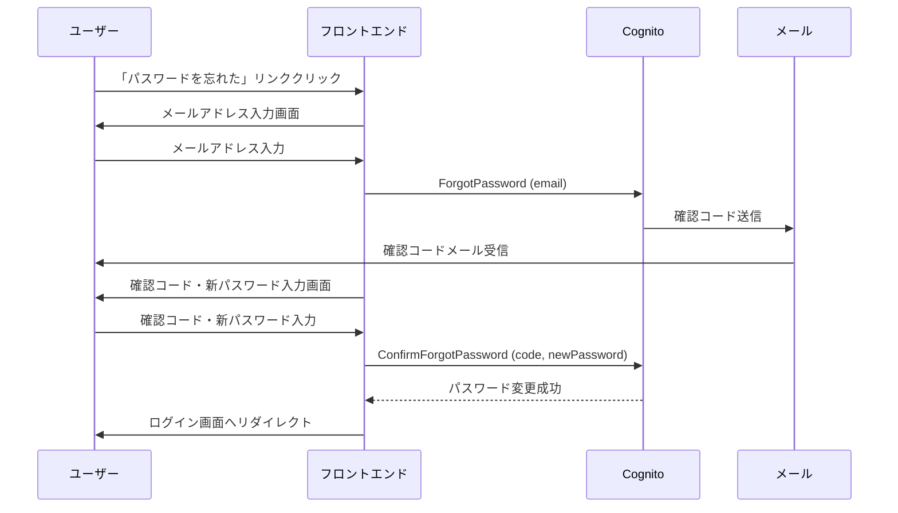
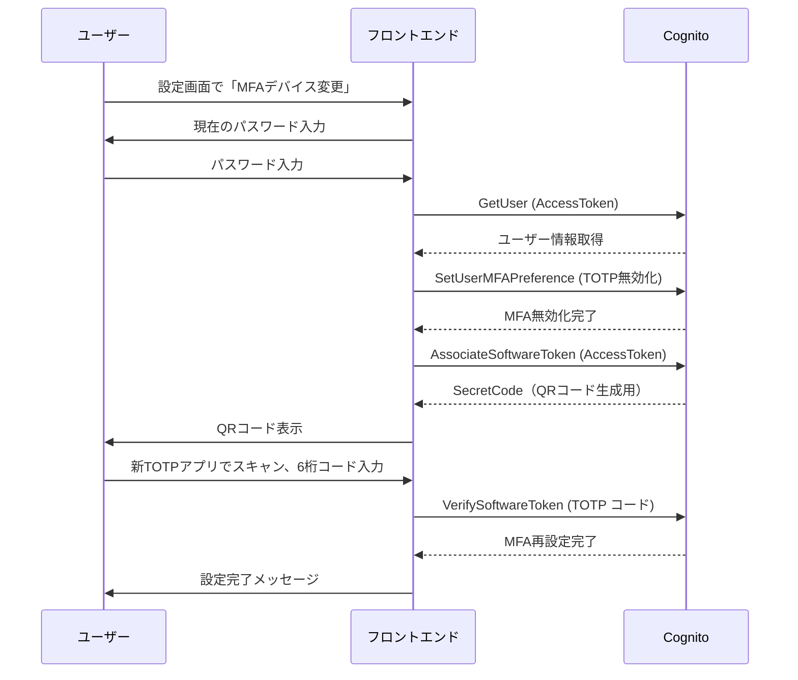
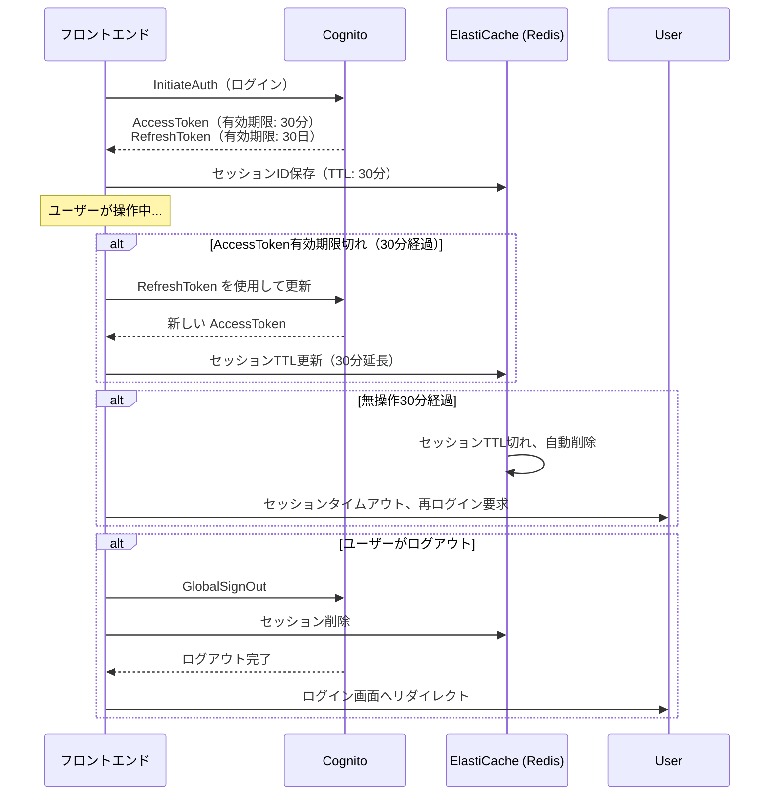

# Cognito 認証・認可設計

## 目次

1. [Cognito ユーザープール設計](#cognito-ユーザープール設計)
2. [Cognito Identity Pool設計](#cognito-identity-pool設計)
3. [ロールベースアクセス制御（RBAC）](#ロールベースアクセス制御rbac)
4. [認証フロー設計](#認証フロー設計)
5. [JWT トークン設計](#jwt-トークン設計)
6. [セキュリティ考慮事項](#セキュリティ考慮事項)

---

## Cognito ユーザープール設計

### 基本設定

| 項目 | 本番環境 | ステージング環境 |
|------|----------|-----------------|
| ユーザープール名 | `kaigo-subsys-prod-user-pool` | `kaigo-subsys-stg-user-pool` |
| リージョン | ap-northeast-1（東京） | ap-northeast-1（東京） |
| エイリアス属性 | email | email |
| サインイン方法 | email + password | email + password |
| ドメイン | `kaigo-subsys-prod.auth.ap-northeast-1.amazoncognito.com` | `kaigo-subsys-stg.auth.ap-northeast-1.amazoncognito.com` |

### パスワードポリシー（GCAS準拠）

```yaml
PasswordPolicy:
  MinimumLength: 12
  RequireUppercase: true
  RequireLowercase: true
  RequireNumbers: true
  RequireSymbols: true
  TemporaryPasswordValidityDays: 1
```

**詳細**:
- **最小文字数**: 12文字以上
- **文字種要件**:
  - 大文字英字（A-Z）必須
  - 小文字英字（a-z）必須
  - 数字（0-9）必須
  - 記号（!@#$%^&*等）必須
- **一時パスワード有効期限**: 1日（初回ログイン時に強制変更）
- **パスワード有効期限**: 90日（Lambda トリガーで実装）

### MFA設定（必須）

```yaml
MfaConfiguration: REQUIRED
EnabledMfas:
  - SOFTWARE_TOKEN_MFA  # TOTP（推奨）
  - SMS_MFA             # SMS（バックアップ）
```

**MFA方式**:
1. **TOTP（Time-based One-Time Password）** - 推奨
   - Google Authenticator、Microsoft Authenticator、Authy 対応
   - オフライン利用可能
   - コスト: 無料
2. **SMS MFA** - バックアップ
   - 携帯電話番号に6桁コード送信
   - コスト: SMS送信料（約0.1円/通）

**MFA強制フロー**:
- 初回ログイン時: パスワード変更 → MFAデバイス登録（必須）
- MFA未設定ユーザー: システムアクセス不可

### ユーザー属性

#### 標準属性

| 属性名 | 必須 | 変更可能 | 検証 | 説明 |
|--------|------|---------|------|------|
| `email` | ✅ | ✅ | ✅ | メールアドレス（ユーザー名） |
| `phone_number` | ❌ | ✅ | ✅ | 携帯電話番号（SMS MFA用） |
| `name` | ✅ | ✅ | - | 氏名 |
| `family_name` | ✅ | ✅ | - | 姓 |
| `given_name` | ✅ | ✅ | - | 名 |

#### カスタム属性

| 属性名 | 型 | 必須 | 変更可能 | 説明 |
|--------|---|------|---------|------|
| `custom:organizationId` | String | ✅ | ❌ | 事業所ID（430事業所を識別） |
| `custom:organizationName` | String | ✅ | ✅ | 事業所名 |
| `custom:role` | String | ✅ | ✅ | ロール（system_admin / org_admin / staff / auditor） |
| `custom:employeeId` | String | ❌ | ❌ | 職員ID |
| `custom:department` | String | ❌ | ✅ | 所属部署 |
| `custom:passwordLastChanged` | Number | ❌ | ✅ | パスワード最終変更日時（Unixタイムスタンプ） |

**注意**: カスタム属性は作成後に削除・型変更ができません。慎重に設計してください。

### Lambda トリガー設定

```yaml
LambdaTriggers:
  PreAuthentication: !GetAtt PreAuthenticationFunction.Arn
  PostAuthentication: !GetAtt PostAuthenticationFunction.Arn
  PostConfirmation: !GetAtt PostConfirmationFunction.Arn
  PreTokenGeneration: !GetAtt PreTokenGenerationFunction.Arn
  CustomMessage: !GetAtt CustomMessageFunction.Arn
```

#### トリガー詳細

| トリガー | 実行タイミング | 用途 | Lambda関数 |
|---------|--------------|------|-----------|
| **PreAuthentication** | 認証前 | アカウントロックアウトチェック、ログイン試行回数チェック | `kaigo-subsys-prod-pre-auth` |
| **PostAuthentication** | 認証成功後 | 最終ログイン日時の記録、ログ出力 | `kaigo-subsys-prod-post-auth` |
| **PostConfirmation** | ユーザー確認後 | 初回ログイン時の追加設定、DynamoDBへのユーザー情報登録 | `kaigo-subsys-prod-post-confirm` |
| **PreTokenGeneration** | トークン生成前 | カスタムクレーム（ロール、事業所ID）の追加 | `kaigo-subsys-prod-pre-token` |
| **CustomMessage** | メール/SMS送信前 | メッセージのカスタマイズ（日本語化） | `kaigo-subsys-prod-custom-msg` |

**PreTokenGeneration Lambda の例**（カスタムクレーム追加）:

```javascript
exports.handler = async (event) => {
  // ユーザー属性からロールと事業所IDを取得
  const role = event.request.userAttributes['custom:role'];
  const organizationId = event.request.userAttributes['custom:organizationId'];

  // IDトークンにカスタムクレームを追加
  event.response = {
    claimsOverrideDetails: {
      claimsToAddOrOverride: {
        'custom:role': role,
        'custom:organizationId': organizationId
      }
    }
  };

  return event;
};
```

### アカウントロックアウトポリシー

**実装方法**: PreAuthentication Lambda トリガー + DynamoDB

| 項目 | 設定 |
|------|------|
| ログイン試行制限 | 5回 / 15分 |
| ロックアウト時間 | 30分 |
| ロック解除方法 | 管理者による手動解除 または 30分経過後 |

**DynamoDB テーブル構造**:

```yaml
TableName: kaigo-subsys-prod-login-attempts
HashKey: userId (String)
Attributes:
  - failedAttempts (Number)
  - lastAttemptTime (Number) # Unixタイムスタンプ
  - lockedUntil (Number) # Unixタイムスタンプ
TTL: lockedUntil
```

**PreAuthentication Lambda ロジック**:

```javascript
// 1. DynamoDB から試行回数を取得
// 2. ロックアウト中か確認
//    - ロック中 → 認証拒否（"User account is locked"）
// 3. 試行回数が5回以上
//    - ロックアウト時刻を設定（現在時刻 + 30分）
//    - 認証拒否
// 4. 試行回数が5回未満
//    - 認証続行
```

### メール検証設定

```yaml
EmailVerificationMessage: |
  【新潟市介護保険事業所システム】

  メールアドレスの確認コード: {####}

  このコードを15分以内に入力してください。
EmailVerificationSubject: "【新潟市介護保険事業所システム】メールアドレス確認"
```

### ドメイン設定

| 項目 | 本番環境 | ステージング環境 |
|------|----------|-----------------|
| Cognitoドメイン | `kaigo-subsys-prod` | `kaigo-subsys-stg` |
| 完全修飾ドメイン | `kaigo-subsys-prod.auth.ap-northeast-1.amazoncognito.com` | `kaigo-subsys-stg.auth.ap-northeast-1.amazoncognito.com` |
| カスタムドメイン | `auth.kaigo-subsys.niigata.lg.jp`（検討中） | - |

**カスタムドメインのメリット**:
- ブランディング向上
- ユーザーの信頼性向上
- ACM証明書必須

---

## Cognito Identity Pool設計

### 基本設定

| 項目 | 本番環境 | ステージング環境 |
|------|----------|-----------------|
| Identity Pool名 | `kaigo-subsys-prod-identity-pool` | `kaigo-subsys-stg-identity-pool` |
| リージョン | ap-northeast-1（東京） | ap-northeast-1（東京） |
| 認証プロバイダー | Cognito User Pool | Cognito User Pool |
| 未認証ユーザー許可 | ❌ 無効 | ❌ 無効 |

### 認証プロバイダー設定

```yaml
AuthenticationProviders:
  - ProviderName: !Sub cognito-idp.${AWS::Region}.amazonaws.com/${UserPool}
    ClientId: !Ref UserPoolClient
```

### IAMロール設定

#### 認証済みユーザーロール

**ロール名**: `kaigo-subsys-prod-cognito-authenticated-role`

**信頼ポリシー**:

```json
{
  "Version": "2012-10-17",
  "Statement": [
    {
      "Effect": "Allow",
      "Principal": {
        "Federated": "cognito-identity.amazonaws.com"
      },
      "Action": "sts:AssumeRoleWithWebIdentity",
      "Condition": {
        "StringEquals": {
          "cognito-identity.amazonaws.com:aud": "ap-northeast-1:xxxxxxxx-xxxx-xxxx-xxxx-xxxxxxxxxxxx"
        },
        "ForAnyValue:StringLike": {
          "cognito-identity.amazonaws.com:amr": "authenticated"
        }
      }
    }
  ]
}
```

**権限ポリシー**（最小権限の原則）:

```json
{
  "Version": "2012-10-17",
  "Statement": [
    {
      "Effect": "Allow",
      "Action": [
        "s3:GetObject",
        "s3:PutObject"
      ],
      "Resource": "arn:aws:s3:::kaigo-subsys-prod-user-uploads/${cognito-identity.amazonaws.com:sub}/*"
    },
    {
      "Effect": "Allow",
      "Action": [
        "execute-api:Invoke"
      ],
      "Resource": "arn:aws:execute-api:ap-northeast-1:*:*/*/POST/*"
    }
  ]
}
```

**注意**: `${cognito-identity.amazonaws.com:sub}` でユーザーごとにS3パスを分離します。

#### 未認証ユーザーロール

未認証ユーザーは許可しないため、IAMロールは作成しません。

---

## ロールベースアクセス制御（RBAC）

### ロール定義

| ロール名 | ロールID | 説明 | 想定ユーザー数 |
|---------|---------|------|--------------|
| **システム管理者** | `system_admin` | すべての機能へのアクセス、ユーザー管理、システム設定変更 | 5名 |
| **事業所管理者** | `org_admin` | 自事業所のデータ管理、職員管理 | 430名（1事業所1名） |
| **一般職員** | `staff` | 自事業所のデータ閲覧・申請作成 | 約800名 |
| **監査担当者** | `auditor` | すべてのデータ閲覧のみ（変更不可） | 10名 |

### 権限マトリックス

| 機能 | システム管理者 | 事業所管理者 | 一般職員 | 監査担当者 |
|------|-------------|------------|---------|----------|
| **ユーザー管理** |  |  |  |  |
| - 全ユーザー閲覧 | ✅ | ❌ | ❌ | ✅ |
| - 自事業所ユーザー閲覧 | ✅ | ✅ | ❌ | ✅ |
| - ユーザー作成 | ✅ | ✅（自事業所のみ） | ❌ | ❌ |
| - ユーザー編集 | ✅ | ✅（自事業所のみ） | ❌ | ❌ |
| - ユーザー削除 | ✅ | ❌ | ❌ | ❌ |
| **事業所管理** |  |  |  |  |
| - 全事業所閲覧 | ✅ | ❌ | ❌ | ✅ |
| - 自事業所閲覧 | ✅ | ✅ | ✅ | ✅ |
| - 事業所作成 | ✅ | ❌ | ❌ | ❌ |
| - 事業所編集 | ✅ | ✅（自事業所のみ） | ❌ | ❌ |
| - 事業所削除 | ✅ | ❌ | ❌ | ❌ |
| **申請管理** |  |  |  |  |
| - 全申請閲覧 | ✅ | ❌ | ❌ | ✅ |
| - 自事業所申請閲覧 | ✅ | ✅ | ✅ | ✅ |
| - 申請作成 | ✅ | ✅ | ✅ | ❌ |
| - 申請編集 | ✅ | ✅ | ✅（自分の申請のみ） | ❌ |
| - 申請承認 | ✅ | ✅ | ❌ | ❌ |
| - 申請削除 | ✅ | ✅ | ❌ | ❌ |
| **ドキュメント管理** |  |  |  |  |
| - ドキュメントアップロード | ✅ | ✅ | ✅ | ❌ |
| - ドキュメントダウンロード | ✅ | ✅ | ✅ | ✅ |
| - ドキュメント削除 | ✅ | ✅ | ❌ | ❌ |
| **システム設定** |  |  |  |  |
| - システム設定閲覧 | ✅ | ❌ | ❌ | ✅ |
| - システム設定変更 | ✅ | ❌ | ❌ | ❌ |
| - 監査ログ閲覧 | ✅ | ❌ | ❌ | ✅ |

### リソースベースアクセス制御（属性ベース）

**事業所ID によるデータ分離**:

```javascript
// API Gateway Lambda オーソライザーの例
exports.handler = async (event) => {
  const token = event.authorizationToken;
  const decoded = jwt.verify(token, publicKey);

  const role = decoded['custom:role'];
  const organizationId = decoded['custom:organizationId'];

  // ポリシードキュメント生成
  return {
    principalId: decoded.sub,
    policyDocument: {
      Version: '2012-10-17',
      Statement: [
        {
          Action: 'execute-api:Invoke',
          Effect: 'Allow',
          Resource: event.methodArn
        }
      ]
    },
    context: {
      role: role,
      organizationId: organizationId
    }
  };
};
```

**アプリケーション層でのフィルタリング**:

```csharp
// .NET Core バックエンドの例
public async Task<List<Application>> GetApplications(ClaimsPrincipal user)
{
    var role = user.FindFirst("custom:role")?.Value;
    var organizationId = user.FindFirst("custom:organizationId")?.Value;

    if (role == "system_admin" || role == "auditor")
    {
        // すべての申請を取得
        return await _dbContext.Applications.ToListAsync();
    }
    else
    {
        // 自事業所の申請のみ取得
        return await _dbContext.Applications
            .Where(a => a.OrganizationId == organizationId)
            .ToListAsync();
    }
}
```

---

## 認証フロー設計

### 1. 初回ログインフロー



### 2. 通常ログインフロー（MFA有効）



### 3. パスワード忘れフロー



### 4. MFAデバイス再設定フロー



### 5. セッション管理フロー



---

## JWT トークン設計

### トークン種別

| トークン | 有効期限 | 用途 | 保存場所 |
|---------|---------|------|---------|
| **IDトークン** | 30分 | ユーザー属性（ロール、事業所ID等）の取得 | フロントエンド（メモリ） |
| **アクセストークン** | 30分 | APIアクセス認可 | フロントエンド（メモリ） |
| **リフレッシュトークン** | 30日 | アクセストークン・IDトークンの更新 | フロントエンド（HttpOnly Cookie）|

### IDトークンの構造

**ヘッダー**:

```json
{
  "kid": "xxxxxxxxxxxxxxxxxxxxxxxx",
  "alg": "RS256"
}
```

**ペイロード**（カスタムクレーム含む）:

```json
{
  "sub": "xxxxxxxx-xxxx-xxxx-xxxx-xxxxxxxxxxxx",
  "cognito:username": "user@example.com",
  "email": "user@example.com",
  "name": "山田 太郎",
  "family_name": "山田",
  "given_name": "太郎",
  "custom:organizationId": "ORG-001",
  "custom:organizationName": "〇〇介護事業所",
  "custom:role": "org_admin",
  "custom:employeeId": "EMP-12345",
  "custom:department": "総務部",
  "iss": "https://cognito-idp.ap-northeast-1.amazonaws.com/ap-northeast-1_xxxxxxxxx",
  "aud": "xxxxxxxxxxxxxxxxxxxxxxxxxx",
  "token_use": "id",
  "auth_time": 1699999999,
  "exp": 1700001799,
  "iat": 1699999999
}
```

**カスタムクレーム**:
- `custom:organizationId`: 事業所ID（データフィルタリングに使用）
- `custom:role`: ロール（RBAC に使用）

### アクセストークンの構造

**ペイロード**:

```json
{
  "sub": "xxxxxxxx-xxxx-xxxx-xxxx-xxxxxxxxxxxx",
  "device_key": "ap-northeast-1_xxxxxxxxx",
  "token_use": "access",
  "scope": "aws.cognito.signin.user.admin",
  "auth_time": 1699999999,
  "exp": 1700001799,
  "iat": 1699999999,
  "jti": "xxxxxxxx-xxxx-xxxx-xxxx-xxxxxxxxxxxx",
  "client_id": "xxxxxxxxxxxxxxxxxxxxxxxxxx",
  "username": "user@example.com"
}
```

### リフレッシュトークンの管理

**保存方法**（セキュリティ重視）:

```javascript
// フロントエンド（Next.js）での実装例
// HttpOnly Cookie に保存（XSS攻撃対策）
document.cookie = `refreshToken=${refreshToken}; HttpOnly; Secure; SameSite=Strict; Max-Age=2592000`; // 30日
```

**更新フロー**:

```javascript
// アクセストークン期限切れ時の自動更新
async function refreshAccessToken() {
  const refreshToken = getRefreshTokenFromCookie();

  const response = await fetch('https://cognito-idp.ap-northeast-1.amazonaws.com/', {
    method: 'POST',
    headers: {
      'X-Amz-Target': 'AWSCognitoIdentityProviderService.InitiateAuth',
      'Content-Type': 'application/x-amz-json-1.1'
    },
    body: JSON.stringify({
      AuthFlow: 'REFRESH_TOKEN_AUTH',
      ClientId: 'xxxxxxxxxxxxxxxxxxxxxxxxxx',
      AuthParameters: {
        REFRESH_TOKEN: refreshToken
      }
    })
  });

  const data = await response.json();
  return {
    accessToken: data.AuthenticationResult.AccessToken,
    idToken: data.AuthenticationResult.IdToken
  };
}
```

### トークン検証（バックエンド）

**.NET Core での検証例**:

```csharp
using Microsoft.IdentityModel.Tokens;
using System.IdentityModel.Tokens.Jwt;

public class CognitoTokenValidator
{
    private readonly string _region = "ap-northeast-1";
    private readonly string _userPoolId = "ap-northeast-1_xxxxxxxxx";
    private readonly string _jwksUri;

    public CognitoTokenValidator()
    {
        _jwksUri = $"https://cognito-idp.{_region}.amazonaws.com/{_userPoolId}/.well-known/jwks.json";
    }

    public async Task<ClaimsPrincipal> ValidateToken(string token)
    {
        var handler = new JwtSecurityTokenHandler();

        // JWKS取得
        var httpClient = new HttpClient();
        var jwks = await httpClient.GetStringAsync(_jwksUri);
        var keys = new JsonWebKeySet(jwks);

        var validationParameters = new TokenValidationParameters
        {
            ValidateIssuer = true,
            ValidIssuer = $"https://cognito-idp.{_region}.amazonaws.com/{_userPoolId}",
            ValidateAudience = true,
            ValidAudience = "xxxxxxxxxxxxxxxxxxxxxxxxxx", // Client ID
            ValidateLifetime = true,
            IssuerSigningKeys = keys.Keys
        };

        var principal = handler.ValidateToken(token, validationParameters, out var validatedToken);
        return principal;
    }
}
```

---

## セキュリティ考慮事項

### 1. アカウントロックアウトポリシー

| 項目 | 設定 | 実装方法 |
|------|------|---------|
| ログイン試行制限 | 5回 / 15分 | PreAuthentication Lambda + DynamoDB |
| ロックアウト時間 | 30分 | DynamoDB TTL |
| ロック解除方法 | 管理者による手動解除 または 30分経過後 | 管理画面 + DynamoDB更新 |
| ロックアウト通知 | ユーザーにメール通知 | CustomMessage Lambda |

### 2. ログイン試行制限

**DynamoDB テーブル設計**:

```yaml
TableName: kaigo-subsys-prod-login-attempts
HashKey: userId (String)
Attributes:
  failedAttempts: Number
  lastAttemptTime: Number # Unixタイムスタンプ
  lockedUntil: Number # Unixタイムスタンプ
  ipAddress: String
  userAgent: String
TTL: lockedUntil # 30分後に自動削除
```

**PreAuthentication Lambda ロジック**:

```javascript
exports.handler = async (event) => {
  const userId = event.userName;
  const now = Math.floor(Date.now() / 1000);

  // DynamoDBから試行回数を取得
  const attempts = await getLoginAttempts(userId);

  // ロックアウト中か確認
  if (attempts.lockedUntil && attempts.lockedUntil > now) {
    throw new Error('User account is locked. Please try again later.');
  }

  // 15分以内の試行回数をカウント
  if (attempts.lastAttemptTime && (now - attempts.lastAttemptTime) < 900) {
    if (attempts.failedAttempts >= 5) {
      // ロックアウト
      await lockUser(userId, now + 1800); // 30分後
      throw new Error('Too many failed login attempts. Account locked for 30 minutes.');
    }
  } else {
    // 15分以上経過している場合、カウントリセット
    await resetLoginAttempts(userId);
  }

  return event; // 認証続行
};
```

### 3. トークン漏洩時の対応

**対応手順**:

1. **即座のトークン無効化**:
   ```bash
   aws cognito-idp admin-user-global-sign-out \
     --user-pool-id ap-northeast-1_xxxxxxxxx \
     --username user@example.com
   ```

2. **パスワード強制変更**:
   ```bash
   aws cognito-idp admin-reset-user-password \
     --user-pool-id ap-northeast-1_xxxxxxxxx \
     --username user@example.com
   ```

3. **MFA再設定要求**:
   - ユーザーに連絡し、MFAデバイスを再設定させる

4. **監査ログ確認**:
   - CloudTrail で不正アクセスの形跡を調査
   - 影響範囲の特定

### 4. MFAバックアップコード

**実装方法**: Lambda + DynamoDB

**DynamoDB テーブル設計**:

```yaml
TableName: kaigo-subsys-prod-mfa-backup-codes
HashKey: userId (String)
RangeKey: code (String)
Attributes:
  used: Boolean
  createdAt: Number # Unixタイムスタンプ
  usedAt: Number # Unixタイムスタンプ
```

**バックアップコード生成**:

```javascript
// MFA設定時に10個のバックアップコードを生成
function generateBackupCodes(count = 10) {
  const codes = [];
  for (let i = 0; i < count; i++) {
    codes.push(crypto.randomBytes(4).toString('hex').toUpperCase());
  }
  return codes;
}

// DynamoDB に保存
async function saveBackupCodes(userId, codes) {
  const items = codes.map(code => ({
    userId,
    code,
    used: false,
    createdAt: Date.now()
  }));

  await dynamoDB.batchWrite({
    RequestItems: {
      'kaigo-subsys-prod-mfa-backup-codes': items.map(item => ({
        PutRequest: { Item: item }
      }))
    }
  });
}
```

**バックアップコード使用フロー**:

1. ユーザーがTOTPアプリにアクセスできない
2. ログイン画面で「バックアップコードを使用」を選択
3. バックアップコードを入力
4. Lambda でバックアップコードを検証
   - コードが存在するか
   - 未使用か
5. 検証成功 → ログイン許可、コードを「使用済み」に変更
6. 検証失敗 → エラー

### 5. セッションタイムアウト

| 項目 | 設定 |
|------|------|
| アクセストークン有効期限 | 30分 |
| IDトークン有効期限 | 30分 |
| リフレッシュトークン有効期限 | 30日 |
| 無操作タイムアウト | 30分（ElastiCache TTL） |

**ElastiCache（Redis）でのセッション管理**:

```javascript
// ログイン時
await redis.set(`session:${userId}`, JSON.stringify(sessionData), 'EX', 1800); // 30分

// API呼び出し時（操作があった場合）
await redis.expire(`session:${userId}`, 1800); // TTL更新

// ログアウト時
await redis.del(`session:${userId}`);
```

### 6. パスワード有効期限（90日）

**実装方法**: PreAuthentication Lambda

```javascript
exports.handler = async (event) => {
  const userId = event.userName;
  const now = Math.floor(Date.now() / 1000);

  // ユーザー属性から最終パスワード変更日を取得
  const user = await cognito.adminGetUser({
    UserPoolId: event.userPoolId,
    Username: userId
  });

  const passwordLastChanged = user.UserAttributes.find(
    attr => attr.Name === 'custom:passwordLastChanged'
  )?.Value;

  if (passwordLastChanged) {
    const daysSinceChange = (now - parseInt(passwordLastChanged)) / 86400;

    if (daysSinceChange > 90) {
      // パスワード変更要求
      throw new Error('Password expired. Please change your password.');
    }
  }

  return event; // 認証続行
};
```

---

## 関連ドキュメント

- [cognito_parameters.md](./cognito_parameters.md) - CloudFormation パラメータ定義
- [authentication_flow.md](./authentication_flow.md) - 認証フロー詳細
- [mfa_setup.md](./mfa_setup.md) - MFA設定手順
- [セキュリティ設計](../../basic/07_security/security_design.md)

---

**作成日**: 2025-11-07
**作成者**: Architect
**バージョン**: 1.0
