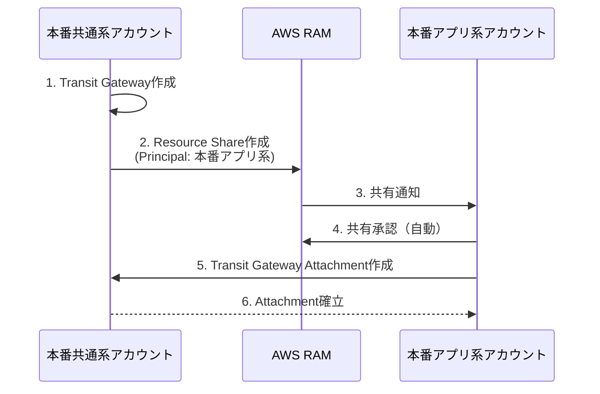

# ネットワーク設計書

## ネットワーク設計概要

### 基本方針

- **ハブ&スポークモデル**: Transit Gateway をハブとした接続
- **Multi-AZ構成**: 高可用性を確保
- **プライベートサブネット**: アプリケーション・データベースはインターネットから隔離
- **Direct Connect冗長化**: 2回線で可用性確保

---

## VPC設計

### 本番アプリ系VPC

| 項目 | 値 |
|------|-----|
| VPC名 | niigata-kaigo-prod-vpc |
| CIDR | 10.1.0.0/16 |
| リージョン | ap-northeast-1 |
| DNS解決 | 有効 |
| DNSホスト名 | 有効 |

#### サブネット構成

| サブネット種別 | AZ | CIDR | 用途 |
|-------------|-----|------|------|
| Public Subnet 1 | ap-northeast-1a | 10.1.1.0/24 | NAT Gateway、ALB |
| Public Subnet 2 | ap-northeast-1c | 10.1.2.0/24 | NAT Gateway、ALB |
| Private App Subnet 1 | ap-northeast-1a | 10.1.11.0/24 | ECS Fargate |
| Private App Subnet 2 | ap-northeast-1c | 10.1.12.0/24 | ECS Fargate |
| Private DB Subnet 1 | ap-northeast-1a | 10.1.21.0/24 | RDS |
| Private DB Subnet 2 | ap-northeast-1c | 10.1.22.0/24 | RDS（スタンバイ） |
| Private Cache Subnet 1 | ap-northeast-1a | 10.1.31.0/24 | ElastiCache |
| Private Cache Subnet 2 | ap-northeast-1c | 10.1.32.0/24 | ElastiCache（レプリカ） |

#### ルートテーブル

**Public Route Table**
- 関連付け: Public Subnet 1, Public Subnet 2
- ルート:
  - 10.1.0.0/16 → local
  - 0.0.0.0/0 → Internet Gateway
  - 192.168.0.0/16 → Transit Gateway（庁舎向け）
  - 10.2.0.0/16 → Transit Gateway（ステージング向け、オプション）

**Private App Route Table**
- 関連付け: Private App Subnet 1, Private App Subnet 2
- ルート:
  - 10.1.0.0/16 → local
  - 0.0.0.0/0 → NAT Gateway（各AZ）
  - 192.168.0.0/16 → Transit Gateway

**Private DB Route Table**
- 関連付け: Private DB Subnet 1, Private DB Subnet 2
- ルート:
  - 10.1.0.0/16 → local
  - 192.168.0.0/16 → Transit Gateway

**Private Cache Route Table**
- 関連付け: Private Cache Subnet 1, Private Cache Subnet 2
- ルート:
  - 10.1.0.0/16 → local

---

### ステージングアプリ系VPC

| 項目 | 値 |
|------|-----|
| VPC名 | niigata-kaigo-stg-vpc |
| CIDR | 10.2.0.0/16 |
| リージョン | ap-northeast-1 |
| DNS解決 | 有効 |
| DNSホスト名 | 有効 |

#### サブネット構成

| サブネット種別 | AZ | CIDR | 用途 |
|-------------|-----|------|------|
| Public Subnet 1 | ap-northeast-1a | 10.2.1.0/24 | NAT Gateway、ALB |
| Public Subnet 2 | ap-northeast-1c | 10.2.2.0/24 | ALB（冗長） |
| Private App Subnet 1 | ap-northeast-1a | 10.2.11.0/24 | ECS Fargate |
| Private App Subnet 2 | ap-northeast-1c | 10.2.12.0/24 | ECS Fargate |
| Private DB Subnet 1 | ap-northeast-1a | 10.2.21.0/24 | RDS |
| Private DB Subnet 2 | ap-northeast-1c | 10.2.22.0/24 | RDS（Multi-AZ構成用） |

**注**: ステージング環境ではコスト削減のため、NAT Gatewayは1AZのみ、ElastiCacheサブネットは省略

---

## Transit Gateway 設計

### Transit Gateway 基本設定

| 項目 | 値 |
|------|-----|
| 名前 | niigata-kaigo-tgw |
| デプロイアカウント | 本番共通系アカウント |
| リージョン | ap-northeast-1 |
| ASN | 64512 |
| デフォルトルートテーブル | 無効（カスタムルートテーブル使用） |
| DNSサポート | 有効 |

### Transit Gateway Attachment

| Attachment名 | 接続先 | VPC CIDR |
|-------------|--------|---------|
| prod-app-attachment | 本番アプリ系VPC | 10.1.0.0/16 |
| stg-app-attachment | ステージングアプリ系VPC | 10.2.0.0/16 |
| dx-attachment | Direct Connect Gateway | - |

### Transit Gateway ルートテーブル

#### 本番アプリ系ルートテーブル

| 宛先 | ターゲット |
|------|----------|
| 192.168.0.0/16 | dx-attachment（Direct Connect） |
| 10.2.0.0/16 | （ルートなし、本番⇔ステージング通信禁止） |

#### ステージングアプリ系ルートテーブル

| 宛先 | ターゲット |
|------|----------|
| 192.168.0.0/16 | dx-attachment（Direct Connect） |
| 10.1.0.0/16 | （ルートなし、ステージング⇔本番通信禁止） |

#### Direct Connect ルートテーブル

| 宛先 | ターゲット |
|------|----------|
| 10.1.0.0/16 | prod-app-attachment |
| 10.2.0.0/16 | stg-app-attachment |

---

### Transit Gateway クロスアカウント共有（AWS RAM）

**目的**: 本番共通系アカウントで作成したTransit Gatewayを、本番アプリ系アカウントから使用する

#### AWS RAM Resource Share 設計

| 項目 | 値 |
|------|-----|
| 名前 | niigata-kaigo-tgw-share |
| 共有元アカウント | 本番共通系アカウント |
| 共有先アカウント | 本番アプリ系アカウント |
| 共有リソース | Transit Gateway |
| 承認方式 | 自動承認（AWS Organizations内） |

#### クロスアカウント共有フロー

#### CloudFormation実装

**本番共通系アカウント**:
- Transit Gatewayリソースを作成
- AWS RAM Resource Shareで本番アプリ系アカウントに共有

**本番アプリ系アカウント**:
- VPCを作成
- Transit Gateway Attachmentを作成（共有されたTGWに接続）

**参照**: [Multi-Account CI/CD設計書 - Transit Gateway クロスアカウント共有](../../10_CICD/Multi-Account_CI_CD設計.md#transit-gateway-クロスアカウント共有)

---

## Direct Connect 設計

### Direct Connect 接続

| 項目 | 値 |
|------|-----|
| 接続タイプ | Dedicated Connection |
| 回線速度 | 100Mbps |
| 回線数 | 2回線（冗長化） |
| ロケーション | Equinix Tokyo（TY2） |
| VLAN ID | 101（回線1）、102（回線2） |

### Direct Connect Gateway

| 項目 | 値 |
|------|-----|
| 名前 | niigata-kaigo-dxgw |
| ASN | 65000（庁舎側） |
| デプロイアカウント | 本番共通系アカウント |

### Virtual Private Gateway（廃止、Transit Gateway使用）

**注**: Transit Gateway を使用するため、Virtual Private Gateway は作成しない

### BGP設定

| 項目 | 回線1 | 回線2 |
|------|------|------|
| AWS側IP | 169.254.100.1/30 | 169.254.100.5/30 |
| 庁舎側IP | 169.254.100.2/30 | 169.254.100.6/30 |
| BGP ASN（AWS） | 64512 | 64512 |
| BGP ASN（庁舎） | 65000 | 65000 |
| BGP認証キー | （共有秘密） | （共有秘密） |

---

## Security Groups 設計

### ALB Security Group

| 項目 | 値 |
|------|-----|
| 名前 | niigata-kaigo-alb-sg |
| VPC | 本番アプリ系VPC / ステージングアプリ系VPC |

**Inbound Rules**
| プロトコル | ポート | ソース | 説明 |
|----------|------|--------|------|
| HTTPS | 443 | 192.168.0.0/16 | 庁舎からのアクセス |
| HTTP | 80 | 192.168.0.0/16 | リダイレクト用 |

**Outbound Rules**
| プロトコル | ポート | 宛先 | 説明 |
|----------|------|------|------|
| TCP | 8080 | ECS Security Group | ECSへの転送 |

---

### ECS Security Group

| 項目 | 値 |
|------|-----|
| 名前 | niigata-kaigo-ecs-sg |
| VPC | 本番アプリ系VPC / ステージングアプリ系VPC |

**Inbound Rules**
| プロトコル | ポート | ソース | 説明 |
|----------|------|--------|------|
| TCP | 8080 | ALB Security Group | ALBからのトラフィック |

**Outbound Rules**
| プロトコル | ポート | 宛先 | 説明 |
|----------|------|------|------|
| TCP | 3306 | RDS Security Group | データベース接続 |
| TCP | 6379 | ElastiCache Security Group | キャッシュ接続 |
| HTTPS | 443 | 0.0.0.0/0 | 外部APIアクセス |

---

### RDS Security Group

| 項目 | 値 |
|------|-----|
| 名前 | niigata-kaigo-rds-sg |
| VPC | 本番アプリ系VPC / ステージングアプリ系VPC |

**Inbound Rules**
| プロトコル | ポート | ソース | 説明 |
|----------|------|--------|------|
| MySQL/Aurora | 3306 | ECS Security Group | ECSからの接続 |

**Outbound Rules**
なし（デフォルトですべて拒否）

---

### ElastiCache Security Group

| 項目 | 値 |
|------|-----|
| 名前 | niigata-kaigo-elasticache-sg |
| VPC | 本番アプリ系VPC / ステージングアプリ系VPC |

**Inbound Rules**
| プロトコル | ポート | ソース | 説明 |
|----------|------|--------|------|
| TCP | 6379 | ECS Security Group | ECSからの接続 |

**Outbound Rules**
なし

---

## Network ACLs

### Public Subnet NACL

**Inbound Rules**
| ルール番号 | プロトコル | ポート | ソース | アクション |
|----------|----------|------|--------|----------|
| 100 | TCP | 443 | 192.168.0.0/16 | ALLOW |
| 110 | TCP | 80 | 192.168.0.0/16 | ALLOW |
| 120 | TCP | 1024-65535 | 0.0.0.0/0 | ALLOW（戻りトラフィック） |
| * | ALL | ALL | 0.0.0.0/0 | DENY |

**Outbound Rules**
| ルール番号 | プロトコル | ポート | 宛先 | アクション |
|----------|----------|------|------|----------|
| 100 | TCP | 8080 | 10.1.0.0/16 | ALLOW |
| 110 | TCP | 443 | 0.0.0.0/0 | ALLOW |
| 120 | TCP | 80 | 0.0.0.0/0 | ALLOW |
| * | ALL | ALL | 0.0.0.0/0 | DENY |

### Private Subnet NACL

デフォルトNACL（すべて許可）を使用

---

## VPC Flow Logs

### 設定

| 項目 | 値 |
|------|-----|
| 送信先 | CloudWatch Logs |
| ロググループ | /aws/vpc/flowlogs/prod-vpc |
| IAMロール | VPCFlowLogsRole |
| トラフィックタイプ | ALL（Accept + Reject） |
| ログ形式 | デフォルト |

### ログ保持期間

- **本番環境**: 90日間
- **ステージング環境**: 30日間

---

## NAT Gateway

### 本番環境

| NAT Gateway名 | AZ | Elastic IP | サブネット |
|-------------|-----|-----------|----------|
| niigata-kaigo-nat-1a | ap-northeast-1a | （自動割り当て） | Public Subnet 1 |
| niigata-kaigo-nat-1c | ap-northeast-1c | （自動割り当て） | Public Subnet 2 |

### ステージング環境

| NAT Gateway名 | AZ | Elastic IP | サブネット |
|-------------|-----|-----------|----------|
| niigata-kaigo-stg-nat-1a | ap-northeast-1a | （自動割り当て） | Public Subnet 1 |

---

## Internet Gateway

### 本番環境

| 項目 | 値 |
|------|-----|
| 名前 | niigata-kaigo-igw |
| VPC | 本番アプリ系VPC |

### ステージング環境

| 項目 | 値 |
|------|-----|
| 名前 | niigata-kaigo-stg-igw |
| VPC | ステージングアプリ系VPC |

---

## Route 53

### Private Hosted Zone

| 項目 | 値 |
|------|-----|
| ドメイン名 | kaigo.niigata.local |
| VPC | 本番アプリ系VPC、ステージングアプリ系VPC |

### レコード

| レコード名 | タイプ | 値 | 説明 |
|----------|------|-----|------|
| db.kaigo.niigata.local | CNAME | RDSエンドポイント | データベース |
| cache.kaigo.niigata.local | CNAME | ElastiCacheエンドポイント | キャッシュ |
| app.kaigo.niigata.local | A（エイリアス） | ALB | アプリケーション |

---

## 非機能要件への対応

### 可用性

| 要件 | 実現方法 |
|------|---------|
| Multi-AZ | すべてのサブネットを2AZ構成 |
| NAT Gateway冗長化 | 各AZにNAT Gatewayを配置 |
| Direct Connect冗長化 | 2回線構成 |

### セキュリティ

| 要件 | 実現方法 |
|------|---------|
| プライベートサブネット | アプリ・DB・キャッシュはインターネットから隔離 |
| Security Groups | 最小権限ルール |
| VPC Flow Logs | 全トラフィック記録 |

---

## 次のステップ

- [ネットワーク構成図を確認](./network_diagram.md)
- [VPCパラメータシートを確認](./vpc_parameters.md)
- [Transit Gateway パラメータシートを確認](./transit_gateway_parameters.md)
- [Multi-Account CI/CD設計書を確認](../../10_CICD/Multi-Account_CI_CD設計.md) ⭐ クロスアカウント構成の詳細

---

**作成日**: 2025-11-07
**更新日**: 2025-11-12（Transit Gatewayクロスアカウント共有追記）
**作成者**: インフラアーキテクト
**レビュー状態**: Draft
