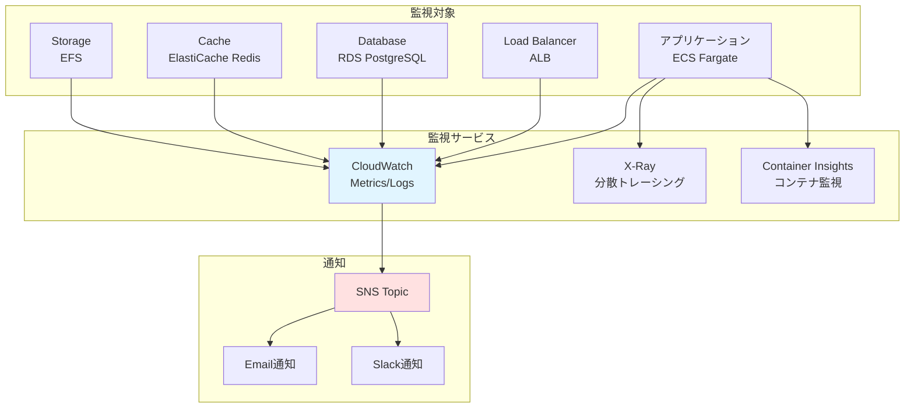
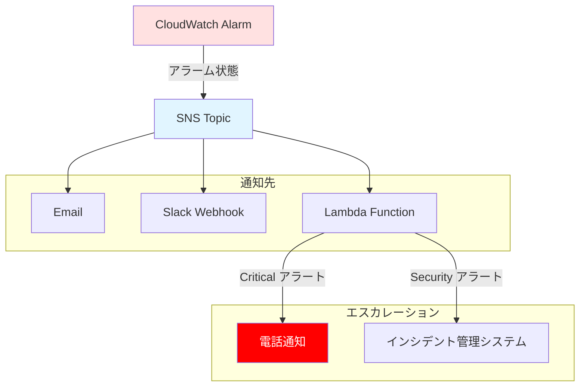
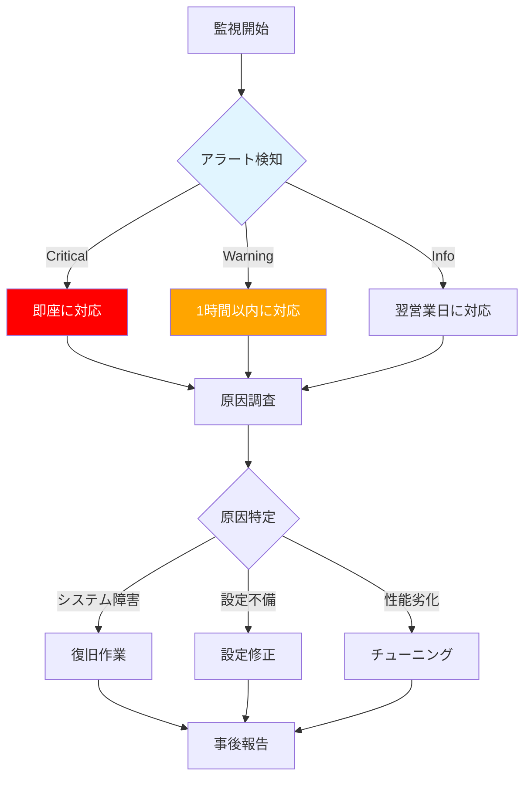

# 監視設計

## 目次
1. [監視概要](#監視概要)
2. [CloudWatch監視](#cloudwatch監視)
3. [アラート設計](#アラート設計)
4. [ログ管理](#ログ管理)
5. [ダッシュボード設計](#ダッシュボード設計)
6. [運用監視](#運用監視)

---

## 監視概要

### 監視方針



### 監視要件

| カテゴリ | 要件 | 実装方法 |
|---------|------|---------|
| 可用性監視 | サービス稼働状況 | ALB ヘルスチェック、CloudWatch Alarms |
| 性能監視 | レスポンスタイム、スループット | CloudWatch Metrics、X-Ray |
| リソース監視 | CPU、メモリ、ディスク使用率 | CloudWatch Metrics |
| ログ監視 | エラーログ、アクセスログ | CloudWatch Logs、Logs Insights |
| セキュリティ監視 | 不正アクセス、攻撃検知 | WAF Logs、VPC Flow Logs、GuardDuty |
| コスト監視 | AWS利用料金 | AWS Cost Explorer、Budgets |

---

## CloudWatch監視

### メトリクス一覧

#### ALB メトリクス

| メトリクス名 | 説明 | 閾値 | アラート重要度 |
|-------------|------|------|--------------|
| `TargetResponseTime` | ターゲットのレスポンスタイム | > 1秒 | Warning |
| `TargetResponseTime` | ターゲットのレスポンスタイム | > 3秒 | Critical |
| `UnHealthyHostCount` | 異常なターゲット数 | >= 1 | Critical |
| `HTTPCode_Target_5XX_Count` | 5xxエラー数 | > 10/5分 | Warning |
| `HTTPCode_Target_5XX_Count` | 5xxエラー数 | > 50/5分 | Critical |
| `HTTPCode_Target_4XX_Count` | 4xxエラー数 | > 100/5分 | Warning |
| `ActiveConnectionCount` | アクティブ接続数 | > 10000 | Warning |
| `RequestCount` | リクエスト数 | - | 監視のみ |

#### ECS メトリクス

| メトリクス名 | 説明 | 閾値 | アラート重要度 |
|-------------|------|------|--------------|
| `CPUUtilization` | CPU使用率 | > 75% | Warning |
| `CPUUtilization` | CPU使用率 | > 90% | Critical |
| `MemoryUtilization` | メモリ使用率 | > 75% | Warning |
| `MemoryUtilization` | メモリ使用率 | > 90% | Critical |
| `RunningTaskCount` | 実行中タスク数 | < 2 | Critical |
| `DesiredTaskCount` | 期待タスク数との差 | != 0 | Warning |

#### RDS メトリクス

| メトリクス名 | 説明 | 閾値 | アラート重要度 |
|-------------|------|------|--------------|
| `CPUUtilization` | CPU使用率 | > 75% | Warning |
| `CPUUtilization` | CPU使用率 | > 90% | Critical |
| `FreeableMemory` | 空きメモリ | < 1GB | Warning |
| `FreeableMemory` | 空きメモリ | < 512MB | Critical |
| `FreeStorageSpace` | 空きストレージ | < 10GB | Warning |
| `FreeStorageSpace` | 空きストレージ | < 5GB | Critical |
| `DatabaseConnections` | DB接続数 | > 80 | Warning |
| `DatabaseConnections` | DB接続数 | > 95 | Critical |
| `ReadLatency` | 読み取りレイテンシ | > 100ms | Warning |
| `WriteLatency` | 書き込みレイテンシ | > 100ms | Warning |
| `ReplicaLag` | レプリケーション遅延 | > 60秒 | Critical |

#### ElastiCache メトリクス

| メトリクス名 | 説明 | 閾値 | アラート重要度 |
|-------------|------|------|--------------|
| `CPUUtilization` | CPU使用率 | > 75% | Warning |
| `DatabaseMemoryUsagePercentage` | メモリ使用率 | > 80% | Warning |
| `DatabaseMemoryUsagePercentage` | メモリ使用率 | > 90% | Critical |
| `CurrConnections` | 現在の接続数 | > 50000 | Warning |
| `Evictions` | キー削除数 | > 100/分 | Warning |
| `CacheHitRate` | キャッシュヒット率 | < 80% | Warning |
| `NetworkBytesIn` | ネットワーク受信 | - | 監視のみ |
| `NetworkBytesOut` | ネットワーク送信 | - | 監視のみ |

#### EFS メトリクス

| メトリクス名 | 説明 | 閾値 | アラート重要度 |
|-------------|------|------|--------------|
| `BurstCreditBalance` | バーストクレジット残高 | < 1000000000 | Warning |
| `PercentIOLimit` | IO制限到達率 | > 80% | Warning |
| `ClientConnections` | クライアント接続数 | > 100 | Warning |

---

## アラート設計

詳細は [cloudwatch_alarms.md](./cloudwatch_alarms.md) を参照

### アラート重要度

| 重要度 | 説明 | 対応時間 | 通知先 |
|--------|------|---------|--------|
| **Critical** | サービス停止、データ損失の可能性 | 即座（15分以内） | Email + Slack + 電話 |
| **Warning** | 性能劣化、リソース不足の兆候 | 1時間以内 | Email + Slack |
| **Info** | 情報提供のみ | 翌営業日 | Email |

### SNS トピック設計

#### 本番環境

| トピック名 | 用途 | サブスクリプション |
|-----------|------|------------------|
| `kaigo-subsys-prod-critical-alerts` | Critical アラート | Email, Slack, Lambda (電話通知) |
| `kaigo-subsys-prod-warning-alerts` | Warning アラート | Email, Slack |
| `kaigo-subsys-prod-info-alerts` | Info アラート | Email |
| `kaigo-subsys-prod-security-alerts` | セキュリティアラート | Email, Slack, Lambda (インシデント管理) |

#### ステージング環境

| トピック名 | 用途 | サブスクリプション |
|-----------|------|------------------|
| `kaigo-subsys-stg-alerts` | すべてのアラート | Email |

### アラート通知フロー



---

## ログ管理

### ログ種別

| ログ種別 | 出力先 | 保持期間 | 用途 |
|---------|--------|---------|------|
| アプリケーションログ | CloudWatch Logs | 90日 | アプリケーションデバッグ |
| アクセスログ (ALB) | S3 | 90日 | アクセス分析 |
| VPC Flow Logs | CloudWatch Logs | 90日 | ネットワーク監視 |
| CloudTrail | S3 | 7年 | 監査 |
| WAF Logs | S3 | 90日 | セキュリティ分析 |
| RDS Error Logs | CloudWatch Logs | 30日 | データベーストラブルシューティング |
| RDS Slow Query Logs | CloudWatch Logs | 30日 | クエリ最適化 |

### CloudWatch Logs ロググループ

#### 本番環境

| ロググループ名 | ログソース | 保持期間 |
|--------------|-----------|---------|
| `/ecs/kaigo-subsys-prod` | ECS コンテナログ | 90日 |
| `/aws/vpc/flowlogs` | VPC Flow Logs | 90日 |
| `/aws/rds/instance/kaigo-subsys-prod/error` | RDS エラーログ | 30日 |
| `/aws/rds/instance/kaigo-subsys-prod/slowquery` | RDS スロークエリログ | 30日 |
| `/aws/lambda/kaigo-subsys-prod-backup` | Lambda バックアップログ | 30日 |

### Logs Insights クエリ

#### 1. エラーログ検索

```sql
fields @timestamp, @message
| filter @message like /ERROR|FATAL/
| sort @timestamp desc
| limit 100
```

#### 2. レスポンスタイム分析

```sql
fields @timestamp, request_time
| filter @message like /response_time/
| stats avg(response_time), max(response_time), min(response_time), count() by bin(5m)
```

#### 3. 5xxエラー集計

```sql
fields @timestamp, status_code
| filter status_code >= 500
| stats count() by status_code, bin(5m)
| sort @timestamp desc
```

#### 4. VPC Flow Logs - 拒否された通信

```sql
fields @timestamp, srcAddr, dstAddr, dstPort, action
| filter action = "REJECT"
| stats count() by srcAddr, dstPort
| sort count desc
| limit 20
```

---

## ダッシュボード設計

### CloudWatch ダッシュボード

#### 本番環境ダッシュボード

**ダッシュボード名**: `kaigo-subsys-prod-overview`

**ウィジェット構成**:

1. **サービス概要**
   - ALB ヘルスチェック状態
   - ECS タスク稼働数
   - RDS 接続数
   - ElastiCache 接続数

2. **パフォーマンス**
   - ALB レスポンスタイム (P50, P90, P99)
   - ECS CPU/メモリ使用率
   - RDS CPU/メモリ使用率
   - ElastiCache CPU/メモリ使用率

3. **エラー率**
   - ALB 5xx エラー率
   - ALB 4xx エラー率
   - アプリケーションエラーログ数

4. **リソース使用状況**
   - ECS タスク数
   - RDS ストレージ使用率
   - ElastiCache メモリ使用率
   - EFS ストレージ使用量

### X-Ray 分散トレーシング

| 項目 | 設定 |
|------|------|
| サンプリングレート | 10% (本番)、100% (ステージング) |
| トレース保持期間 | 30日 |
| トレース対象 | ECS コンテナ、Lambda関数 |

**X-Ray サービスマップ**:
- ALB → ECS → RDS/ElastiCache の依存関係を可視化
- レスポンスタイムのボトルネック特定

---

## 運用監視

### 監視フロー

詳細は [monitoring_flow.md](./monitoring_flow.md) を参照



### 定期監視タスク

| タスク | 頻度 | 担当 | 内容 |
|-------|------|------|------|
| ダッシュボード確認 | 毎日 | 運用担当者 | 主要メトリクスの異常確認 |
| ログレビュー | 毎日 | 運用担当者 | エラーログ、警告ログの確認 |
| コスト確認 | 毎週 | 運用管理者 | AWS利用料金の確認 |
| 性能レビュー | 月次 | システム管理者 | パフォーマンス傾向分析 |
| セキュリティログレビュー | 月次 | セキュリティ担当者 | GuardDuty、VPC Flow Logs確認 |

### オンコール体制

#### 本番環境

| 時間帯 | 対応者 | 対応時間 |
|--------|--------|---------|
| 平日 9:00-18:00 | 1次対応: 運用担当者 | 15分以内 |
| 平日 18:00-9:00 | 2次対応: オンコール担当者 | 30分以内 |
| 休日・祝日 | 2次対応: オンコール担当者 | 30分以内 |

**エスカレーションルール**:
1. 1次対応で解決できない場合、30分以内に2次対応へエスカレーション
2. 2次対応で解決できない場合、1時間以内にシステム管理者へエスカレーション

---

## コスト監視

### AWS Budgets 設定

| バジェット名 | 予算額 | アラート閾値 | 通知先 |
|------------|--------|------------|--------|
| `kaigo-subsys-prod-monthly` | $2,000/月 | 80%, 100%, 120% | Email |
| `kaigo-subsys-prod-ec2` | $500/月 | 80%, 100% | Email |
| `kaigo-subsys-prod-rds` | $600/月 | 80%, 100% | Email |
| `kaigo-subsys-stg-monthly` | $500/月 | 80%, 100% | Email |

### Cost Explorer レポート

| レポート名 | 頻度 | 内容 |
|-----------|------|------|
| 月次コストレポート | 月次 | サービス別、リソース別コスト |
| コスト推移レポート | 月次 | 前月比、前年同月比 |
| リザーブドインスタンス利用率 | 月次 | RIの利用率、推奨RI |

---

## トラブルシューティング

### 高負荷時の対応

#### 1. CPU使用率が高い

**確認手順**:
1. CloudWatch Metrics で CPU使用率を確認
2. Container Insights でタスクごとのCPU使用率を確認
3. X-Ray でボトルネックを特定

**対処法**:
- ECS タスク数を増やす (AutoScaling)
- vCPU数を増やす (タスク定義変更)

#### 2. メモリ使用率が高い

**確認手順**:
1. CloudWatch Metrics でメモリ使用率を確認
2. Container Insights でメモリリークの有無を確認

**対処法**:
- ECS タスクのメモリ割り当てを増やす
- アプリケーションのメモリリーク修正

#### 3. データベース接続数が多い

**確認手順**:
1. RDS メトリクス `DatabaseConnections` を確認
2. RDS スロークエリログを確認
3. アプリケーションログで接続プールの状態を確認

**対処法**:
- 接続プールの最大接続数を調整
- 不要な長時間接続を切断
- RDS インスタンスタイプをスケールアップ

---

## 関連ドキュメント

- [cloudwatch_alarms.md](./cloudwatch_alarms.md)
- [monitoring_flow.md](./monitoring_flow.md)
- [セキュリティ設計](../07_security/security_design.md)
- [バックアップ設計](../09_backup_dr/backup_dr_design.md)

---

**作成日**: 2025-11-05
**作成者**: Architect
**バージョン**: 1.0
