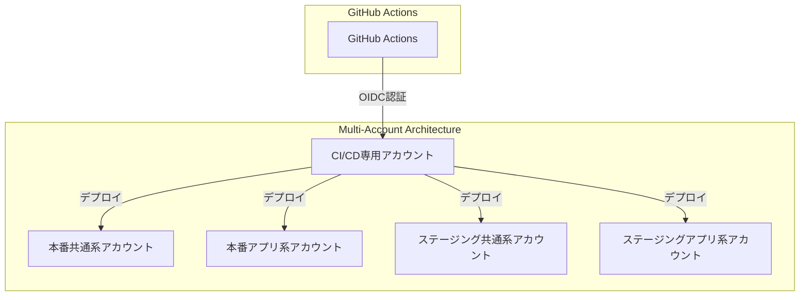
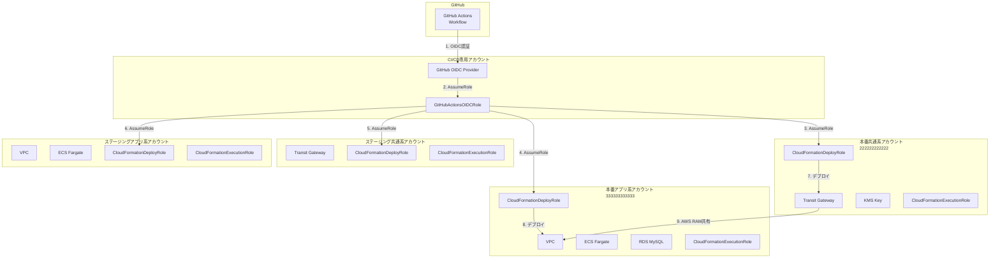
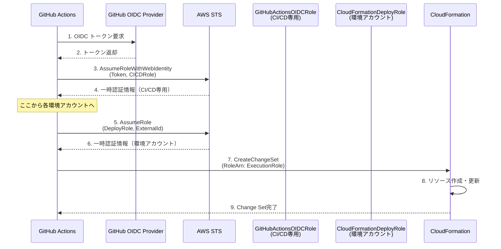
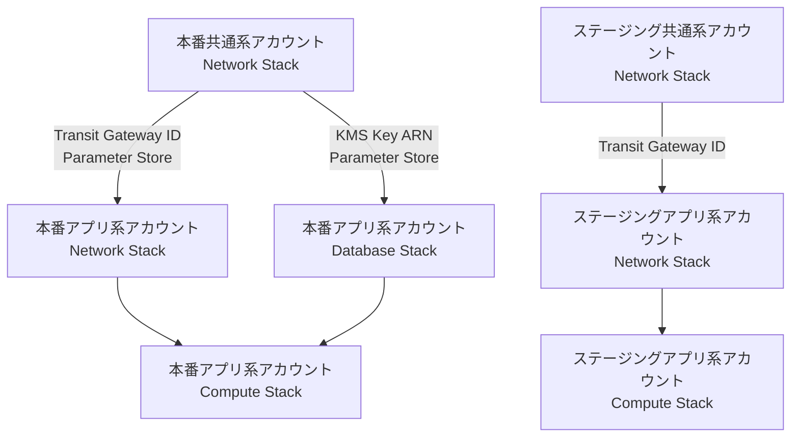
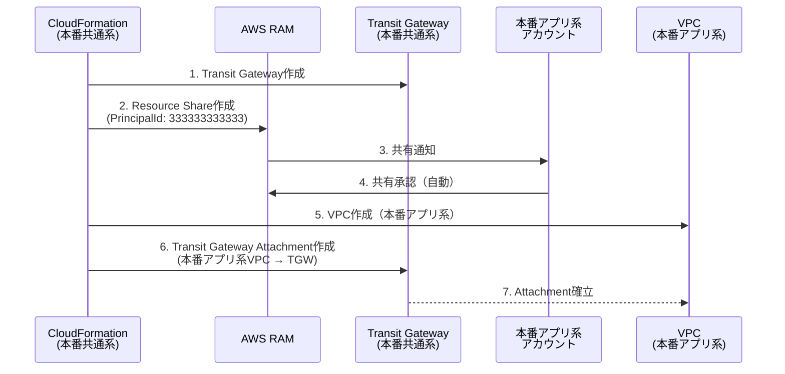
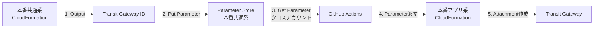
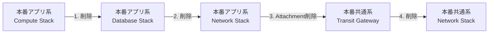

# Multi-Account CI/CD設計書

**プロジェクト**: 新潟市介護保険事業所システム
**作成日**: 2025-11-12
**作成者**: インフラアーキテクト
**ステータス**: 設計中

---

## 目次

1. [概要](#概要)
2. [Multi-Accountでの課題](#multi-accountでの課題)
3. [アカウント構成](#アカウント構成)
4. [IAMロール設計](#iamロール設計)
5. [GitHub Actions OIDC認証フロー](#github-actions-oidc認証フロー)
6. [デプロイ順序制御](#デプロイ順序制御)
7. [Transit Gateway クロスアカウント共有](#transit-gateway-クロスアカウント共有)
8. [パラメーター管理](#パラメーター管理)
9. [セキュリティ要件](#セキュリティ要件)
10. [ロールバック戦略](#ロールバック戦略)
11. [実装ロードマップ](#実装ロードマップ)

---

## 概要

### Multi-Account構成でのCI/CDの必要性

新潟市介護保険事業所システムは、以下の**4つのAWSアカウント**を使用したMulti-Account構成を採用しています：



### 採用アーキテクチャ

**方式**: CI/CD専用アカウントパターン（ベストプラクティス）

**理由**:
1. **セキュリティ**: CI/CDリソースを本番環境から分離
2. **監査性**: すべてのデプロイ操作を1つのアカウントで集中管理
3. **アクセス制御**: GitHub OIDCプロバイダーを1箇所で管理
4. **スケーラビリティ**: 新しい環境アカウントを追加しやすい

---

## Multi-Accountでの課題

### 課題1: クロスアカウントデプロイ

**問題**:
- GitHub Actionsは通常、単一のAWSアカウントにしかデプロイできない
- Multi-Accountでは、各環境ごとに異なるアカウントにデプロイする必要がある

**解決策**:
- **AssumeRole chain**: CI/CD専用アカウント → 各環境アカウント
- IAMロールの信頼関係で安全にクロスアカウントアクセス

### 課題2: リソース依存関係（Common → App）

**問題**:
- 本番共通系アカウント（Transit Gateway, KMS等）のリソースIDを、本番アプリ系アカウントで参照する必要がある
- CloudFormation Outputsのクロスアカウント参照はできない

**解決策**:
- **AWS Systems Manager Parameter Store** でクロスアカウント共有
- デプロイ順序制御（Common Account → App Account）

### 課題3: Transit Gateway のクロスアカウント共有

**問題**:
- Transit Gatewayは本番共通系アカウントに作成
- 本番アプリ系アカウントのVPCをアタッチするには、AWS RAM（Resource Access Manager）が必要

**解決策**:
- AWS RAMでTransit Gatewayを共有
- CloudFormation StackSetsまたは個別スタックでAttachment作成

---

## アカウント構成

### アカウント一覧とロール

| アカウント | アカウントID（例） | 役割 | デプロイ対象リソース |
|----------|---------------|------|-----------------|
| **CI/CD専用** | `111111111111` | CI/CDパイプライン | GitHub OIDC Provider, CodeBuild（オプション） |
| **本番共通系** | `222222222222` | 共有基盤 | Transit Gateway, KMS, AWS Config, CloudTrail |
| **本番アプリ系** | `333333333333` | アプリケーション | VPC, ECS, RDS, ALB, S3 |
| **ステージング共通系** | `444444444444` | 共有基盤（検証環境） | Transit Gateway, KMS |
| **ステージングアプリ系** | `555555555555` | アプリケーション（検証環境） | VPC, ECS, RDS, ALB, S3 |

**注**: アカウントIDはプレースホルダー。実際のIDは環境構築時に決定。

### システム構成図（Multi-Account）



---

## IAMロール設計

### ロール一覧

| ロール名 | アカウント | 目的 | AssumeRoleパス |
|---------|----------|------|--------------|
| **GitHubActionsOIDCRole** | CI/CD専用 | GitHub Actionsの初期認証 | GitHub OIDC → このロール |
| **CloudFormationDeployRole** | 各環境アカウント | CloudFormation実行権限 | CI/CD専用アカウント → このロール |
| **CloudFormationExecutionRole** | 各環境アカウント | CloudFormationが使用するサービスロール | CloudFormationDeployRole → このロール |

### GitHubActionsOIDCRole（CI/CD専用アカウント）

**ARN**: `arn:aws:iam::111111111111:role/GitHubActionsOIDCRole`

**Trust Policy（信頼ポリシー）**:

```json
{
  "Version": "2012-10-17",
  "Statement": [
    {
      "Effect": "Allow",
      "Principal": {
        "Federated": "arn:aws:iam::111111111111:oidc-provider/token.actions.githubusercontent.com"
      },
      "Action": "sts:AssumeRoleWithWebIdentity",
      "Condition": {
        "StringEquals": {
          "token.actions.githubusercontent.com:aud": "sts.amazonaws.com"
        },
        "StringLike": {
          "token.actions.githubusercontent.com:sub": "repo:niigata-city/kaigo-system:*"
        }
      }
    }
  ]
}
```

**Permission Policy**:

```json
{
  "Version": "2012-10-17",
  "Statement": [
    {
      "Sid": "AssumeCrossAccountRoles",
      "Effect": "Allow",
      "Action": "sts:AssumeRole",
      "Resource": [
        "arn:aws:iam::222222222222:role/CloudFormationDeployRole",
        "arn:aws:iam::333333333333:role/CloudFormationDeployRole",
        "arn:aws:iam::444444444444:role/CloudFormationDeployRole",
        "arn:aws:iam::555555555555:role/CloudFormationDeployRole"
      ]
    },
    {
      "Sid": "S3TemplateAccess",
      "Effect": "Allow",
      "Action": [
        "s3:GetObject",
        "s3:PutObject"
      ],
      "Resource": [
        "arn:aws:s3:::niigata-kaigo-cloudformation-templates/*"
      ]
    }
  ]
}
```

### CloudFormationDeployRole（各環境アカウント）

**ARN（例: 本番共通系）**: `arn:aws:iam::222222222222:role/CloudFormationDeployRole`

**Trust Policy**:

```json
{
  "Version": "2012-10-17",
  "Statement": [
    {
      "Effect": "Allow",
      "Principal": {
        "AWS": "arn:aws:iam::111111111111:role/GitHubActionsOIDCRole"
      },
      "Action": "sts:AssumeRole",
      "Condition": {
        "StringEquals": {
          "sts:ExternalId": "niigata-kaigo-deploy-${ENVIRONMENT}"
        }
      }
    }
  ]
}
```

**Permission Policy**:

```json
{
  "Version": "2012-10-17",
  "Statement": [
    {
      "Sid": "CloudFormationFullAccess",
      "Effect": "Allow",
      "Action": [
        "cloudformation:CreateChangeSet",
        "cloudformation:DescribeChangeSet",
        "cloudformation:ExecuteChangeSet",
        "cloudformation:DescribeStacks",
        "cloudformation:DescribeStackEvents",
        "cloudformation:GetTemplate",
        "cloudformation:ValidateTemplate",
        "cloudformation:DeleteChangeSet",
        "cloudformation:ListStacks"
      ],
      "Resource": "*"
    },
    {
      "Sid": "IAMPassRole",
      "Effect": "Allow",
      "Action": "iam:PassRole",
      "Resource": "arn:aws:iam::*:role/CloudFormationExecutionRole"
    },
    {
      "Sid": "S3TemplateAccess",
      "Effect": "Allow",
      "Action": [
        "s3:GetObject"
      ],
      "Resource": [
        "arn:aws:s3:::niigata-kaigo-cloudformation-templates/*"
      ]
    },
    {
      "Sid": "ParameterStoreAccess",
      "Effect": "Allow",
      "Action": [
        "ssm:GetParameter",
        "ssm:GetParameters",
        "ssm:PutParameter"
      ],
      "Resource": [
        "arn:aws:ssm:ap-northeast-1:*:parameter/niigata-kaigo/*"
      ]
    }
  ]
}
```

### CloudFormationExecutionRole（各環境アカウント）

**ARN（例: 本番共通系）**: `arn:aws:iam::222222222222:role/CloudFormationExecutionRole`

**Trust Policy**:

```json
{
  "Version": "2012-10-17",
  "Statement": [
    {
      "Effect": "Allow",
      "Principal": {
        "Service": "cloudformation.amazonaws.com"
      },
      "Action": "sts:AssumeRole"
    }
  ]
}
```

**Permission Policy**:

**原則**: 最小権限（必要なリソースのみ）

```json
{
  "Version": "2012-10-17",
  "Statement": [
    {
      "Sid": "NetworkResources",
      "Effect": "Allow",
      "Action": [
        "ec2:CreateVpc",
        "ec2:CreateSubnet",
        "ec2:CreateInternetGateway",
        "ec2:CreateTransitGateway",
        "ec2:CreateTransitGatewayAttachment",
        "ec2:CreateSecurityGroup",
        "ec2:AuthorizeSecurityGroupIngress",
        "ec2:CreateRouteTable",
        "ec2:CreateRoute",
        "ec2:AssociateRouteTable",
        "ec2:CreateNatGateway",
        "ec2:AllocateAddress",
        "ec2:DescribeVpcs",
        "ec2:DescribeSubnets",
        "ec2:DescribeSecurityGroups",
        "ec2:DescribeTransitGateways",
        "ec2:DescribeTransitGatewayAttachments",
        "ec2:ModifyVpcAttribute",
        "ec2:CreateTags",
        "ec2:DeleteVpc",
        "ec2:DeleteSubnet",
        "ec2:DeleteInternetGateway",
        "ec2:DeleteSecurityGroup",
        "ec2:DeleteRouteTable",
        "ec2:DeleteNatGateway",
        "ec2:ReleaseAddress"
      ],
      "Resource": "*"
    },
    {
      "Sid": "RAMResources",
      "Effect": "Allow",
      "Action": [
        "ram:CreateResourceShare",
        "ram:AssociateResourceShare",
        "ram:GetResourceShares",
        "ram:TagResource"
      ],
      "Resource": "*"
    },
    {
      "Sid": "KMSResources",
      "Effect": "Allow",
      "Action": [
        "kms:CreateKey",
        "kms:CreateAlias",
        "kms:DescribeKey",
        "kms:PutKeyPolicy",
        "kms:TagResource"
      ],
      "Resource": "*"
    },
    {
      "Sid": "ECSResources",
      "Effect": "Allow",
      "Action": [
        "ecs:*",
        "ecr:*",
        "elasticloadbalancing:*"
      ],
      "Resource": "*"
    },
    {
      "Sid": "RDSResources",
      "Effect": "Allow",
      "Action": [
        "rds:*"
      ],
      "Resource": "*"
    }
  ]
}
```

**重要**: 本番環境では、さらに細かく権限を絞り込むことを推奨（例: `Resource: "arn:aws:ec2:ap-northeast-1:222222222222:vpc/*"`）

---

## GitHub Actions OIDC認証フロー

### 認証シーケンス図



### GitHub Actionsワークフロー実装例

**`.github/workflows/infra-deploy.yml`**:

```yaml
name: Multi-Account Infrastructure Deploy

on:
  push:
    branches:
      - main
    paths:
      - 'infra/cloudformation/**'

env:
  AWS_REGION: ap-northeast-1
  CICD_ACCOUNT_ID: '111111111111'
  PROD_COMMON_ACCOUNT_ID: '222222222222'
  PROD_APP_ACCOUNT_ID: '333333333333'
  STAG_COMMON_ACCOUNT_ID: '444444444444'
  STAG_APP_ACCOUNT_ID: '555555555555'

jobs:
  # ================================
  # Phase 1: 本番共通系アカウント
  # ================================
  deploy-prod-common:
    runs-on: ubuntu-latest
    permissions:
      id-token: write
      contents: read
    steps:
      - uses: actions/checkout@v3

      # Step 1: CI/CD専用アカウントに認証
      - name: Configure AWS Credentials (CICD Account)
        uses: aws-actions/configure-aws-credentials@v2
        with:
          role-to-assume: arn:aws:iam::${{ env.CICD_ACCOUNT_ID }}:role/GitHubActionsOIDCRole
          aws-region: ${{ env.AWS_REGION }}

      # Step 2: 本番共通系アカウントにAssumeRole
      - name: Assume Role to Prod Common Account
        run: |
          CREDS=$(aws sts assume-role \
            --role-arn arn:aws:iam::${{ env.PROD_COMMON_ACCOUNT_ID }}:role/CloudFormationDeployRole \
            --role-session-name github-actions-deploy \
            --external-id niigata-kaigo-deploy-prod-common)

          echo "AWS_ACCESS_KEY_ID=$(echo $CREDS | jq -r '.Credentials.AccessKeyId')" >> $GITHUB_ENV
          echo "AWS_SECRET_ACCESS_KEY=$(echo $CREDS | jq -r '.Credentials.SecretAccessKey')" >> $GITHUB_ENV
          echo "AWS_SESSION_TOKEN=$(echo $CREDS | jq -r '.Credentials.SessionToken')" >> $GITHUB_ENV

      # Step 3: CloudFormation Change Set作成
      - name: Create CloudFormation Change Set
        run: |
          aws cloudformation create-change-set \
            --stack-name niigata-kaigo-prod-common-network \
            --change-set-name deploy-$(date +%Y%m%d-%H%M%S) \
            --template-body file://infra/cloudformation/common/stacks/01-network/main.yaml \
            --parameters file://infra/cloudformation/common/parameters/prod.json \
            --capabilities CAPABILITY_NAMED_IAM \
            --role-arn arn:aws:iam::${{ env.PROD_COMMON_ACCOUNT_ID }}:role/CloudFormationExecutionRole

      # Step 4: Change Set実行
      - name: Execute Change Set
        run: |
          CHANGE_SET_NAME=$(aws cloudformation list-change-sets \
            --stack-name niigata-kaigo-prod-common-network \
            --query 'Summaries[0].ChangeSetName' \
            --output text)

          aws cloudformation execute-change-set \
            --stack-name niigata-kaigo-prod-common-network \
            --change-set-name $CHANGE_SET_NAME

          aws cloudformation wait stack-update-complete \
            --stack-name niigata-kaigo-prod-common-network

      # Step 5: Transit Gateway IDをParameter Storeに保存
      - name: Export Transit Gateway ID
        run: |
          TGW_ID=$(aws cloudformation describe-stacks \
            --stack-name niigata-kaigo-prod-common-network \
            --query 'Stacks[0].Outputs[?OutputKey==`TransitGatewayId`].OutputValue' \
            --output text)

          aws ssm put-parameter \
            --name /niigata-kaigo/prod/common/transit-gateway-id \
            --value $TGW_ID \
            --type String \
            --overwrite

  # ================================
  # Phase 2: 本番アプリ系アカウント
  # ================================
  deploy-prod-app:
    runs-on: ubuntu-latest
    needs: deploy-prod-common  # ★ 依存関係: Common Accountが完了してから実行
    permissions:
      id-token: write
      contents: read
    steps:
      - uses: actions/checkout@v3

      # Step 1: CI/CD専用アカウントに認証
      - name: Configure AWS Credentials (CICD Account)
        uses: aws-actions/configure-aws-credentials@v2
        with:
          role-to-assume: arn:aws:iam::${{ env.CICD_ACCOUNT_ID }}:role/GitHubActionsOIDCRole
          aws-region: ${{ env.AWS_REGION }}

      # Step 2: 本番アプリ系アカウントにAssumeRole
      - name: Assume Role to Prod App Account
        run: |
          CREDS=$(aws sts assume-role \
            --role-arn arn:aws:iam::${{ env.PROD_APP_ACCOUNT_ID }}:role/CloudFormationDeployRole \
            --role-session-name github-actions-deploy \
            --external-id niigata-kaigo-deploy-prod-app)

          echo "AWS_ACCESS_KEY_ID=$(echo $CREDS | jq -r '.Credentials.AccessKeyId')" >> $GITHUB_ENV
          echo "AWS_SECRET_ACCESS_KEY=$(echo $CREDS | jq -r '.Credentials.SecretAccessKey')" >> $GITHUB_ENV
          echo "AWS_SESSION_TOKEN=$(echo $CREDS | jq -r '.Credentials.SessionToken')" >> $GITHUB_ENV

      # Step 3: Parameter StoreからTransit Gateway IDを取得（クロスアカウント参照）
      - name: Get Transit Gateway ID from Parameter Store
        run: |
          # 本番共通系アカウントに再度AssumeRole
          COMMON_CREDS=$(aws sts assume-role \
            --role-arn arn:aws:iam::${{ env.PROD_COMMON_ACCOUNT_ID }}:role/CloudFormationDeployRole \
            --role-session-name github-actions-get-params \
            --external-id niigata-kaigo-deploy-prod-common)

          export AWS_ACCESS_KEY_ID=$(echo $COMMON_CREDS | jq -r '.Credentials.AccessKeyId')
          export AWS_SECRET_ACCESS_KEY=$(echo $COMMON_CREDS | jq -r '.Credentials.SecretAccessKey')
          export AWS_SESSION_TOKEN=$(echo $COMMON_CREDS | jq -r '.Credentials.SessionToken')

          TGW_ID=$(aws ssm get-parameter \
            --name /niigata-kaigo/prod/common/transit-gateway-id \
            --query 'Parameter.Value' \
            --output text)

          echo "TRANSIT_GATEWAY_ID=$TGW_ID" >> $GITHUB_ENV

      # Step 4: CloudFormation Change Set作成（Transit Gateway IDをパラメータで渡す）
      - name: Create CloudFormation Change Set
        run: |
          aws cloudformation create-change-set \
            --stack-name niigata-kaigo-prod-app-network \
            --change-set-name deploy-$(date +%Y%m%d-%H%M%S) \
            --template-body file://infra/cloudformation/app/stacks/01-network/main.yaml \
            --parameters file://infra/cloudformation/app/parameters/prod.json \
              ParameterKey=TransitGatewayId,ParameterValue=${{ env.TRANSIT_GATEWAY_ID }} \
            --capabilities CAPABILITY_NAMED_IAM \
            --role-arn arn:aws:iam::${{ env.PROD_APP_ACCOUNT_ID }}:role/CloudFormationExecutionRole

      # Step 5: Change Set実行
      - name: Execute Change Set
        run: |
          CHANGE_SET_NAME=$(aws cloudformation list-change-sets \
            --stack-name niigata-kaigo-prod-app-network \
            --query 'Summaries[0].ChangeSetName' \
            --output text)

          aws cloudformation execute-change-set \
            --stack-name niigata-kaigo-prod-app-network \
            --change-set-name $CHANGE_SET_NAME

          aws cloudformation wait stack-update-complete \
            --stack-name niigata-kaigo-prod-app-network
```

---

## デプロイ順序制御

### 依存関係フロー図



### GitHub Actions `needs:` による順序制御

```yaml
jobs:
  # Phase 1: 本番共通系アカウント
  deploy-prod-common-network:
    runs-on: ubuntu-latest
    steps: [...]

  deploy-prod-common-security:
    runs-on: ubuntu-latest
    needs: deploy-prod-common-network
    steps: [...]

  # Phase 2: 本番アプリ系アカウント
  deploy-prod-app-network:
    runs-on: ubuntu-latest
    needs: deploy-prod-common-network  # ★ Transit Gateway 作成完了まで待機
    steps: [...]

  deploy-prod-app-database:
    runs-on: ubuntu-latest
    needs:
      - deploy-prod-common-security  # ★ KMS Key 作成完了まで待機
      - deploy-prod-app-network
    steps: [...]

  deploy-prod-app-compute:
    runs-on: ubuntu-latest
    needs:
      - deploy-prod-app-network
      - deploy-prod-app-database
    steps: [...]
```

---

## Transit Gateway クロスアカウント共有

### AWS RAM（Resource Access Manager）による共有フロー



### CloudFormationテンプレート実装例

**本番共通系アカウント: `infra/cloudformation/common/templates/network/transit-gateway.yaml`**

```yaml
AWSTemplateFormatVersion: '2010-09-09'
Description: Transit Gateway with AWS RAM Resource Share

Parameters:
  ProjectName:
    Type: String
    Default: niigata-kaigo
  Environment:
    Type: String
    AllowedValues: [prod, stg]
  ProdAppAccountId:
    Type: String
    Description: 本番アプリ系アカウントID
    Default: '333333333333'

Resources:
  # Transit Gateway
  TransitGateway:
    Type: AWS::EC2::TransitGateway
    Properties:
      Description: !Sub ${ProjectName}-${Environment}-tgw
      AmazonSideAsn: 64512
      DefaultRouteTableAssociation: disable
      DefaultRouteTablePropagation: disable
      DnsSupport: enable
      Tags:
        - Key: Name
          Value: !Sub ${ProjectName}-${Environment}-tgw
        - Key: Environment
          Value: !Ref Environment

  # AWS RAM Resource Share（本番アプリ系アカウントに共有）
  TransitGatewayResourceShare:
    Type: AWS::RAM::ResourceShare
    Properties:
      Name: !Sub ${ProjectName}-${Environment}-tgw-share
      Principals:
        - !Sub arn:aws:iam::${ProdAppAccountId}:root
      ResourceArns:
        - !Sub arn:aws:ec2:${AWS::Region}:${AWS::AccountId}:transit-gateway/${TransitGateway}
      AllowExternalPrincipals: false  # AWS Organizations内のみ
      Tags:
        - Key: Name
          Value: !Sub ${ProjectName}-${Environment}-tgw-share
        - Key: Environment
          Value: !Ref Environment

Outputs:
  TransitGatewayId:
    Description: Transit Gateway ID
    Value: !Ref TransitGateway
    Export:
      Name: !Sub ${ProjectName}-${Environment}-TransitGatewayId

  ResourceShareArn:
    Description: Resource Share ARN
    Value: !GetAtt TransitGatewayResourceShare.Arn
```

**本番アプリ系アカウント: `infra/cloudformation/app/templates/network/transit-gateway-attachment.yaml`**

```yaml
AWSTemplateFormatVersion: '2010-09-09'
Description: Transit Gateway Attachment (Cross-Account)

Parameters:
  ProjectName:
    Type: String
    Default: niigata-kaigo
  Environment:
    Type: String
    AllowedValues: [prod, stg]
  VpcId:
    Type: String
    Description: VPC ID
  PrivateSubnetIds:
    Type: CommaDelimitedList
    Description: Private Subnet IDs for TGW Attachment
  TransitGatewayId:
    Type: String
    Description: Transit Gateway ID (from Common Account)

Resources:
  # Transit Gateway Attachment
  TransitGatewayAttachment:
    Type: AWS::EC2::TransitGatewayAttachment
    Properties:
      TransitGatewayId: !Ref TransitGatewayId
      VpcId: !Ref VpcId
      SubnetIds: !Ref PrivateSubnetIds
      Tags:
        - Key: Name
          Value: !Sub ${ProjectName}-${Environment}-tgw-attachment
        - Key: Environment
          Value: !Ref Environment

Outputs:
  TransitGatewayAttachmentId:
    Description: Transit Gateway Attachment ID
    Value: !Ref TransitGatewayAttachment
    Export:
      Name: !Sub ${ProjectName}-${Environment}-TGW-Attachment-Id
```

---

## パラメーター管理

### クロスアカウント参照パターン

**問題**: CloudFormation Outputsはクロスアカウント参照できない

**解決策**: AWS Systems Manager Parameter Store

### Parameter Store 設計

| パラメータ名 | アカウント | 値 | 参照元アカウント |
|------------|----------|-----|--------------|
| `/niigata-kaigo/prod/common/transit-gateway-id` | 本番共通系 | `tgw-0123456789abcdef0` | 本番アプリ系 |
| `/niigata-kaigo/prod/common/kms-key-arn` | 本番共通系 | `arn:aws:kms:...` | 本番アプリ系 |
| `/niigata-kaigo/stg/common/transit-gateway-id` | ステージング共通系 | `tgw-0987654321fedcba0` | ステージングアプリ系 |

### パラメーター受け渡しフロー



### パラメーターファイル設計

**`infra/cloudformation/app/parameters/prod.json`**:

```json
[
  {
    "ParameterKey": "Environment",
    "ParameterValue": "prod"
  },
  {
    "ParameterKey": "ProjectName",
    "ParameterValue": "niigata-kaigo"
  },
  {
    "ParameterKey": "VpcCidr",
    "ParameterValue": "10.1.0.0/16"
  },
  {
    "ParameterKey": "TransitGatewayId",
    "ParameterValue": "TGW_ID_FROM_PARAMETER_STORE"
  },
  {
    "ParameterKey": "KmsKeyArn",
    "ParameterValue": "KMS_ARN_FROM_PARAMETER_STORE"
  }
]
```

**注**: `TGW_ID_FROM_PARAMETER_STORE` は、GitHub Actionsワークフロー内で動的に置換する。

---

## セキュリティ要件

### 最小権限の原則

| ロール | 権限範囲 | 制約 |
|-------|---------|------|
| **GitHubActionsOIDCRole** | AssumeRoleのみ | 各環境アカウントのDeployRoleにのみAssumeRole可能 |
| **CloudFormationDeployRole** | CloudFormation操作のみ | リソース直接操作は不可、ExecutionRoleにPassRole |
| **CloudFormationExecutionRole** | リソース操作 | CloudFormationが使用する最小権限 |

### GCAS準拠事項

**GCAS（政府情報システムのセキュリティ評価制度）準拠項目**:

1. **多要素認証（MFA）**
   - IAMユーザーには適用不可（OIDC認証のため）
   - CI/CDパイプライン自体はGitHub側で2FAを必須化

2. **監査ログ**
   - CloudTrail: すべてのAssumeRole操作を記録
   - Parameter Store: パラメータアクセスを記録
   - CloudFormation: スタック変更履歴を記録

3. **外部ID（External ID）**
   - AssumeRole時に外部IDを必須化
   - 推測困難な値（例: `niigata-kaigo-deploy-${ENVIRONMENT}-${RANDOM}`）

### 監査ログ設計

**CloudTrail イベント**:
```json
{
  "eventName": "AssumeRole",
  "userIdentity": {
    "type": "WebIdentityUser",
    "principalId": "...",
    "arn": "arn:aws:sts::111111111111:assumed-role/GitHubActionsOIDCRole/..."
  },
  "requestParameters": {
    "roleArn": "arn:aws:iam::222222222222:role/CloudFormationDeployRole",
    "externalId": "niigata-kaigo-deploy-prod-common"
  },
  "sourceIPAddress": "GitHub Actions IP"
}
```

---

## ロールバック戦略

### 逆順削除フロー



**重要**: デプロイと逆順に削除する必要がある

### 緊急時の手順

**手順書**: `docs/02_設計/インフラ設計/運用設計/緊急時対応手順.md`

**緊急ロールバック手順**:

1. **GitHub Actionsワークフローを停止**
   ```bash
   # Actions タブ → 実行中のワークフローをキャンセル
   ```

2. **CloudFormation Change Setを削除（未実行の場合）**
   ```bash
   aws cloudformation delete-change-set \
     --stack-name niigata-kaigo-prod-app-network \
     --change-set-name deploy-20251112-123456
   ```

3. **前回のスタックバージョンにロールバック**
   ```bash
   # 前回のテンプレートで Change Set 作成
   aws cloudformation create-change-set \
     --stack-name niigata-kaigo-prod-app-network \
     --change-set-name rollback-$(date +%Y%m%d-%H%M%S) \
     --template-body file://infra/cloudformation/app/stacks/01-network/main.yaml.previous \
     --parameters file://infra/cloudformation/app/parameters/prod.json.previous \
     --capabilities CAPABILITY_NAMED_IAM \
     --role-arn arn:aws:iam::333333333333:role/CloudFormationExecutionRole

   # Change Set 実行
   aws cloudformation execute-change-set \
     --stack-name niigata-kaigo-prod-app-network \
     --change-set-name rollback-$(date +%Y%m%d-%H%M%S)
   ```

4. **Parameter Storeの値を前回バージョンに戻す**
   ```bash
   aws ssm put-parameter \
     --name /niigata-kaigo/prod/common/transit-gateway-id \
     --value tgw-PREVIOUS-ID \
     --type String \
     --overwrite
   ```

---

## 実装ロードマップ

### Phase 1: CI/CD専用アカウントセットアップ（Week 1-2）

**タスク**:
1. **GitHub OIDC Provider作成**
   ```bash
   aws iam create-open-id-connect-provider \
     --url https://token.actions.githubusercontent.com \
     --client-id-list sts.amazonaws.com \
     --thumbprint-list <thumbprint>
   ```

2. **GitHubActionsOIDCRole作成**
   - Trust Policy設定（GitHub リポジトリ限定）
   - Permission Policy設定（AssumeRoleのみ）

3. **S3バケット作成（CloudFormationテンプレート保存用）**
   ```bash
   aws s3 mb s3://niigata-kaigo-cloudformation-templates
   aws s3api put-bucket-versioning \
     --bucket niigata-kaigo-cloudformation-templates \
     --versioning-configuration Status=Enabled
   ```

**成果物**:
- CI/CD専用アカウントの準備完了
- GitHub Actionsからの認証テスト成功

---

### Phase 2: 各環境アカウントのIAMロール作成（Week 3-4）

**タスク**:
1. **CloudFormationDeployRole作成（4アカウント）**
   - 本番共通系
   - 本番アプリ系
   - ステージング共通系
   - ステージングアプリ系

2. **CloudFormationExecutionRole作成（4アカウント）**
   - 最小権限設定（リソース種別ごとに権限分割）

3. **External ID設定**
   - 各環境ごとにユニークなExternal IDを生成

**成果物**:
- 4アカウント × 2ロール = 8ロール作成完了
- AssumeRole chain のテスト成功

---

### Phase 3: 本番共通系アカウントデプロイ（Week 5-6）

**タスク**:
1. **Transit Gateway スタック作成**
   - Transit Gateway リソース
   - AWS RAM Resource Share

2. **KMS スタック作成**
   - KMS Key（RDS暗号化用）
   - Key Policy設定（本番アプリ系アカウントに使用許可）

3. **Parameter Store に値を保存**
   - `/niigata-kaigo/prod/common/transit-gateway-id`
   - `/niigata-kaigo/prod/common/kms-key-arn`

**成果物**:
- 本番共通系アカウントのインフラ完成
- Parameter Store から値が取得可能

---

### Phase 4: 本番アプリ系アカウントデプロイ（Week 7-8）

**タスク**:
1. **Parameter StoreからTransit Gateway ID取得（クロスアカウント）**

2. **VPC スタック作成**
   - Transit Gateway Attachment作成（共有TGWを使用）

3. **ECS スタック作成**
   - KMS Key（共通系）で暗号化

4. **RDS スタック作成**
   - KMS Key（共通系）で暗号化

**成果物**:
- 本番アプリ系アカウントのインフラ完成
- Common Account → App Accountの依存関係確認

---

### Phase 5: GitHub Actionsワークフロー完成（Week 9-10）

**タスク**:
1. **Multi-Account デプロイワークフロー実装**
   - `needs:` による順序制御
   - エラーハンドリング
   - ロールバック手順

2. **dry-run（Change Sets）の自動化**
   - Pull Request時に自動実行
   - 変更内容をコメントで表示

3. **承認ゲート設定**
   - 本番環境デプロイ時に手動承認必須

**成果物**:
- `.github/workflows/infra-deploy-multi-account.yml` 完成
- CI/CDパイプライン全自動化

---

### Phase 6: ステージング環境展開（Week 11-12）

**タスク**:
1. **ステージング共通系アカウント**
   - Transit Gateway
   - KMS

2. **ステージングアプリ系アカウント**
   - VPC + Transit Gateway Attachment
   - ECS + RDS

3. **ステージング環境への自動デプロイ設定**
   - `develop` ブランチへのマージで自動デプロイ

**成果物**:
- ステージング環境完成
- 本番環境とステージング環境の完全分離確認

---

## 参照ドキュメント

- [AWS CloudFormation User Guide - Cross-Account Access](https://docs.aws.amazon.com/AWSCloudFormation/latest/UserGuide/using-iam-servicerole.html)
- [AWS RAM User Guide](https://docs.aws.amazon.com/ram/latest/userguide/what-is.html)
- [GitHub Actions - Configuring OpenID Connect in Amazon Web Services](https://docs.github.com/en/actions/deployment/security-hardening-your-deployments/configuring-openid-connect-in-amazon-web-services)
- `.claude/docs/40_standards/42_infra/iac/cloudformation.md` - CloudFormation技術標準
- [IaC戦略.md](./IaC戦略.md) - IaC全体戦略
- [GitHub_Actions設計.md](./GitHub_Actions設計.md) - GitHub Actions詳細設計

---

**作成日**: 2025-11-12
**作成者**: インフラアーキテクト
**レビュー**: 未
**承認**: 未
