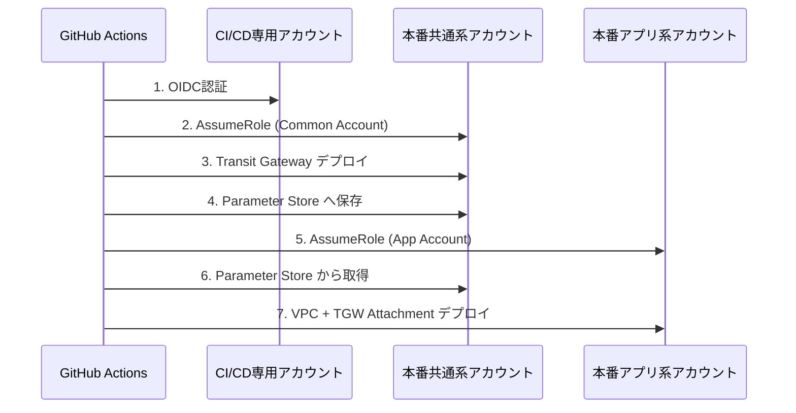

# CI/CD設計 - 概要

## 目的
新潟市介護保険事業所システムの継続的インテグレーション・継続的デプロイメント（CI/CD）戦略を定義し、安全で効率的な開発・デプロイプロセスを実現する。

---

## ディレクトリ構成

```
10_CICD/
├── README.md                           # 本ファイル（概要）
├── Multi-Account_CI_CD設計.md          # Multi-Accountデプロイ設計（重要）
├── ブランチ戦略.md                      # Gitブランチ運用方針
├── IaC戦略.md                          # CloudFormationによるインフラコード管理
└── GitHub_Actions設計.md               # CI/CDパイプライン設計
```

---

## 設計ドキュメント一覧

### 0. [Multi-Account_CI_CD設計.md](./Multi-Account_CI_CD設計.md) ⭐ **重要**

**内容**:
- Multi-Account構成でのCI/CD課題と解決策
- CI/CD専用アカウントパターン
- IAMロール設計（OIDC認証、AssumeRole chain）
- GitHub Actions OIDC認証フロー
- デプロイ順序制御（Common Account → App Account）
- Transit Gateway クロスアカウント共有（AWS RAM）
- Parameter Storeによるクロスアカウントパラメーター参照
- セキュリティ要件（GCAS準拠）
- 実装ロードマップ（Phase 1-6）

**対象読者**:
- インフラエンジニア（必読）
- SRE
- セキュリティ担当者

**前提知識**:
- AWS Multi-Account戦略
- IAMロール、Trust Policy
- CloudFormation基礎

---

### 1. [ブランチ戦略.md](./ブランチ戦略.md)

**内容**:
- Git-Flow（簡略版）ブランチモデル
- ブランチ保護ルール（main, develop）
- コミットメッセージ規約（Conventional Commits）
- プルリクエストテンプレート
- リリースフロー

**主要ブランチ**:
- `main` - 本番環境用（保護あり）
- `develop` - ステージング環境用（保護あり）
- `feature/*` - 新機能開発
- `bugfix/*` - バグ修正
- `hotfix/*` - 本番緊急修正
- `infra/*` - インフラ変更

---

### 2. [IaC戦略.md](./IaC戦略.md)

**内容**:
- AWS CloudFormation採用理由
- スタック設計（ライフサイクルごとに分割）
- Change Setsによるdry-run必須化
- パラメータ管理（環境差分）
- シークレット管理（Parameter Store）
- ドリフト検出
- セキュリティベストプラクティス

**スタック一覧**:
1. `niigata-kaigo-{env}-network` - VPC, Transit Gateway
2. `niigata-kaigo-{env}-security` - Security Groups, WAF
3. `niigata-kaigo-{env}-database` - RDS, ElastiCache
4. `niigata-kaigo-{env}-compute` - ECS Fargate, ALB
5. `niigata-kaigo-{env}-cognito` - Cognito User Pool
6. `niigata-kaigo-{env}-storage` - S3, CloudFront
7. `niigata-kaigo-{env}-monitoring` - CloudWatch, SNS

---

### 3. [GitHub_Actions設計.md](./GitHub_Actions設計.md)

**内容**:
- OIDC認証によるAWSアクセス
- 3つのワークフロー（Frontend, Backend, Infrastructure）
- セキュリティスキャン（Trivy, Dependabot）
- デプロイメント戦略
- ロールバック手順

**ワークフロー**:
1. **Frontend CI/CD** (`.github/workflows/frontend-deploy.yml`)
   - テスト → ビルド → S3デプロイ → CloudFront無効化

2. **Backend CI/CD** (`.github/workflows/backend-deploy.yml`)
   - テスト → Dockerビルド → ECRプッシュ → ECSデプロイ

3. **Infrastructure CI/CD** (`.github/workflows/infra-deploy.yml`)
   - 構文チェック → Change Set作成 → レビュー → 実行

---

## CI/CDフロー全体像（Multi-Account対応）

```mermaid
graph LR
    A[開発者] -->|1. feature/* ブランチで開発| B[GitHub]
    B -->|2. Pull Request| C[GitHub Actions: Test]
    C -->|3. テスト通過| D[レビュー・承認]
    D -->|4. develop へマージ| E[GitHub Actions: Deploy Staging]
    E -->|5. ステージング環境へ自動デプロイ| F[Staging環境]
    F -->|6. 動作確認OK| G[main へ PR]
    G -->|7. レビュー・承認| H[main へマージ]
    H -->|8. 手動承認ゲート| I[GitHub Actions: Deploy Production]
    I -->|9. 本番環境へデプロイ| J[Production環境]
```



### Multi-Account認証フロー



**詳細**: [Multi-Account_CI_CD設計.md](./Multi-Account_CI_CD設計.md)

---

## 環境戦略

| 環境 | ブランチ | AWSアカウント | デプロイタイミング | 承認 |
|------|---------|--------------|----------------|------|
| **Staging** | `develop` | ステージング共通系<br>ステージングアプリ系 | develop へプッシュ時 | 自動 |
| **Production** | `main` | 本番共通系<br>本番アプリ系 | main へプッシュ時 | 手動承認必須 |

---

## デプロイメント戦略

### Frontend（Next.js）

| ステップ | 内容 |
|---------|------|
| 1. ビルド | `npm run build` |
| 2. S3アップロード | 静的ファイルを S3 にアップロード |
| 3. キャッシュ制御 | HTML: `max-age=0`, JS/CSS: `max-age=31536000` |
| 4. CloudFront無効化 | キャッシュクリア |

### Backend（.NET Core）

| ステップ | 内容 |
|---------|------|
| 1. Dockerビルド | `docker build` |
| 2. セキュリティスキャン | Trivy による脆弱性スキャン |
| 3. ECRプッシュ | コンテナイメージを ECR にプッシュ |
| 4. ECS更新 | タスク定義更新 + サービス更新 |
| 5. Blue/Green | 本番環境のみ（ゼロダウンタイムデプロイ） |

### Infrastructure（CloudFormation）

| ステップ | 内容 |
|---------|------|
| 1. 構文チェック | `cfn-lint` |
| 2. テンプレート検証 | `aws cloudformation validate-template` |
| 3. Change Set作成 | 変更内容のプレビュー |
| 4. レビュー | 変更内容を確認（手動） |
| 5. 承認 | 本番環境のみ手動承認 |
| 6. Change Set実行 | インフラ変更の適用 |
| 7. ドリフト検出 | 手動変更の検出 |

---

## セキュリティ

### 認証

- **OIDC認証**: GitHub ActionsがAWS STSに一時的な認証情報を要求
- **アクセスキー不要**: IAMユーザーのシークレット不要
- **Multi-Account対応**: CI/CD専用アカウント → 各環境アカウントへAssumeRole

### スキャン

| 種類 | ツール | タイミング |
|------|-------|----------|
| コンテナイメージ | Trivy | Docker ビルド後 |
| 依存関係 | Dependabot | 週次 |
| CloudFormation | cfn-lint | プッシュ時 |

### シークレット管理

- **禁止**: GitHubリポジトリにシークレットをコミット
- **推奨**: AWS Systems Manager Parameter Store

---

## モニタリング

### デプロイメント通知

- **成功時**: SNS → Slack通知
- **失敗時**: SNS → Slack通知 + メール通知

### メトリクス

| メトリクス | 目標値 |
|----------|-------|
| **デプロイ頻度** | 週3回以上 |
| **変更失敗率** | 10%以下 |
| **平均復旧時間（MTTR）** | 1時間以内 |
| **変更リードタイム** | 1日以内 |

---

## ロールバック戦略

### Frontend

- S3バケットバージョニングによる復元
- CloudFrontキャッシュ無効化

### Backend

- ECSタスク定義のリビジョン戻し
- 以前のDockerイメージで再デプロイ

### Infrastructure

- 以前のCloudFormationテンプレートで Change Set 作成・実行

---

## 次のステップ

### 1. Multi-Account CI/CD設計の確認（必須）

**参照**: [Multi-Account_CI_CD設計.md](./Multi-Account_CI_CD設計.md)

**重要項目**:
- IAMロール設計
- OIDC認証フロー
- デプロイ順序制御
- Transit Gateway クロスアカウント共有

### 2. GitHub Actionsワークフローの実装

```bash
# ワークフローファイルの作成
mkdir -p .github/workflows
touch .github/workflows/frontend-deploy.yml
touch .github/workflows/backend-deploy.yml
touch .github/workflows/infra-deploy-multi-account.yml
```

**参照**: [GitHub_Actions設計.md](./GitHub_Actions設計.md)

### 3. AWS OIDC プロバイダーの設定

```bash
# GitHub OIDC プロバイダーを作成（CI/CD専用アカウント）
aws iam create-open-id-connect-provider \
  --url https://token.actions.githubusercontent.com \
  --client-id-list sts.amazonaws.com \
  --thumbprint-list <thumbprint>

# IAMロール作成（GitHubActionsOIDCRole）
```

**参照**: [Multi-Account_CI_CD設計.md - IAMロール設計](./Multi-Account_CI_CD設計.md#iamロール設計)

### 4. GitHub Secrets の設定

```
Settings → Secrets and variables → Actions → New repository secret
```

**必須シークレット**:
- `AWS_ROLE_CICD` - CI/CD専用アカウントのロールARN
- `AWS_ROLE_PROD_COMMON` - 本番共通系アカウントのロールARN
- `AWS_ROLE_PROD_APP` - 本番アプリ系アカウントのロールARN
- `AWS_ROLE_STAG_COMMON` - ステージング共通系アカウントのロールARN
- `AWS_ROLE_STAG_APP` - ステージングアプリ系アカウントのロールARN
- その他（[GitHub_Actions設計.md](./GitHub_Actions設計.md#github-secrets-設定) 参照）

### 5. GitHub Environments の設定

```
Settings → Environments → New environment
```

**環境**:
- `staging` - 自動デプロイ
- `staging-infra` - 自動デプロイ
- `production` - 手動承認必須
- `production-infra` - 手動承認必須

### 6. ブランチ保護ルールの設定

```
Settings → Branches → Add branch protection rule
```

**対象ブランチ**:
- `main` - [ブランチ戦略.md](./ブランチ戦略.md#main-ブランチ) 参照
- `develop` - [ブランチ戦略.md](./ブランチ戦略.md#develop-ブランチ) 参照

---

## トラブルシューティング

### デプロイが失敗した場合

1. **GitHub Actionsログ確認**
   - Actionsタブ → 失敗したワークフロー → 詳細ログ

2. **AWS CloudWatch Logs確認**
   - ECSタスクログ
   - Lambda関数ログ
   - CloudFormationスタックイベント

3. **ロールバック実施**
   - 各ドキュメントの「ロールバック手順」セクション参照

### Change Set が空の場合

**原因**: 変更内容がない

**対処**: 問題なし（変更がなかったことを確認）

### OIDC認証エラー

**原因**: IAMロールの信頼ポリシーが正しくない

**対処**:
- IAMロールの信頼ポリシーを確認
- リポジトリ名が正しいか確認
- OIDC Providerが正しく設定されているか確認

### クロスアカウントAssumeRoleエラー

**原因**: Trust PolicyまたはExternal IDが正しくない

**対処**:
- Trust Policyを確認（[Multi-Account_CI_CD設計.md](./Multi-Account_CI_CD設計.md#iamロール設計) 参照）
- External IDが一致しているか確認
- CloudTrailでAssumeRole操作を確認

---

## 参照ドキュメント

- **[Multi-Account_CI_CD設計.md](./Multi-Account_CI_CD設計.md)** ⭐ 必読
- [ブランチ戦略.md](./ブランチ戦略.md)
- [IaC戦略.md](./IaC戦略.md)
- [GitHub_Actions設計.md](./GitHub_Actions設計.md)
- `.claude/docs/40_standards/42_infra/iac/cloudformation.md` - CloudFormation標準
- `.claude/docs/40_standards/46_git.md` - Git運用標準

---

**作成日**: 2025-11-07
**更新日**: 2025-11-12（Multi-Account CI/CD設計追加）
**作成者**: Claude (PM)
**レビュー状態**: Draft
