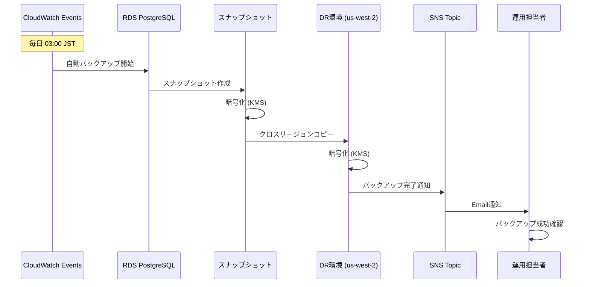
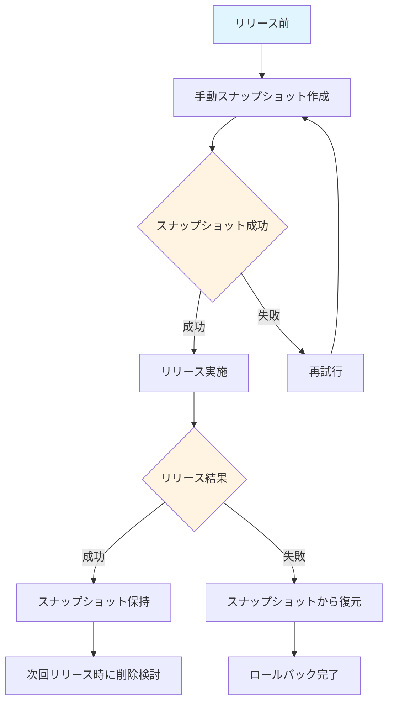
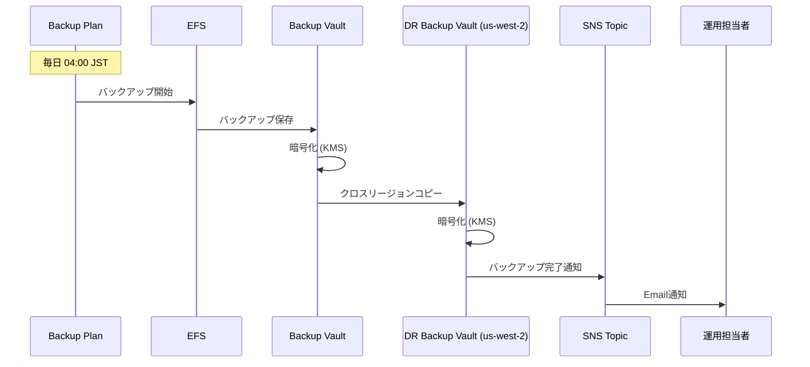
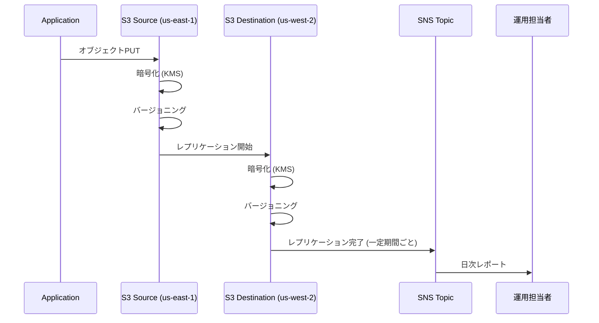

# バックアップフロー

## 目次
1. [バックアップフロー概要](#バックアップフロー概要)
2. [RDSバックアップフロー](#rdsバックアップフロー)
3. [EFSバックアップフロー](#efsバックアップフロー)
4. [S3バックアップフロー](#s3バックアップフロー)
5. [バックアップ監視](#バックアップ監視)

---

## バックアップフロー概要

### 全体フロー

```mermaid
graph TB
    subgraph "スケジュール"
        CRON[CloudWatch Events<br/>毎日 03:00 JST]
    end

    subgraph "バックアップ実行"
        RDS_AUTO[RDS 自動バックアップ]
        EFS_BACKUP[AWS Backup (EFS)]
        S3_REPL[S3 レプリケーション]
    end

    subgraph "クロスリージョンコピー"
        RDS_COPY[RDS スナップショット<br/>us-west-2へコピー]
        EFS_COPY[EFS バックアップ<br/>us-west-2へコピー]
        S3_COPY[S3 オブジェクト<br/>us-west-2へレプリケーション]
    end

    subgraph "通知"
        SNS[SNS Topic]
        EMAIL[Email通知]
    end

    CRON --> RDS_AUTO
    CRON --> EFS_BACKUP

    RDS_AUTO --> RDS_COPY
    EFS_BACKUP --> EFS_COPY
    S3_REPL --> S3_COPY

    RDS_COPY --> SNS
    EFS_COPY --> SNS
    SNS --> EMAIL

    style CRON fill:#e1f5ff
    style SNS fill:#ffe1e1
```

---

## RDSバックアップフロー

### 自動バックアップフロー



### 手動バックアップフロー



### バックアップスクリプト例

```bash
#!/bin/bash
# RDS手動スナップショット作成スクリプト

DB_INSTANCE="kaigo-subsys-prod"
SNAPSHOT_NAME="${DB_INSTANCE}-manual-$(date +%Y%m%d-%H%M%S)"

echo "Creating manual snapshot: ${SNAPSHOT_NAME}"

aws rds create-db-snapshot \
  --db-instance-identifier ${DB_INSTANCE} \
  --db-snapshot-identifier ${SNAPSHOT_NAME} \
  --tags Key=Type,Value=Manual Key=Purpose,Value=PreRelease

# スナップショット作成完了まで待機
aws rds wait db-snapshot-completed \
  --db-snapshot-identifier ${SNAPSHOT_NAME}

echo "Snapshot created successfully: ${SNAPSHOT_NAME}"

# DR環境へコピー
echo "Copying snapshot to DR region (us-west-2)"

aws rds copy-db-snapshot \
  --source-db-snapshot-identifier arn:aws:rds:us-east-1:123456789012:snapshot:${SNAPSHOT_NAME} \
  --target-db-snapshot-identifier ${SNAPSHOT_NAME} \
  --region us-west-2 \
  --kms-key-id arn:aws:kms:us-west-2:123456789012:key/dr-key-id \
  --copy-tags

echo "Snapshot copy initiated to DR region"
```

---

## EFSバックアップフロー

### AWS Backupフロー



### バックアッププラン (CloudFormation)

```yaml
Resources:
  BackupPlan:
    Type: AWS::Backup::BackupPlan
    Properties:
      BackupPlan:
        BackupPlanName: kaigo-subsys-prod-efs-backup
        BackupPlanRule:
          - RuleName: DailyBackup
            TargetBackupVault: !Ref BackupVault
            ScheduleExpression: cron(0 19 * * ? *)  # 04:00 JST (19:00 UTC)
            StartWindowMinutes: 60
            CompletionWindowMinutes: 480
            Lifecycle:
              DeleteAfterDays: 30
            CopyActions:
              - DestinationBackupVaultArn: !Sub arn:aws:backup:us-west-2:${AWS::AccountId}:backup-vault:kaigo-subsys-dr-backup-vault
                Lifecycle:
                  DeleteAfterDays: 30

  BackupVault:
    Type: AWS::Backup::BackupVault
    Properties:
      BackupVaultName: kaigo-subsys-prod-backup-vault
      EncryptionKeyArn: !GetAtt BackupKey.Arn

  BackupSelection:
    Type: AWS::Backup::BackupSelection
    Properties:
      BackupPlanId: !Ref BackupPlan
      BackupSelection:
        SelectionName: EFSSelection
        IamRoleArn: !GetAtt BackupRole.Arn
        Resources:
          - !Sub arn:aws:elasticfilesystem:${AWS::Region}:${AWS::AccountId}:file-system/${EFSFileSystem}
```

---

## S3バックアップフロー

### クロスリージョンレプリケーション



### レプリケーション設定 (CloudFormation)

```yaml
Resources:
  SourceBucket:
    Type: AWS::S3::Bucket
    Properties:
      BucketName: kaigo-subsys-prod-backups
      VersioningConfiguration:
        Status: Enabled
      BucketEncryption:
        ServerSideEncryptionConfiguration:
          - ServerSideEncryptionByDefault:
              SSEAlgorithm: aws:kms
              KMSMasterKeyID: !Ref BackupKey
      ReplicationConfiguration:
        Role: !GetAtt ReplicationRole.Arn
        Rules:
          - Id: ReplicateAll
            Status: Enabled
            Priority: 1
            Filter: {}
            Destination:
              Bucket: !Sub arn:aws:s3:::kaigo-subsys-dr-backups
              ReplicationTime:
                Status: Enabled
                Time:
                  Minutes: 15
              Metrics:
                Status: Enabled
                EventThreshold:
                  Minutes: 15
              EncryptionConfiguration:
                ReplicaKmsKeyID: !Sub arn:aws:kms:us-west-2:${AWS::AccountId}:key/dr-backup-key-id
```

---

## バックアップ監視

### バックアップ成功/失敗の確認

#### 日次確認項目

| 項目 | 確認方法 | 正常な状態 |
|------|---------|----------|
| RDS自動バックアップ | CloudWatch Events ログ | `backup-succeeded` |
| EFS バックアップ | AWS Backup ジョブステータス | `COMPLETED` |
| S3 レプリケーション | S3 レプリケーションメトリクス | `ReplicationLatency < 15分` |
| クロスリージョンコピー | CloudWatch Logs | コピー完了ログあり |

#### バックアップ失敗時のアラート

```yaml
Resources:
  BackupFailureAlarm:
    Type: AWS::CloudWatch::Alarm
    Properties:
      AlarmName: kaigo-subsys-prod-backup-failure
      AlarmDescription: バックアップが失敗した
      MetricName: NumberOfBackupJobsFailed
      Namespace: AWS/Backup
      Statistic: Sum
      Period: 3600
      EvaluationPeriods: 1
      Threshold: 1
      ComparisonOperator: GreaterThanOrEqualToThreshold
      AlarmActions:
        - !Ref CriticalAlertsTopic
```

### バックアップ確認スクリプト

```bash
#!/bin/bash
# バックアップ確認スクリプト (日次実行)

echo "=== RDS Backup Check ==="
aws rds describe-db-snapshots \
  --db-instance-identifier kaigo-subsys-prod \
  --query "DBSnapshots[?SnapshotCreateTime >= '$(date -u -d '1 day ago' +%Y-%m-%d)'] | [*].[DBSnapshotIdentifier, SnapshotCreateTime, Status]" \
  --output table

echo ""
echo "=== EFS Backup Check ==="
aws backup list-recovery-points-by-backup-vault \
  --backup-vault-name kaigo-subsys-prod-backup-vault \
  --query "RecoveryPoints[?CreationDate >= '$(date -u -d '1 day ago' +%Y-%m-%d)'] | [*].[RecoveryPointArn, CreationDate, Status]" \
  --output table

echo ""
echo "=== S3 Replication Check ==="
aws cloudwatch get-metric-statistics \
  --namespace AWS/S3 \
  --metric-name ReplicationLatency \
  --dimensions Name=SourceBucket,Value=kaigo-subsys-prod-backups Name=DestinationBucket,Value=kaigo-subsys-dr-backups \
  --start-time $(date -u -d '1 day ago' +%Y-%m-%dT%H:%M:%S) \
  --end-time $(date -u +%Y-%m-%dT%H:%M:%S) \
  --period 3600 \
  --statistics Average \
  --output table
```

### 復元テスト手順

#### 四半期ごとの復元テスト

**目的**: バックアップが正常に復元できることを確認

**手順**:

1. **ステージング環境でテスト実施**
   - 本番環境のスナップショットを使用
   - ステージング環境のRDSインスタンスを一時削除
   - スナップショットから復元

2. **復元確認**
   ```bash
   # スナップショットから復元
   aws rds restore-db-instance-from-db-snapshot \
     --db-instance-identifier kaigo-subsys-stg-restored \
     --db-snapshot-identifier rds:kaigo-subsys-prod-2025-01-15-03-00 \
     --db-instance-class db.t4g.medium \
     --vpc-security-group-ids sg-stg-xxxxx \
     --db-subnet-group-name kaigo-subsys-stg-db-subnet-group
   ```

3. **データ整合性確認**
   - テーブル数確認
   - レコード数確認
   - アプリケーション接続確認

4. **レポート作成**
   - 復元時間記録
   - 問題点記録
   - 改善提案

---

## 関連ドキュメント

- [バックアップ・DR設計](./backup_dr_design.md)
- [DR手順書](./dr_procedure.md)
- [データベース設計](../05_database/rds_design.md)

---

**作成日**: 2025-11-05
**作成者**: Architect
**バージョン**: 1.0
