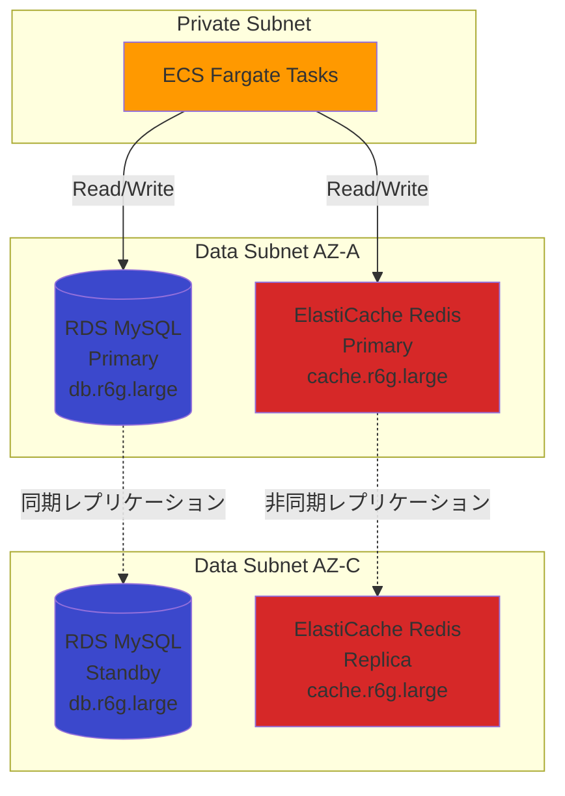
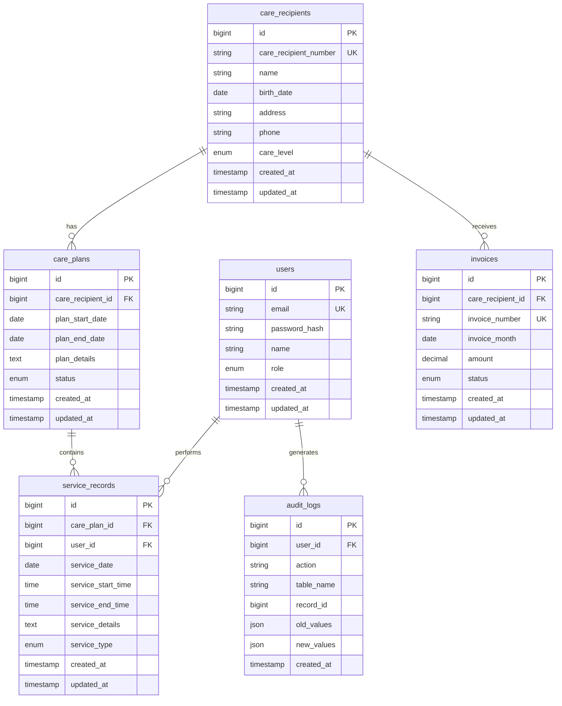

# データベース設計

## 概要

このドキュメントでは、RDS MySQL、ElastiCache Redisの設計を定義します。

---

## 設計方針

1. **高可用性**: Multi-AZ構成
2. **バックアップ**: 自動バックアップ（7日間保持）
3. **セキュリティ**: Data Subnet配置、暗号化
4. **パフォーマンス**: Read Replicaは初期フェーズでは不要

---

## システム構成図

---

## RDS MySQL 設計

### DB Subnet Group

| パラメータ | 本番環境 | ステージング環境 |
|----------|---------|---------------|
| 名前 | kaigo-prod-db-subnet-group | kaigo-stg-db-subnet-group |
| サブネット | kaigo-prod-data-subnet-a, kaigo-prod-data-subnet-c | kaigo-stg-data-subnet-a, kaigo-stg-data-subnet-c |
| 説明 | Subnet group for RDS MySQL | Subnet group for RDS MySQL |

### DB Parameter Group

| パラメータ | 本番環境 | ステージング環境 |
|----------|---------|---------------|
| 名前 | kaigo-prod-mysql-params | kaigo-stg-mysql-params |
| Family | mysql8.0 | mysql8.0 |
| 説明 | Custom parameter group for MySQL 8.0 | Custom parameter group for MySQL 8.0 |

**主要なパラメータ**

| パラメータ | 値 | 説明 |
|----------|-----|------|
| character_set_server | utf8mb4 | 日本語対応 |
| collation_server | utf8mb4_unicode_ci | 日本語ソート対応 |
| max_connections | 150 | 最大接続数 |
| innodb_buffer_pool_size | {DBInstanceClassMemory*3/4} | バッファプールサイズ |
| log_bin_trust_function_creators | 1 | ストアドファンクション作成許可 |
| time_zone | Asia/Tokyo | タイムゾーン |
| slow_query_log | 1 | スロークエリログ有効化 |
| long_query_time | 2 | スロークエリ閾値（2秒） |

### RDS Instance

#### 本番環境

| パラメータ | 値 |
|----------|-----|
| DB Instance Identifier | kaigo-prod-mysql |
| Engine | MySQL 8.0.35 |
| Instance Class | db.r6g.large（2 vCPU / 16 GB RAM） |
| Multi-AZ | 有効 |
| Storage Type | gp3（SSD） |
| Allocated Storage | 100 GB |
| Max Allocated Storage | 500 GB（自動拡張） |
| IOPS | 3000 IOPS |
| Throughput | 125 MB/s |
| DB Name | kaigo_db |
| Master Username | admin |
| Master Password | Secrets Manager管理 |
| DB Subnet Group | kaigo-prod-db-subnet-group |
| VPC Security Groups | kaigo-prod-rds-sg |
| Public Access | 無効 |
| Backup Retention Period | 7日 |
| Backup Window | 17:00-18:00 JST（深夜2:00-3:00 UTC） |
| Maintenance Window | 日曜 19:00-20:00 JST（日曜 10:00-11:00 UTC） |
| Enhanced Monitoring | 有効（60秒間隔） |
| Performance Insights | 有効（7日間保持） |
| Encryption at Rest | 有効（AWS KMS） |
| Deletion Protection | 有効 |
| タグ: Name | kaigo-prod-mysql |
| タグ: Environment | production |

#### ステージング環境

| パラメータ | 値 |
|----------|-----|
| DB Instance Identifier | kaigo-stg-mysql |
| Engine | MySQL 8.0.35 |
| Instance Class | db.t4g.medium（2 vCPU / 4 GB RAM） |
| Multi-AZ | 無効（Single-AZ） |
| Storage Type | gp3（SSD） |
| Allocated Storage | 50 GB |
| Max Allocated Storage | 200 GB（自動拡張） |
| IOPS | 3000 IOPS |
| Throughput | 125 MB/s |
| DB Name | kaigo_db |
| Master Username | admin |
| Master Password | Secrets Manager管理 |
| DB Subnet Group | kaigo-stg-db-subnet-group |
| VPC Security Groups | kaigo-stg-rds-sg |
| Public Access | 無効 |
| Backup Retention Period | 3日 |
| Backup Window | 17:00-18:00 JST |
| Maintenance Window | 日曜 19:00-20:00 JST |
| Enhanced Monitoring | 無効 |
| Performance Insights | 無効 |
| Encryption at Rest | 有効（AWS KMS） |
| Deletion Protection | 無効 |
| タグ: Name | kaigo-stg-mysql |
| タグ: Environment | staging |

### バックアップ戦略

#### 自動バックアップ

| 項目 | 本番環境 | ステージング環境 |
|------|---------|---------------|
| 保持期間 | 7日 | 3日 |
| バックアップウィンドウ | 17:00-18:00 JST | 17:00-18:00 JST |
| スナップショット | 自動作成 | 自動作成 |
| ポイントインタイムリカバリ | 有効 | 有効 |

#### 手動スナップショット

| 項目 | 頻度 | 保持期間 |
|------|------|---------|
| 月次スナップショット | 毎月1日 | 1年間 |
| リリース前スナップショット | リリース直前 | 3ヶ月 |
| 障害時スナップショット | 障害発生時 | 無期限 |

---

## ElastiCache Redis 設計

### Subnet Group

| パラメータ | 本番環境 | ステージング環境 |
|----------|---------|---------------|
| 名前 | kaigo-prod-redis-subnet-group | kaigo-stg-redis-subnet-group |
| サブネット | kaigo-prod-data-subnet-a, kaigo-prod-data-subnet-c | kaigo-stg-data-subnet-a, kaigo-stg-data-subnet-c |
| 説明 | Subnet group for ElastiCache Redis | Subnet group for ElastiCache Redis |

### Parameter Group

| パラメータ | 本番環境 | ステージング環境 |
|----------|---------|---------------|
| 名前 | kaigo-prod-redis-params | kaigo-stg-redis-params |
| Family | redis7 | redis7 |
| 説明 | Custom parameter group for Redis 7.0 | Custom parameter group for Redis 7.0 |

**主要なパラメータ**

| パラメータ | 値 | 説明 |
|----------|-----|------|
| maxmemory-policy | allkeys-lru | メモリ不足時はLRUで削除 |
| timeout | 300 | アイドル接続タイムアウト（秒） |
| tcp-keepalive | 300 | TCP Keepalive（秒） |
| notify-keyspace-events | Ex | キー有効期限イベント通知 |

### Replication Group

#### 本番環境

| パラメータ | 値 |
|----------|-----|
| Replication Group ID | kaigo-prod-redis |
| 説明 | Redis cluster for Kaigo subsystem |
| Engine | Redis 7.0 |
| Node Type | cache.r6g.large（2 vCPU / 13.07 GB RAM） |
| Number of Replicas | 1 |
| Multi-AZ | 有効 |
| Automatic Failover | 有効 |
| Subnet Group | kaigo-prod-redis-subnet-group |
| Security Groups | kaigo-prod-redis-sg |
| Encryption at Rest | 有効（AWS KMS） |
| Encryption in Transit | 有効 |
| Auth Token | 有効（Secrets Manager管理） |
| Snapshot Retention | 7日 |
| Snapshot Window | 18:00-19:00 JST（深夜3:00-4:00 UTC） |
| Maintenance Window | 日曜 20:00-21:00 JST（日曜 11:00-12:00 UTC） |
| タグ: Name | kaigo-prod-redis |
| タグ: Environment | production |

#### ステージング環境

| パラメータ | 値 |
|----------|-----|
| Replication Group ID | kaigo-stg-redis |
| 説明 | Redis cluster for Kaigo subsystem (staging) |
| Engine | Redis 7.0 |
| Node Type | cache.t4g.medium（2 vCPU / 3.09 GB RAM） |
| Number of Replicas | 0（レプリカなし） |
| Multi-AZ | 無効 |
| Automatic Failover | 無効 |
| Subnet Group | kaigo-stg-redis-subnet-group |
| Security Groups | kaigo-stg-redis-sg |
| Encryption at Rest | 有効（AWS KMS） |
| Encryption in Transit | 有効 |
| Auth Token | 有効（Secrets Manager管理） |
| Snapshot Retention | 3日 |
| Snapshot Window | 18:00-19:00 JST |
| Maintenance Window | 日曜 20:00-21:00 JST |
| タグ: Name | kaigo-stg-redis |
| タグ: Environment | staging |

---

## データモデル設計（ER図）

---

## テーブル定義

### users（ユーザー）

| カラム名 | データ型 | NULL | デフォルト | 説明 |
|---------|---------|------|----------|------|
| id | BIGINT | NO | AUTO_INCREMENT | ユーザーID（PK） |
| email | VARCHAR(255) | NO | - | メールアドレス（UK） |
| password_hash | VARCHAR(255) | NO | - | パスワードハッシュ |
| name | VARCHAR(100) | NO | - | 氏名 |
| role | ENUM('admin', 'staff', 'viewer') | NO | 'viewer' | 権限 |
| created_at | TIMESTAMP | NO | CURRENT_TIMESTAMP | 作成日時 |
| updated_at | TIMESTAMP | NO | CURRENT_TIMESTAMP ON UPDATE | 更新日時 |

**Index**
- PRIMARY KEY (id)
- UNIQUE KEY (email)
- INDEX (role)

### care_recipients（要介護者）

| カラム名 | データ型 | NULL | デフォルト | 説明 |
|---------|---------|------|----------|------|
| id | BIGINT | NO | AUTO_INCREMENT | 要介護者ID（PK） |
| care_recipient_number | VARCHAR(20) | NO | - | 要介護者番号（UK） |
| name | VARCHAR(100) | NO | - | 氏名 |
| birth_date | DATE | NO | - | 生年月日 |
| address | VARCHAR(255) | NO | - | 住所 |
| phone | VARCHAR(20) | YES | NULL | 電話番号 |
| care_level | ENUM('none', 'support1', 'support2', 'care1', 'care2', 'care3', 'care4', 'care5') | NO | 'none' | 要介護度 |
| created_at | TIMESTAMP | NO | CURRENT_TIMESTAMP | 作成日時 |
| updated_at | TIMESTAMP | NO | CURRENT_TIMESTAMP ON UPDATE | 更新日時 |

**Index**
- PRIMARY KEY (id)
- UNIQUE KEY (care_recipient_number)
- INDEX (name)
- INDEX (care_level)

### care_plans（ケアプラン）

| カラム名 | データ型 | NULL | デフォルト | 説明 |
|---------|---------|------|----------|------|
| id | BIGINT | NO | AUTO_INCREMENT | ケアプランID（PK） |
| care_recipient_id | BIGINT | NO | - | 要介護者ID（FK） |
| plan_start_date | DATE | NO | - | プラン開始日 |
| plan_end_date | DATE | NO | - | プラン終了日 |
| plan_details | TEXT | NO | - | プラン詳細 |
| status | ENUM('draft', 'active', 'expired', 'cancelled') | NO | 'draft' | ステータス |
| created_at | TIMESTAMP | NO | CURRENT_TIMESTAMP | 作成日時 |
| updated_at | TIMESTAMP | NO | CURRENT_TIMESTAMP ON UPDATE | 更新日時 |

**Index**
- PRIMARY KEY (id)
- INDEX (care_recipient_id)
- INDEX (status)
- INDEX (plan_start_date, plan_end_date)

### service_records（サービス実績）

| カラム名 | データ型 | NULL | デフォルト | 説明 |
|---------|---------|------|----------|------|
| id | BIGINT | NO | AUTO_INCREMENT | サービス実績ID（PK） |
| care_plan_id | BIGINT | NO | - | ケアプランID（FK） |
| user_id | BIGINT | NO | - | 実施者ID（FK） |
| service_date | DATE | NO | - | サービス日 |
| service_start_time | TIME | NO | - | 開始時刻 |
| service_end_time | TIME | NO | - | 終了時刻 |
| service_details | TEXT | NO | - | サービス内容 |
| service_type | ENUM('home_care', 'day_service', 'short_stay', 'other') | NO | 'home_care' | サービス種別 |
| created_at | TIMESTAMP | NO | CURRENT_TIMESTAMP | 作成日時 |
| updated_at | TIMESTAMP | NO | CURRENT_TIMESTAMP ON UPDATE | 更新日時 |

**Index**
- PRIMARY KEY (id)
- INDEX (care_plan_id)
- INDEX (user_id)
- INDEX (service_date)
- INDEX (service_type)

### invoices（請求）

| カラム名 | データ型 | NULL | デフォルト | 説明 |
|---------|---------|------|----------|------|
| id | BIGINT | NO | AUTO_INCREMENT | 請求ID（PK） |
| care_recipient_id | BIGINT | NO | - | 要介護者ID（FK） |
| invoice_number | VARCHAR(30) | NO | - | 請求番号（UK） |
| invoice_month | DATE | NO | - | 請求月 |
| amount | DECIMAL(10, 2) | NO | - | 請求額 |
| status | ENUM('draft', 'sent', 'paid', 'overdue', 'cancelled') | NO | 'draft' | ステータス |
| created_at | TIMESTAMP | NO | CURRENT_TIMESTAMP | 作成日時 |
| updated_at | TIMESTAMP | NO | CURRENT_TIMESTAMP ON UPDATE | 更新日時 |

**Index**
- PRIMARY KEY (id)
- UNIQUE KEY (invoice_number)
- INDEX (care_recipient_id)
- INDEX (invoice_month)
- INDEX (status)

### audit_logs（監査ログ）

| カラム名 | データ型 | NULL | デフォルト | 説明 |
|---------|---------|------|----------|------|
| id | BIGINT | NO | AUTO_INCREMENT | 監査ログID（PK） |
| user_id | BIGINT | YES | NULL | ユーザーID（FK） |
| action | VARCHAR(50) | NO | - | 操作（INSERT/UPDATE/DELETE） |
| table_name | VARCHAR(50) | NO | - | テーブル名 |
| record_id | BIGINT | NO | - | レコードID |
| old_values | JSON | YES | NULL | 変更前の値 |
| new_values | JSON | YES | NULL | 変更後の値 |
| created_at | TIMESTAMP | NO | CURRENT_TIMESTAMP | 作成日時 |

**Index**
- PRIMARY KEY (id)
- INDEX (user_id)
- INDEX (table_name, record_id)
- INDEX (created_at)

---

## Redisキャッシュ戦略

### キャッシュキーの命名規則

| 用途 | キー形式 | TTL | 例 |
|------|---------|-----|-----|
| セッション | `session:{session_id}` | 1時間 | `session:abc123` |
| ユーザー情報 | `user:{user_id}` | 10分 | `user:123` |
| 要介護者情報 | `care_recipient:{id}` | 10分 | `care_recipient:456` |
| ケアプラン一覧 | `care_plans:list:{recipient_id}` | 5分 | `care_plans:list:456` |
| APIレート制限 | `ratelimit:{ip}:{endpoint}` | 1分 | `ratelimit:192.168.1.1:api/v1/users` |

### キャッシュ更新戦略

| データ種別 | 戦略 | 理由 |
|----------|------|------|
| セッション | Write-Through | 常に最新 |
| ユーザー情報 | Cache-Aside | 更新頻度低い |
| 要介護者情報 | Cache-Aside + TTL | 更新頻度低い |
| ケアプラン一覧 | Cache-Aside + TTL | 更新頻度中 |
| レート制限 | Write-Through | 常に最新 |

---

## 監視とアラート

### RDS CloudWatch メトリクス

| メトリクス | 閾値 | アラート |
|----------|------|---------|
| CPUUtilization | 80% | 警告 |
| CPUUtilization | 90% | 重大 |
| FreeableMemory | 500 MB | 警告 |
| FreeableMemory | 250 MB | 重大 |
| DatabaseConnections | 120 | 警告 |
| DatabaseConnections | 140 | 重大 |
| ReadLatency | 10 ms | 警告 |
| WriteLatency | 10 ms | 警告 |
| FreeStorageSpace | 10 GB | 警告 |
| FreeStorageSpace | 5 GB | 重大 |

### ElastiCache CloudWatch メトリクス

| メトリクス | 閾値 | アラート |
|----------|------|---------|
| CPUUtilization | 80% | 警告 |
| EngineCPUUtilization | 80% | 警告 |
| DatabaseMemoryUsagePercentage | 80% | 警告 |
| DatabaseMemoryUsagePercentage | 90% | 重大 |
| CurrConnections | 50,000 | 警告 |
| Evictions | 1000/分 | 警告 |

---

## セキュリティ考慮事項

1. **暗号化**: 保管時・転送時の両方で暗号化
2. **Private Subnet配置**: インターネットからの直接アクセス不可
3. **Security Group**: ECSからのみアクセス許可
4. **認証情報管理**: Secrets Managerで管理
5. **監査ログ**: すべてのデータ変更を記録

---

## コスト試算

### 本番環境（月額）

| 項目 | 単価 | 数量 | 月額コスト |
|------|------|------|-----------|
| RDS db.r6g.large Multi-AZ | $0.688/時間 | 730時間 | $502.24 |
| RDS ストレージ gp3 100GB | $0.138/GB | 100 GB | $13.80 |
| ElastiCache cache.r6g.large × 2 | $0.295/時間 × 2 | 730時間 | $430.70 |
| バックアップストレージ | $0.095/GB | 50 GB | $4.75 |
| **合計** | - | - | **$951.49** |

**年間コスト**: 約 $11,417.88（約 1,598,000円 @ $1=140円）

### ステージング環境（月額）

| 項目 | 単価 | 数量 | 月額コスト |
|------|------|------|-----------|
| RDS db.t4g.medium Single-AZ | $0.104/時間 | 730時間 | $75.92 |
| RDS ストレージ gp3 50GB | $0.138/GB | 50 GB | $6.90 |
| ElastiCache cache.t4g.medium | $0.072/時間 | 730時間 | $52.56 |
| **合計** | - | - | **$135.38** |

**年間コスト**: 約 $1,624.56（約 227,000円 @ $1=140円）

---

## まとめ

- **RDS MySQL**: Multi-AZ構成で高可用性
- **ElastiCache Redis**: セッション・キャッシュ管理
- **暗号化**: 保管時・転送時の両方で対応
- **バックアップ**: 7日間自動保持 + 手動スナップショット

---

**作成者**: architect
**レビュー状態**: Draft
**関連ドキュメント**: [rds_parameters.md](rds_parameters.md), [elasticache_parameters.md](elasticache_parameters.md)
