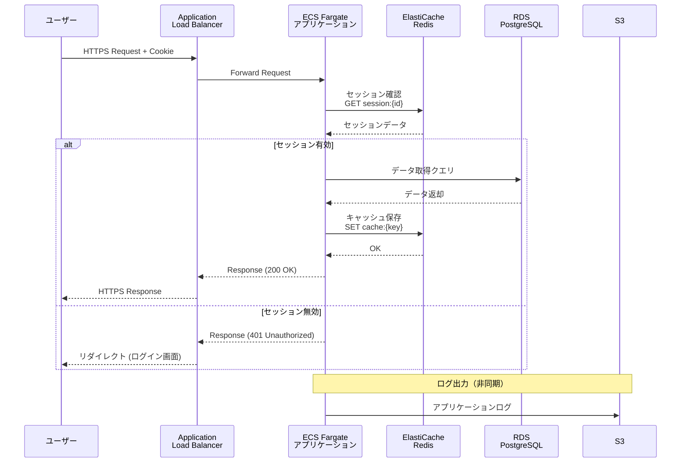
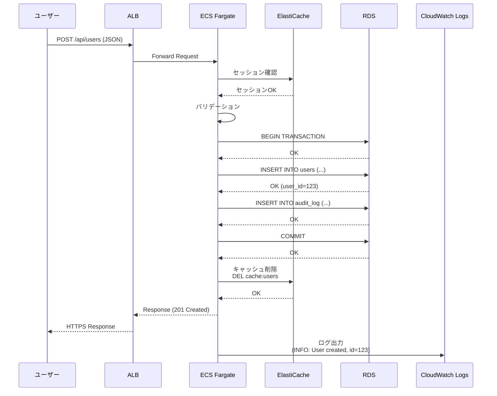
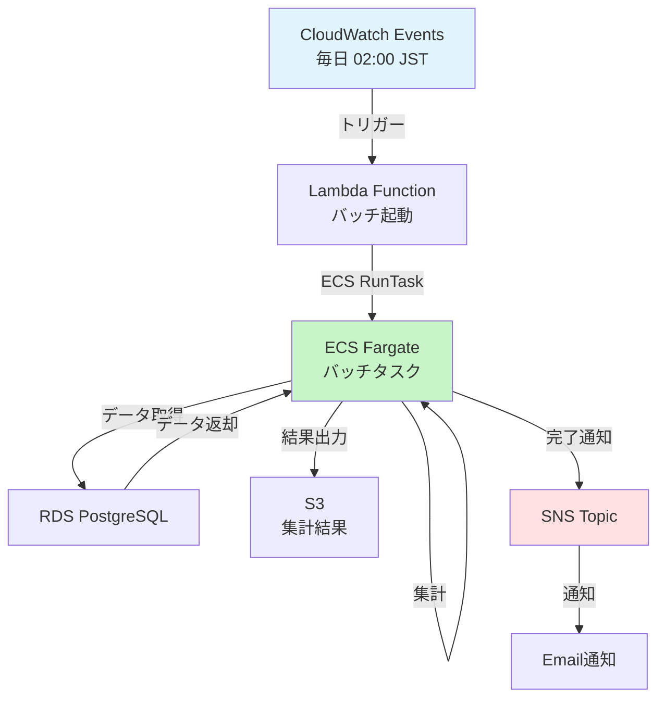
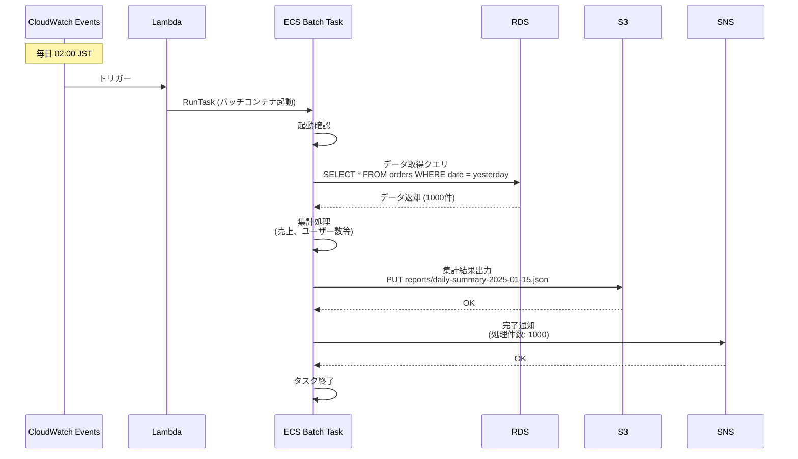
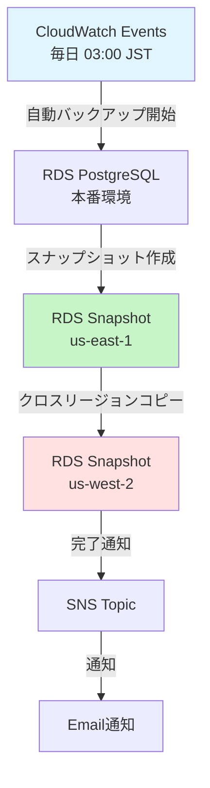
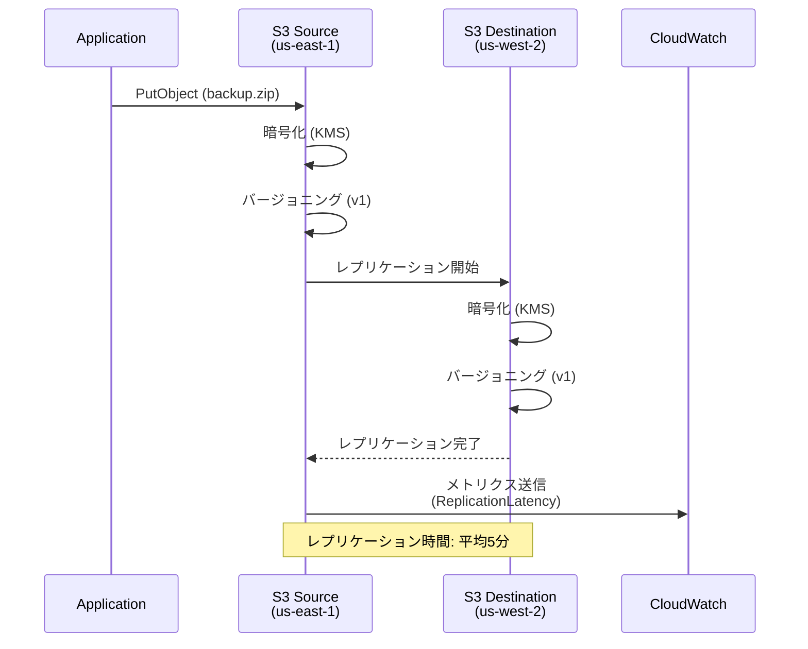
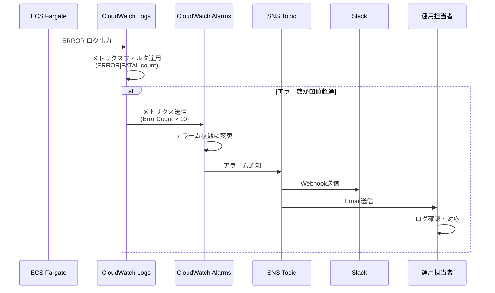
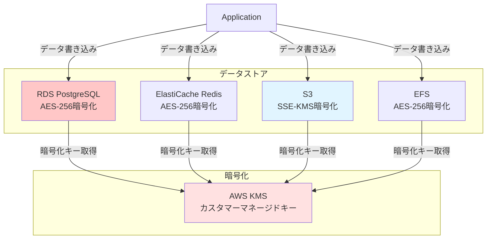
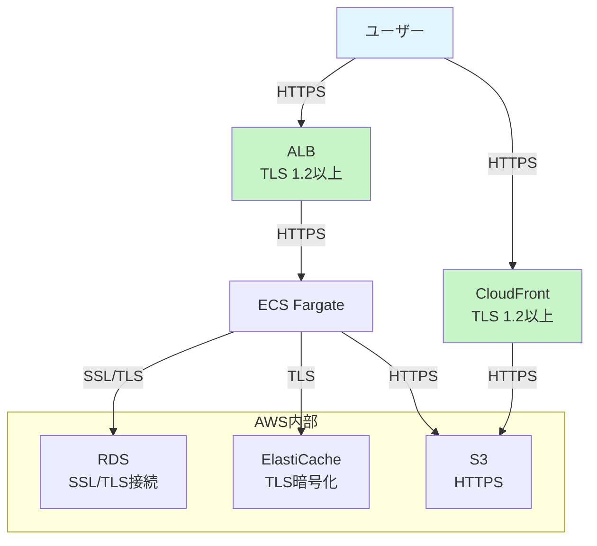

# データフロー図

## 目次
1. [全体データフロー](#全体データフロー)
2. [ユーザーリクエストフロー](#ユーザーリクエストフロー)
3. [バッチ処理フロー](#バッチ処理フロー)
4. [バックアップフロー](#バックアップフロー)
5. [ログフロー](#ログフロー)

---

## 全体データフロー

### システム全体のデータの流れ

```mermaid
graph TB
    USER[ユーザー<br/>Webブラウザ]

    subgraph "AWS Cloud (us-east-1)"
        CF[CloudFront<br/>(静的コンテンツ)]
        ALB[Application Load Balancer]
        ECS[ECS Fargate<br/>アプリケーション]
        RDS[RDS PostgreSQL<br/>マスターデータ]
        CACHE[ElastiCache Redis<br/>セッション・キャッシュ]
        EFS[EFS<br/>共有ファイル]
        S3_APP[S3<br/>アプリケーションログ]
        CW[CloudWatch Logs]
    end

    subgraph "DR環境 (us-west-2)"
        S3_DR[S3<br/>バックアップ]
    end

    USER -->|HTTPS| CF
    USER -->|HTTPS| ALB
    CF --> S3_STATIC[S3<br/>静的コンテンツ]
    ALB --> ECS
    ECS --> RDS
    ECS --> CACHE
    ECS --> EFS
    ECS --> S3_APP
    ECS --> CW

    S3_APP -.クロスリージョン<br/>レプリケーション.-> S3_DR

    style USER fill:#e1f5ff
    style ECS fill:#c7f5c7
    style RDS fill:#ffc7c7
    style S3_DR fill:#ffe1e1
```

---

## ユーザーリクエストフロー

### 認証ありリクエストフロー



### データ登録フロー



---

## バッチ処理フロー

### 日次集計バッチフロー



### バッチ処理詳細フロー



---

## バックアップフロー

### RDS自動バックアップフロー



### S3クロスリージョンレプリケーションフロー



---

## ログフロー

### アプリケーションログフロー

```mermaid
graph TB
    ECS[ECS Fargate<br/>アプリケーション]
    CW_LOGS[CloudWatch Logs<br/>/ecs/kaigo-subsys-prod]
    S3_LOGS[S3<br/>kaigo-subsys-prod-app-logs]
    S3_ARCHIVE[S3 Glacier<br/>長期保管]

    ECS -->|ログ出力<br/>(STDOUT/STDERR)| CW_LOGS
    CW_LOGS -->|エクスポート<br/>(日次)| S3_LOGS
    S3_LOGS -->|ライフサイクル<br/>(90日後)| S3_ARCHIVE

    style ECS fill:#c7f5c7
    style CW_LOGS fill:#e1f5ff
    style S3_ARCHIVE fill:#fff4e1
```

### 監査ログフロー

```mermaid
graph TB
    subgraph "ログソース"
        CT[CloudTrail<br/>API操作ログ]
        VPC[VPC Flow Logs<br/>ネットワークログ]
        ALB_LOG[ALB Access Logs]
        WAF_LOG[WAF Logs]
    end

    subgraph "ログ保存"
        S3_AUDIT[S3<br/>kaigo-subsys-prod-audit-logs]
        CW_LOGS[CloudWatch Logs]
    end

    subgraph "長期保管"
        S3_GLACIER[S3 Glacier<br/>7年保管]
    end

    CT --> S3_AUDIT
    VPC --> CW_LOGS
    ALB_LOG --> S3_AUDIT
    WAF_LOG --> S3_AUDIT

    S3_AUDIT -->|ライフサイクル<br/>(365日後)| S3_GLACIER

    style S3_AUDIT fill:#ffe1e1
    style S3_GLACIER fill:#fff4e1
```

### リアルタイムログ監視フロー



---

## データ暗号化フロー

### データ保存時の暗号化



### 通信時の暗号化



---

## 関連ドキュメント

- [システム構成図](./system_architecture.md)
- [ネットワーク図](./network_diagram.md)
- [バックアップ・DR設計](../09_backup_dr/backup_dr_design.md)
- [セキュリティ設計](../07_security/security_design.md)

---

**作成日**: 2025-11-05
**作成者**: Architect
**バージョン**: 1.0
