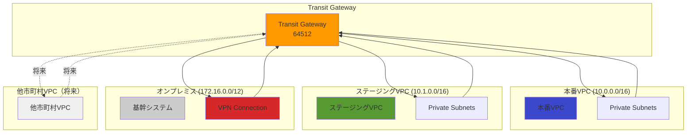

# Transit Gateway パラメータシート（将来の拡張用）

## 概要

このドキュメントでは、将来的に複数のVPCを統合管理する必要が生じた場合のTransit Gateway構成を定義します。

**現時点では未実装**：初期フェーズでは単一VPCで運用し、他の市町村との連携や複数VPC統合が必要になった際にTransit Gatewayを導入します。

---

## 導入シナリオ

### Transit Gatewayが必要になる場合

1. **複数市町村との連携**
   - 他の市町村の介護保険システムとのVPCピアリングが複雑化
   - スター型トポロジで一元管理したい場合

2. **複数VPCの統合管理**
   - 本番環境とステージング環境のVPCを統合ルーティング
   - 開発環境、検証環境の追加

3. **オンプレミスとの集約接続**
   - 複数のオンプレミス拠点との接続を一元管理
   - VPN接続の冗長化と負荷分散

---

## Transit Gateway基本設定

### Transit Gateway

| パラメータ | 値（仮） |
|----------|---------|
| 名前 | niigata-kaigo-tgw |
| リージョン | ap-northeast-1 |
| ASN | 64512 |
| デフォルトルートテーブルの関連付け | 無効（手動管理） |
| デフォルトルートテーブルの伝播 | 無効（手動管理） |
| VPNエコーイクポート | 有効 |
| DNSサポート | 有効 |
| マルチキャストサポート | 無効 |
| タグ: Name | niigata-kaigo-tgw |
| タグ: Environment | shared |

### CloudFormationパラメータ

```yaml
TransitGatewayName:
  Type: String
  Default: "niigata-kaigo-tgw"

TransitGatewayASN:
  Type: Number
  Default: 64512
  Description: "BGP ASN for Transit Gateway"

DefaultRouteTableAssociation:
  Type: String
  Default: "disable"
  AllowedValues:
    - "enable"
    - "disable"

DefaultRouteTablePropagation:
  Type: String
  Default: "disable"
  AllowedValues:
    - "enable"
    - "disable"
```

---

## Transit Gateway Attachment

### 本番VPC Attachment

| パラメータ | 値（仮） |
|----------|---------|
| 名前 | niigata-kaigo-prod-tgw-attachment |
| Transit Gateway | niigata-kaigo-tgw |
| VPC | kaigo-prod-vpc (10.0.0.0/16) |
| サブネット | kaigo-prod-private-subnet-a, kaigo-prod-private-subnet-c |
| DNS サポート | 有効 |
| タグ: Name | niigata-kaigo-prod-tgw-attachment |
| タグ: Environment | production |

### ステージングVPC Attachment

| パラメータ | 値（仮） |
|----------|---------|
| 名前 | niigata-kaigo-stg-tgw-attachment |
| Transit Gateway | niigata-kaigo-tgw |
| VPC | kaigo-stg-vpc (10.1.0.0/16) |
| サブネット | kaigo-stg-private-subnet-a, kaigo-stg-private-subnet-c |
| DNS サポート | 有効 |
| タグ: Name | niigata-kaigo-stg-tgw-attachment |
| タグ: Environment | staging |

### VPN Attachment（基幹システム連携）

| パラメータ | 値（仮） |
|----------|---------|
| 名前 | niigata-kaigo-vpn-tgw-attachment |
| Transit Gateway | niigata-kaigo-tgw |
| VPN Connection | kaigo-prod-vpn |
| タグ: Name | niigata-kaigo-vpn-tgw-attachment |
| タグ: Purpose | legacy-system-connection |

---

## Transit Gateway Route Table

### 本番用ルートテーブル

| パラメータ | 値（仮） |
|----------|---------|
| 名前 | niigata-kaigo-prod-tgw-rt |
| Transit Gateway | niigata-kaigo-tgw |
| 関連付け | niigata-kaigo-prod-tgw-attachment |
| タグ: Name | niigata-kaigo-prod-tgw-rt |
| タグ: Environment | production |

**ルート設定**

| Destination CIDR | Attachment | 説明 |
|-----------------|-----------|------|
| 10.1.0.0/16 | niigata-kaigo-stg-tgw-attachment | ステージング環境へのルート |
| 172.16.0.0/12 | niigata-kaigo-vpn-tgw-attachment | 基幹システムへのルート |

### ステージング用ルートテーブル

| パラメータ | 値（仮） |
|----------|---------|
| 名前 | niigata-kaigo-stg-tgw-rt |
| Transit Gateway | niigata-kaigo-tgw |
| 関連付け | niigata-kaigo-stg-tgw-attachment |
| タグ: Name | niigata-kaigo-stg-tgw-rt |
| タグ: Environment | staging |

**ルート設定**

| Destination CIDR | Attachment | 説明 |
|-----------------|-----------|------|
| 10.0.0.0/16 | niigata-kaigo-prod-tgw-attachment | 本番環境へのルート（制限付き） |
| 172.16.0.0/12 | niigata-kaigo-vpn-tgw-attachment | 基幹システムへのルート |

### VPN用ルートテーブル

| パラメータ | 値（仮） |
|----------|---------|
| 名前 | niigata-kaigo-vpn-tgw-rt |
| Transit Gateway | niigata-kaigo-tgw |
| 関連付け | niigata-kaigo-vpn-tgw-attachment |
| タグ: Name | niigata-kaigo-vpn-tgw-rt |
| タグ: Purpose | vpn |

**ルート設定**

| Destination CIDR | Attachment | 説明 |
|-----------------|-----------|------|
| 10.0.0.0/16 | niigata-kaigo-prod-tgw-attachment | 本番環境へのルート |
| 10.1.0.0/16 | niigata-kaigo-stg-tgw-attachment | ステージング環境へのルート |

---

## VPCルートテーブルの変更（Transit Gateway導入後）

### 本番VPC Private Route Tableの変更

**Transit Gateway導入前**

| Destination | Target |
|------------|--------|
| 10.0.0.0/16 | local |
| 0.0.0.0/0 | nat-xxxxx |
| 172.16.0.0/12 | vgw-xxxxx |

**Transit Gateway導入後**

| Destination | Target |
|------------|--------|
| 10.0.0.0/16 | local |
| 0.0.0.0/0 | nat-xxxxx |
| 172.16.0.0/12 | tgw-xxxxx |
| 10.1.0.0/16 | tgw-xxxxx |

---

## ネットワーク構成図（Transit Gateway導入後）



---

## コスト試算（Transit Gateway導入時）

### Transit Gateway料金（東京リージョン）

| 項目 | 単価 | 月間利用量 | 月額コスト |
|------|------|----------|-----------|
| Transit Gateway（時間課金） | $0.07/時間 | 730時間 | $51.10 |
| Attachment（3つ: 本番/ステージング/VPN） | $0.07/時間 × 3 | 730時間 | $153.30 |
| データ転送（VPC間） | $0.02/GB | 500 GB | $10.00 |
| **合計** | - | - | **$214.40** |

**年間コスト**: 約 $2,572.80（約 360,000円 @ $1=140円）

---

## Transit Gateway のメリット・デメリット

### メリット

1. **スケーラビリティ**: 複数VPCの追加が容易
2. **集中管理**: ルーティングを一元管理
3. **冗長性**: 複数のVPN接続を統合管理
4. **セキュリティ**: VPC間の通信を細かく制御

### デメリット

1. **コスト**: Attachmentごとに課金（$0.07/時間）
2. **複雑性**: 初期構築が複雑
3. **オーバースペック**: 単一VPCの場合は不要

---

## 導入タイミング

### 導入すべきタイミング

1. **VPCが3つ以上になったとき**
   - 本番・ステージング・開発環境が必要
   - VPCピアリングが複雑化

2. **他の市町村との連携が発生したとき**
   - 複数の市町村VPCを統合管理
   - 共有サービス（監査ログ等）の一元化

3. **VPN接続が2つ以上になったとき**
   - 複数のオンプレミス拠点との接続
   - VPN冗長化と負荷分散

### 現時点では不要な理由

- 本番・ステージングの2つのVPCのみ
- VPCピアリングで十分対応可能
- コスト削減のため、必要になった時点で導入

---

## 移行計画（Transit Gateway導入時）

### フェーズ1: Transit Gateway作成（1週間）

1. Transit Gatewayの作成
2. Attachmentの作成（本番VPC、ステージングVPC、VPN）
3. Transit Gateway Route Tableの作成

### フェーズ2: ルーティング変更（1週間）

1. VPCルートテーブルの変更（段階的）
2. 動作確認
3. 旧VPNルートの削除

### フェーズ3: 監視設定（1週間）

1. CloudWatch メトリクスの設定
2. アラームの設定
3. 運用手順書の更新

**合計期間**: 約3週間

---

## 監視設定（Transit Gateway導入後）

### CloudWatch メトリクス

| メトリクス | 閾値 | アラート |
|----------|------|---------|
| BytesIn | 1 GB/分 | 警告 |
| BytesOut | 1 GB/分 | 警告 |
| PacketDropCountNoRoute | 100 packets/分 | 重大 |
| BytesDropCountBlackhole | 1 MB/分 | 重大 |

---

## セキュリティ考慮事項

### Transit Gateway使用時の注意点

1. **最小権限の原則**: 必要な通信のみ許可
2. **ルートテーブルの分離**: 本番・ステージングを分離
3. **ログ記録**: VPC Flow Logsでトラフィック監視
4. **定期的な見直し**: 不要なルートの削除

---

## まとめ

- **現時点では未実装**: VPCが2つのみのため、Transit Gatewayは不要
- **将来の拡張に備えて**: 設計を準備
- **導入タイミング**: VPCが3つ以上、または他市町村との連携時
- **コスト**: 月額 $214.40（3 Attachments）

---

**作成者**: architect
**レビュー状態**: Draft
**関連ドキュメント**: [network_design.md](network_design.md), [vpc_parameters.md](vpc_parameters.md)
