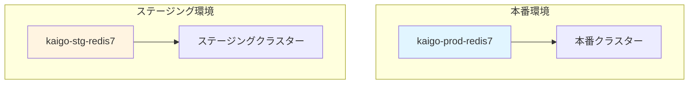

# ElastiCache パラメータ設計

## 目次
1. [パラメータグループ概要](#パラメータグループ概要)
2. [本番環境パラメータ](#本番環境パラメータ)
3. [ステージング環境パラメータ](#ステージング環境パラメータ)
4. [チューニング指針](#チューニング指針)

---

## パラメータグループ概要

### パラメータグループ戦略



### バージョン

| 項目 | 値 |
|------|-----|
| Redisバージョン | 7.0 |
| パラメータグループファミリー | redis7 |

---

## 本番環境パラメータ

### パラメータグループ名
`kaigo-subsys-prod-redis7-params`

### 主要パラメータ

#### メモリ管理

| パラメータ名 | 設定値 | デフォルト値 | 理由 |
|-------------|--------|-------------|------|
| `maxmemory-policy` | `allkeys-lru` | `volatile-lru` | 全キーを対象にLRU削除（セッション管理に適切） |
| `maxmemory-samples` | `10` | `5` | LRUの精度向上（パフォーマンスとのバランス） |

#### タイムアウト設定

| パラメータ名 | 設定値 | デフォルト値 | 理由 |
|-------------|--------|-------------|------|
| `timeout` | `300` | `0` | アイドル接続を5分でタイムアウト（リソース効率化） |
| `tcp-keepalive` | `300` | `300` | TCP接続維持（デッドコネクション検出） |

#### パフォーマンス

| パラメータ名 | 設定値 | デフォルト値 | 理由 |
|-------------|--------|-------------|------|
| `maxclients` | `65000` | `65000` | 最大同時接続数（ECSタスク数を考慮） |
| `tcp-backlog` | `511` | `511` | 接続要求キューサイズ |
| `databases` | `16` | `16` | データベース数 |

#### スローログ

| パラメータ名 | 設定値 | デフォルト値 | 理由 |
|-------------|--------|-------------|------|
| `slowlog-log-slower-than` | `10000` | `10000` | 10ms以上の処理をスローログに記録 |
| `slowlog-max-len` | `128` | `128` | スローログの最大保存件数 |

#### 永続化（Redisでは使用しないが念のため確認）

| パラメータ名 | 設定値 | デフォルト値 | 理由 |
|-------------|--------|-------------|------|
| `appendonly` | `no` | `no` | ElastiCacheでは自動バックアップ使用 |
| `save` | `""` | 複数設定 | RDBスナップショット無効化 |

#### セキュリティ

| パラメータ名 | 設定値 | デフォルト値 | 理由 |
|-------------|--------|-------------|------|
| `rename-command` | 未設定 | - | 危険コマンドの無効化（必要に応じて） |

---

## ステージング環境パラメータ

### パラメータグループ名
`kaigo-subsys-stg-redis7-params`

### 主要パラメータ（本番との差異のみ記載）

| パラメータ名 | 本番環境 | ステージング環境 | 理由 |
|-------------|----------|-----------------|------|
| `maxmemory-samples` | `10` | `5` | ステージングはデフォルト値で十分 |
| `slowlog-log-slower-than` | `10000` | `5000` | より詳細なログを取得（5ms以上） |
| `timeout` | `300` | `600` | 開発時の長時間接続を許容 |

その他のパラメータは本番環境と同一。

---

## チューニング指針

### パフォーマンスチューニング

#### 1. メモリ使用率監視

```bash
# CloudWatch メトリクス監視
# DatabaseMemoryUsagePercentage > 80% でアラート
```

**対処法**:
- `maxmemory-policy` が適切に動作しているか確認
- キャッシュサイズの見直し（ノードタイプのスケールアップ）

#### 2. スローログ分析

```bash
# Redis CLIでスローログ確認
redis-cli SLOWLOG GET 10
```

**対処法**:
- 10ms以上かかるクエリの最適化
- インデックス設計の見直し（アプリケーション側）

#### 3. 接続数監視

```bash
# CloudWatch メトリクス監視
# CurrConnections 監視
```

**対処法**:
- 接続プーリングの見直し（アプリケーション側）
- `maxclients` の増加（必要に応じて）

### メモリチューニング

#### メモリポリシーの選択

| ポリシー | 用途 | 推奨度 |
|---------|------|--------|
| `allkeys-lru` | セッション管理、汎用キャッシュ | ⭐⭐⭐ 推奨 |
| `volatile-lru` | TTL付きキーのみ削除 | ⭐⭐ 用途限定 |
| `allkeys-lfu` | アクセス頻度重視 | ⭐⭐ 高度な用途 |
| `noeviction` | メモリフル時エラー | ⭐ 非推奨 |

**本システムの選択理由**:
- セッション管理が主用途
- すべてのキーが同等の重要度
- メモリフルでもサービス継続が必要
- → `allkeys-lru` が最適

### セキュリティチューニング

#### 危険コマンドの無効化（必要に応じて）

```bash
# パラメータグループで設定
rename-command FLUSHDB ""
rename-command FLUSHALL ""
rename-command CONFIG ""
rename-command SHUTDOWN ""
```

**注意**:
- 運用時のトラブルシューティングが困難になる
- 本番環境のみ適用検討
- ステージング環境では無効化しない

### バックアップ関連

#### ElastiCache自動バックアップ

| 項目 | 本番環境 | ステージング環境 |
|------|----------|-----------------|
| バックアップ保持期間 | 7日 | 3日 |
| バックアップウィンドウ | 03:00-04:00 JST | 任意 |
| メンテナンスウィンドウ | 日曜 04:00-05:00 JST | 任意 |

---

## パラメータ変更手順

### 1. パラメータグループの作成

```bash
aws elasticache create-cache-parameter-group \
  --cache-parameter-group-name kaigo-subsys-prod-redis7-params \
  --cache-parameter-group-family redis7 \
  --description "Production Redis parameters for kaigo subsystem"
```

### 2. パラメータの変更

```bash
aws elasticache modify-cache-parameter-group \
  --cache-parameter-group-name kaigo-subsys-prod-redis7-params \
  --parameter-name-values \
    "ParameterName=maxmemory-policy,ParameterValue=allkeys-lru" \
    "ParameterName=timeout,ParameterValue=300" \
    "ParameterName=slowlog-log-slower-than,ParameterValue=10000"
```

### 3. クラスターへの適用

```bash
aws elasticache modify-replication-group \
  --replication-group-id kaigo-subsys-prod \
  --cache-parameter-group-name kaigo-subsys-prod-redis7-params \
  --apply-immediately
```

**注意**:
- 一部のパラメータは再起動が必要
- `apply-immediately` の使用は影響を確認してから

---

## モニタリング推奨メトリクス

### CloudWatch メトリクス

| メトリクス | 閾値 | アラート |
|-----------|------|----------|
| DatabaseMemoryUsagePercentage | > 80% | Warning |
| DatabaseMemoryUsagePercentage | > 90% | Critical |
| CurrConnections | > 50000 | Warning |
| Evictions | > 100/min | Warning |
| CPUUtilization | > 75% | Warning |
| NetworkBytesIn/Out | - | 監視のみ |

### Redis コマンドでの確認

```bash
# メモリ使用状況
INFO memory

# 接続数
INFO clients

# スローログ
SLOWLOG GET 10

# キー統計
INFO keyspace
```

---

## 関連ドキュメント

- [RDS パラメータ設計](./rds_parameters.md)
- [ElastiCache 設計](./elasticache_design.md)
- [セキュリティ設計](../07_security/security_design.md)
- [監視設計](../08_monitoring/monitoring_design.md)

---

**作成日**: 2025-11-05
**作成者**: Architect
**バージョン**: 1.0
